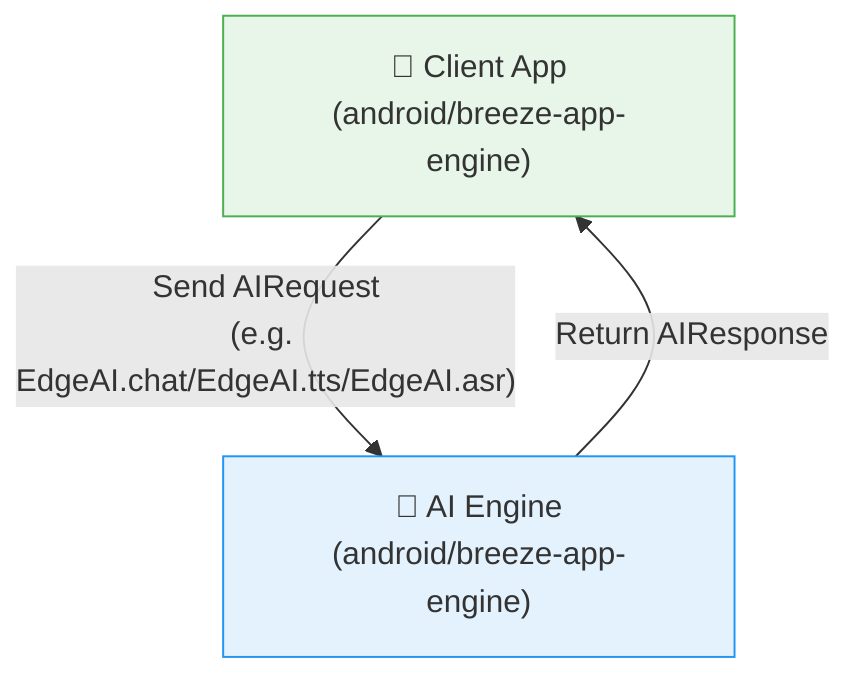

English | [繁體中文](./docs/i18n/README_zh.md)

# 🤖 Welcome to BreezeApp Engine!

Ready to build the future of on-device AI on Android? You're in the right place!

BreezeApp Engine is a next-generation framework for creating powerful, modular, and extensible AI-driven experiences. It's built with a focus on type safety, modern Android practices, and a great developer experience.

### 📦 Latest Versions

- `BreezeApp-engine`: `v0.1.1`
- `EdgeAI`: `v0.1.4`

## 📁 Project Structure

```
BreezeApp-engine/
├── android/                    # Android project root
│   ├── EdgeAI/                # EdgeAI library module
│   ├── breeze-app-engine/     # Main AI engine module
│   ├── build.gradle.kts       # Root build script
│   ├── settings.gradle.kts    # Project settings
│   └── jitpack.yml           # JitPack configuration
├── docs/                      # Documentation
│   ├── QUICK_START.md         # Quick start guide
│   ├── CONTRIBUTING.md        # Contribution guidelines
│   ├── ARCHITECTURE.md        # Architecture guidelines
│   ├── RUNNER_DEVELOPMENT.md  # Runner development guide
│   ├── MODEL_DOWNLOAD_UI_TUTORIAL.md  # Model download UI tutorial
│   ├── PERMISSION_SYSTEM.md   # Permission system documentation
│   ├── internal/              # Internal development docs
│   └── i18n/                  # Internationalization
│       ├── README_zh.md       # Chinese README
│       ├── QUICK_START_zh.md  # Chinese quick start
│       ├── CONTRIBUTING_zh.md # Chinese contributing
│       ├── ARCHITECTURE_zh.md # Chinese architecture
│       ├── RUNNER_DEVELOPMENT_zh.md # Chinese runner guide
│       └── internal/          # Chinese internal docs
├── README.md                  # This file
├── LICENSE                    # License file
└── .github/                   # GitHub workflows
```

## ✨ The Heart of the Project: The AI Engine

The most important part of this project is the **`android/breeze-app-engine`**.

Think of it as a powerful, "headless" **AI Brain** for Android. It runs as a background service, completely separate from any user interface. Its sole purpose is to manage, execute, and serve AI capabilities (like text generation, speech recognition, etc.) to any application that needs them.

By decoupling the complex AI logic from the UI, we empower app developers to add sophisticated AI features with minimal effort.

## 🔎 The Runtime View: How Client Talks to the Engine

At runtime, your app (the client) sends an `AIRequest` to the engine. The engine processes it and responds with an `AIResponse`. This interaction is completely decoupled from UI logic.



This clean separation allows the engine to remain UI-agnostic and service-oriented.

## 🚀 How to Get Started: Choose Your Role

Now that you understand the big picture, here's how you can dive in based on your goals.

---

### 📱 I'm an App Developer...

*...and I want to **use** the BreezeApp Engine in my application.*

Excellent! Your journey is about consuming the API.

1. **Start Here:** Begin with the **[Quick Start Guide](./docs/QUICK_START.md)**. It's a comprehensive guide that shows you how to connect to the service and use its features.
2. **Learn the API:** Then, review the **[android/EdgeAI/README.md](./android/EdgeAI/README.md)** to understand the `AIRequest` and `AIResponse` models you'll be using.
3. **JitPack Integration:** Check out **[android/EdgeAI/docs/USAGE_GUIDE.md](./android/EdgeAI/docs/USAGE_GUIDE.md)** for how to integrate EdgeAI via JitPack.
4. **Permission System:** Learn about the unified permission management in our **[Permission System Guide](./docs/PERMISSION_SYSTEM.md)**.

---

### 🧠 I'm an AI/ML Engineer...

*...and I want to **extend** the BreezeApp Engine with a new model.*

Fantastic! Your path is focused on implementing runners.

1. **Start Here:** The **[Architecture Guide](./docs/ARCHITECTURE.md)** is your main entry point. It explains the internal architecture of the routing engine.
2. **Build Your First Runner:** Then, follow our detailed **[🧩 Runner Development Guide](./docs/RUNNER_DEVELOPMENT.md)**. It will walk you through creating, testing, and integrating a new runner from scratch.

---

### 🏗️ I'm a Build Engineer...

*...and I want to **build and deploy** the project.*

Perfect! Here's what you need to know:

1. **Android Project:** All Android-related files are in the `android/` directory
2. **Build Commands:** 
   ```bash
   cd android
   ./gradlew :EdgeAI:assembleRelease
   ./gradlew :breeze-app-engine:assembleRelease
   ```
3. **JitPack Release:** See **[android/EdgeAI/docs/JitPack_Release_SOP.md](./android/EdgeAI/docs/JitPack_Release_SOP.md)** for release procedures.

---

## 🤝 Join Our Community & Contribute

Whether you're fixing a bug, improving the docs, or adding a revolutionary new runner, we welcome your contributions!

* **Contribution Guidelines:** Please read our **[Contributing Guide](./docs/CONTRIBUTING.md)**.
* **Have Questions?** Don't hesitate to open an issue! We're happy to help.

---

## 📦 JitPack Integration

The EdgeAI module is available via JitPack for easy integration:

```kotlin
// Add to your app's build.gradle.kts
implementation("com.github.mtkresearch:BreezeApp-engine:EdgeAI-v0.1.1")
```

For detailed usage instructions, see **[android/EdgeAI/docs/USAGE_GUIDE.md](./android/EdgeAI/docs/USAGE_GUIDE.md)**.
