English

# 🤖 Welcome to BreezeApp Engine!

Ready to build the future of on-device AI on Android? You're in the right place!

BreezeApp Engine is a next-generation framework for creating powerful, modular, and extensible AI-driven experiences.

## 📦 What's in This Repository

This repository contains two main components:

### 1. **BreezeApp Engine** (`android/breeze-app-engine`)
The AI inference service that runs as a background Android service. It manages AI models, routes requests to appropriate runners, and handles the heavy lifting of AI processing.

**Key Features**:
- Multi-provider AI support (ExecuTorch, Sherpa, OpenRouter, LlamaStack)

- Model management and download
- Configuration UI for settings

### 2. **EdgeAI SDK** (`android/EdgeAI`)
The client-side SDK that apps use to communicate with the engine. It provides a clean, type-safe API for AI operations.

**Key Features**:
- Simple API: `EdgeAI.chat()`, `EdgeAI.asr()`, `EdgeAI.tts()`
- AIDL-based IPC for cross-process communication
- Streaming support for real-time responses

--- 

## ✨ The Heart of the Project: The AI Engine

The most important part of this project is the **`android/breeze-app-engine`**.

Think of it as a powerful **AI Service** for Android. It runs as a background service that manages, executes, and serves AI capabilities (like text generation, speech recognition, etc.) to any application that needs them. While primarily service-oriented, it includes a minimal configuration UI for settings and model management.

By decoupling the complex AI logic from client apps, we empower app developers to add sophisticated AI features with minimal effort.

## 🔎 The Runtime View: How the Engine Serves Requests

The engine accepts AIDL connections from client apps and routes requests to appropriate AI runners. Here's how the engine processes incoming requests:

```mermaid
%%{init: {'flowchart': {'useMaxWidth': false, 'width': 800}}}%%
graph TD
    A["📱 Client App<br/>(via EdgeAI SDK)"]
    B["🔌 AIDL Service Binder<br/>(EngineServiceBinder)"]
    C["🎯 Request Router<br/>(AIEngineManager)"]
    D["🤖 AI Runners<br/>(ExecutorchLLMRunner, SherpaASRRunner, etc.)"]
    E["📊 Model Manager<br/>(ModelManager)"]

    A -- "1. bindService()" --> B
    B -- "2. Route request" --> C
    C -- "3. Select runner" --> D
    C -- "Load model if needed" --> E
    D -- "4. Return result" --> C
    C -- "5. Stream/return response" --> B
    B -- "6. Deliver to client" --> A

    style B fill:#FFE0B2,stroke:#FF6F00
    style C fill:#E1BEE7,stroke:#7B1FA2
    style D fill:#B2DFDB,stroke:#00796B
```

This architecture allows the engine to manage multiple AI providers and route requests efficiently.

## 🤖 Supported AI Providers

BreezeApp Engine integrates with multiple AI providers, each bringing unique capabilities:

| Provider | Type | LLM | VLM | ASR | TTS | Guardian | Streaming |
|----------|------|:---:|:---:|:---:|:---:|:--------:|:---------:|
| **MediaTek** | Local NPU | ✅ | 🚧 | ❌ | ❌ | ❌ | ✅ |
| **ExecuTorch** | Local | ✅ | 🚧 | ❌ | ❌ | ❌ | ✅ |
| **LlamaStack** | Remote | ✅ | ✅ | ❌ | ❌ | ✅ | ❌* |
| **OpenRouter** | Remote | ✅ | ✅ | ❌ | ❌ | ❌ | ✅ |
| **Sherpa** | Local | ❌ | ❌ | ✅ | ✅ | ❌ | ✅ |

**Legend**: ✅ Supported | 🚧 Experimental | ❌ Not Supported  
***Note**: LlamaStack streaming is not yet supported by the official SDK. Falls back to non-streaming mode.

*For detailed technical implementation, see [Engine Architecture →](./android/breeze-app-engine/README.md#10-supported-ai-runners)*

## 🚀 How to Get Started

Your path depends on your goal. Are you building an app *with* the engine, or building a new feature *for* the engine?

### 📱 For App Developers (Using the Engine)

If you want to add AI features to your Android app, this is your path.

1.  **Start Here:** Our **[BreezeApp Client Guide](https://github.com/mtkresearch/BreezeApp-client/blob/174b3717575664dd8b08f195cbfad9aad5c300f1/README.md)** is the best place to begin. It provides a step-by-step tutorial on how to integrate the `EdgeAI` SDK and make your first API call.
2.  **Explore the API:** The `EdgeAI` SDK is the public API for the engine. You can explore its features and data models in the **[EdgeAI README](./android/EdgeAI/README.md)**.

### 🧠 For AI/ML Engineers (Extending the Engine)

If you want to add a new model or AI capability to the engine itself.

1.  **Understand the Design:** The **[Architecture Guide](./docs/architecture/README.md)** explains the internal design of the engine and how all the pieces fit together.
2.  **Build a Runner:** Follow the **[Runner Development Guide](./docs/guides/runner-development.md)** to learn how to implement a new `Runner` that can be discovered by the engine.

> **⚠️ Development Note**: After rebuilding the engine, you must also rebuild your client app to reconnect properly.

## 🤝 Join Our Community & Contribute

Whether you're fixing a bug, improving the docs, or adding a revolutionary new runner, we welcome your contributions!

* **Contribution Guidelines:** Please read our **[Contributing Guide](./docs/guides/contributing.md)**.
* **Have Questions?** Don't hesitate to open an issue! We're happy to help.