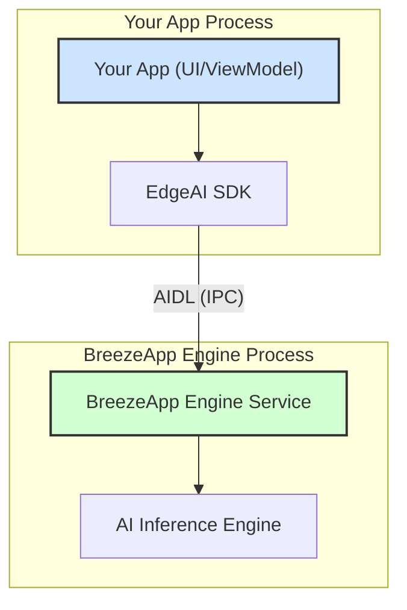

# EdgeAI SDK

## Language Support

- **English**
- **[繁體中文](./docs/i18n/README_zh.md)**


> **EdgeAI** is a production-ready Android SDK for local AI inference, providing standardized APIs for text generation, speech recognition, and text-to-speech. It integrates seamlessly with the BreezeApp Engine Service.

---

## Overview

- **Client-Server Model**: EdgeAI SDK (client) communicates with BreezeApp Engine (server) via AIDL IPC.
- **JitPack Integration**: Easy to add via Gradle dependency.
- **Type-Safe API**: Clean Kotlin data models and coroutine/Flow support.

---

## Architecture



---

## Quick JitPack Installation

```kotlin
// In your app's build.gradle.kts
dependencies {
    implementation("com.github.mtkresearch:BreezeApp-engine:EdgeAI-v0.1.7")
}
```

---

## Documentation

- **[Getting Started](./docs/i18n/GETTING_STARTED_zh.md)**: New user quickstart (install, init, first API call)
- **[Usage Guide](./docs/i18n/USAGE_GUIDE_zh.md)**: Advanced usage, configuration, permissions, FAQ
- **[API Reference](./docs/i18n/API_REFERENCE_zh.md)**: All API parameters, return types, and code examples
- **[Architecture](./docs/i18n/ARCHITECTURE_zh.md)**: Design philosophy, AIDL, client-server model
- **[Error Handling](./docs/i18n/ERROR_HANDLING_zh.md)**: Exception types and handling strategies
- **[Best Practices](./docs/i18n/BEST_PRACTICES_zh.md)**: Lifecycle, state, UI/UX, performance
- **[JitPack Release SOP](./docs/i18n/JitPack_Release_SOP_zh.md)**: Internal release/maintenance guide