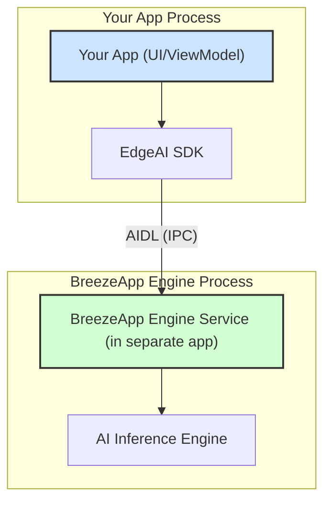

# EdgeAI SDK

> **🚀 Production-Ready Android AI SDK**
>
> EdgeAI is a professional-grade Android SDK that provides standardized APIs for local AI inference. It offers seamless integration with the BreezeApp Engine Service, enabling high-performance text generation, speech recognition, and text-to-speech capabilities directly on Android devices.

## 核心概念 (Core Concepts)

在使用 EdgeAI SDK 之前，請先了解以下核心概念：

1.  **角色定位 (SDK Role)**
    -   `EdgeAI` SDK 是一個 **客戶端函式庫** (client-side library)，它會被整合到 **您的應用程式** 中。它本身不執行任何 AI 計算。

2.  **外部依賴 (External Dependency)**
    -   ⚠️ **重要**: 此 SDK 的運作依賴一個名為 **BreezeApp Engine** 的獨立 Android 應用程式。您的應用程式在調用 SDK 前，**必須確保目標設備上已安裝並運行 BreezeApp Engine**。

3.  **通訊機制 (Communication)**
    -   SDK 透過 Android 系統的 **AIDL (Binder)** 機制與 `BreezeApp Engine` 進行跨進程通訊 (IPC)，將您的請求安全地發送到 AI 引擎。

## 架構與通訊 (Architecture & Communication)

下圖展示了您的 App、EdgeAI SDK 與 BreezeApp Engine 之間的關係：


*   您的應用程式調用 `EdgeAI.chat()` 等簡單的 API。
*   SDK 負責將請求打包並透過 AIDL 傳遞給在另一個進程中運行的 Engine Service。
*   Engine Service 執行 AI 推理後，將結果回傳給 SDK，最終交給您的應用程式。

## 安裝指南 (Installation)

將 EdgeAI 模組作為一個依賴項加入到您的 `build.gradle.kts` 文件中：

```kotlin
// In your app's build.gradle.kts
dependencies {
    implementation(project(":EdgeAI"))
}
```

## 快速上手 (Quick Start)

在您的 `Activity` 或 `ViewModel` 中，使用以下程式碼來初始化 SDK 並發送一個簡單的請求。

```kotlin
import com.mtkresearch.breezeapp.edgeai.*
import kotlinx.coroutines.launch

// In a CoroutineScope, e.g., lifecycleScope or viewModelScope
launch {
    // 1. Initialize and wait for the SDK to connect to the BreezeApp Engine Service
    try {
        EdgeAI.initializeAndWait(context, timeoutMs = 10000)
        Log.i("EdgeAI", "SDK connected successfully.")
    } catch (e: ServiceConnectionException) {
        Log.e("EdgeAI", "SDK connection failed. Is BreezeApp Engine installed and running?", e)
        return@launch
    }

    // 2. Send a simple chat request
    val request = chatRequest(prompt = "Explain quantum computing in simple terms")
    
    EdgeAI.chat(request).collect { response ->
        val content = response.choices.firstOrNull()?.message?.content
        Log.d("EdgeAI", "AI Response: $content")
    }
}
```
**重要**: `EdgeAI.shutdown()` 應在您的應用程式退出時（例如 `Application.onTerminate()`）被調用以釋放資源。

## 📚 文件索引 (Documentation Index)

我們提供完整的文件來幫助您深入了解和使用 EdgeAI SDK。

*   **[🚀 入門指南](./docs/GETTING_STARTED.md)**：從零開始的完整設置與初始化指南。
*   **[🏛️ 內部架構](./docs/ARCHITECTURE.md)**：深入了解 SDK 的客戶端-伺服器模型與 AIDL 通訊機制。
*   **[🔧 API 參考](./docs/API_REFERENCE.md)**：所有公開 API (Chat, TTS, ASR) 的詳細參數與回應格式說明。
*   **[❗ 錯誤處理](./docs/ERROR_HANDLING.md)**：`EdgeAIException` 異常體系詳解與建議處理方式。
*   **[✨ 最佳實踐](./docs/BEST_PRACTICES.md)**：在真實應用中管理服務生命週期、對話歷史和 UI 互動的建議。

## 支援 (Support)

若遇到問題，請優先查閱 **[文件索引](#-文件索引-documentation-index)** 中的相關文件。
