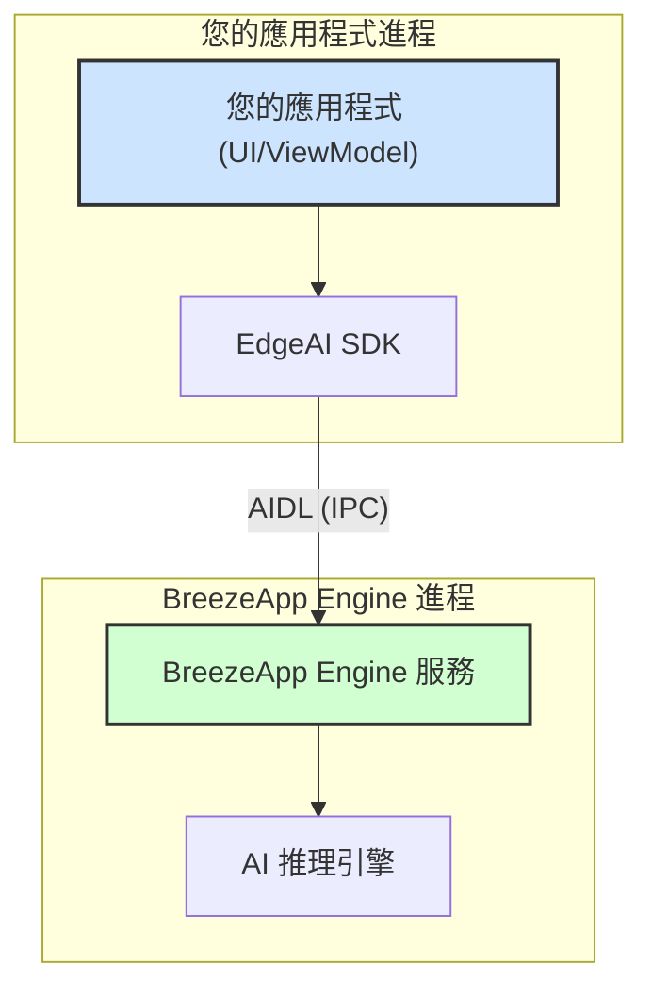

# 架構

[← 回到 README](./README_zh.md)

> **設計理念與架構說明**：深入了解 EdgeAI SDK 的客戶端-伺服器模型與 AIDL 通訊機制。

---

## 設計理念

EdgeAI SDK 採用**客戶端-伺服器架構**，將 AI 推理功能與應用程式邏輯分離：

- **EdgeAI SDK**：輕量級客戶端，提供標準化 API
- **BreezeApp Engine**：獨立服務，執行實際的 AI 推理
- **AIDL IPC**：跨進程通訊，確保安全性和穩定性

---

## 架構圖



---

## AIDL 通訊設計

### 介面定義

```aidl
// IEdgeAIService.aidl
interface IEdgeAIService {
    void initialize();
    void chat(in ChatRequest request, IEdgeAIResponseCallback callback);
    void tts(in TTSRequest request, IEdgeAIResponseCallback callback);
    void asr(in ASRRequest request, IEdgeAIResponseCallback callback);
    void shutdown();
}

interface IEdgeAIResponseCallback {
    void onResponse(in EdgeAIResponse response);
    void onError(in String errorMessage);
}
```

### 通訊流程

1. **初始化**：SDK 綁定到 BreezeApp Engine 服務
2. **請求發送**：透過 AIDL 將請求傳送到服務
3. **處理**：服務執行 AI 推理
4. **回應**：結果透過回調返回給 SDK
5. **清理**：釋放資源和連接

---

## 優勢

### 安全性
- **進程隔離**：AI 推理在獨立進程中執行
- **權限控制**：服務可以限制存取權限
- **資源保護**：防止惡意應用程式影響系統

### 穩定性
- **崩潰隔離**：服務崩潰不會影響主應用程式
- **記憶體管理**：AI 模型在專用進程中管理
- **錯誤恢復**：可以重新啟動服務而不影響客戶端

### 效能
- **並行處理**：多個應用程式可以同時使用
- **資源共享**：模型可以在多個請求間共享
- **快取優化**：服務可以維護模型快取

---

## 生命週期管理

### 服務生命週期

```kotlin
// 服務啟動
class EdgeAIService : Service() {
    override fun onCreate() {
        super.onCreate()
        // 初始化 AI 引擎
        initializeAIEngine()
    }
    
    override fun onDestroy() {
        super.onDestroy()
        // 清理資源
        cleanupAIEngine()
    }
}
```

### 客戶端生命週期

```kotlin
// SDK 初始化
EdgeAI.initializeAndWait(context, timeoutMs = 10000)

// 使用期間
EdgeAI.chat(request).collect { response ->
    // 處理回應
}

// 清理
EdgeAI.shutdown()
```

---

## 錯誤處理策略

### 連接錯誤
- **自動重連**：SDK 會嘗試重新連接服務
- **降級模式**：提供離線功能或快取回應
- **用戶通知**：清楚說明問題和解決方案

### 服務錯誤
- **錯誤分類**：區分暫時性和永久性錯誤
- **重試邏輯**：指數退避重試策略
- **錯誤報告**：收集錯誤資訊用於改進

---

## 擴展性

### 新功能添加
- **介面擴展**：在 AIDL 中定義新方法
- **向後相容**：保持舊版本 API 的相容性
- **版本管理**：支援多個 API 版本

### 效能優化
- **連接池**：管理多個服務連接
- **請求批次**：合併多個小請求
- **快取策略**：快取常用回應

---

## 未來規劃

### 功能增強
- **串流支援**：即時回應串流
- **批次處理**：同時處理多個請求
- **模型切換**：動態切換不同 AI 模型

### 架構改進
- **微服務**：將不同功能拆分為獨立服務
- **負載平衡**：在多個服務實例間分配負載
- **監控系統**：即時監控服務狀態和效能 