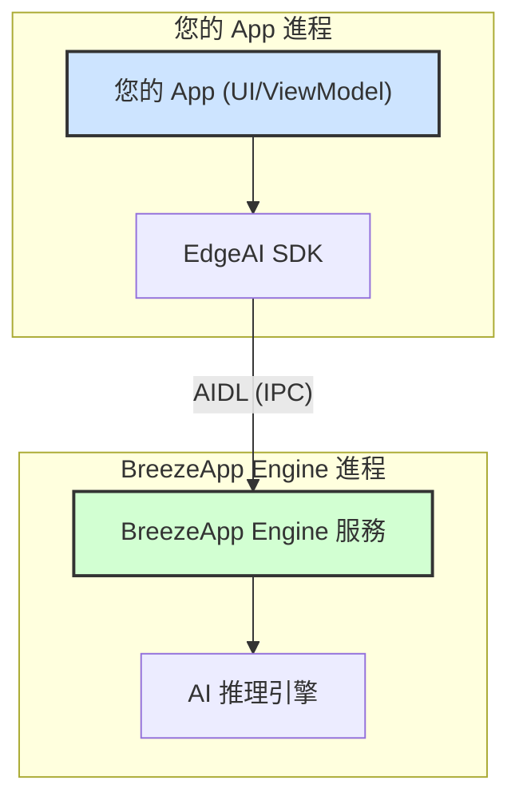

# EdgeAI SDK

## Language Support

- **[English](../../README.md)**
- **繁體中文**

> **EdgeAI** 是一套專為 Android 設計的本地 AI 推理 SDK，提供標準化的文字生成、語音辨識、文字轉語音 API，並可無縫整合 BreezeApp Engine 服務。

---

## 簡介

- **客戶端-伺服器架構**：EdgeAI SDK（客戶端）透過 AIDL IPC 與 BreezeApp Engine（伺服器）通訊。
- **JitPack 整合**：可直接透過 Gradle 依賴安裝。
- **型別安全 API**：Kotlin 資料模型與 coroutine/Flow 支援。

---

## 架構圖



---

## JitPack 安裝

```kotlin
// 在您的 app 的 build.gradle.kts 中
dependencies {
    implementation("com.github.mtkresearch:BreezeApp-engine:EdgeAI-v0.1.7")
}
```

---

## 文件導覽

- **[快速開始](./GETTING_STARTED_zh.md)**：新手入門（安裝、初始化、第一個 API 呼叫）
- **[使用指南](./USAGE_GUIDE_zh.md)**：進階用法、配置、權限、常見問題
- **[API 參考](./API_REFERENCE_zh.md)**：所有 API 參數、回傳型態與範例
- **[架構](./ARCHITECTURE_zh.md)**：設計理念、AIDL、客戶端-伺服器模型
- **[錯誤處理](./ERROR_HANDLING_zh.md)**：例外類型與處理策略
- **[最佳實踐](./BEST_PRACTICES_zh.md)**：生命週期、狀態、UI/UX、效能
- **[JitPack 發佈 SOP](./JitPack_Release_SOP_zh.md)**：內部維護/發佈指南