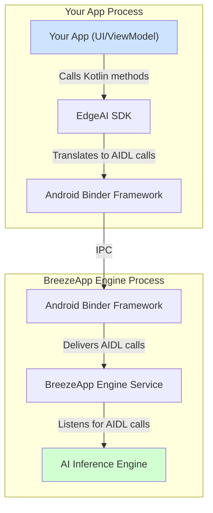

# 🏛️ EdgeAI SDK Architecture

This document provides a deeper look into the internal architecture of the EdgeAI SDK and its interaction with the `BreezeApp Engine`.

## Core Philosophy: Client-Server Model

The EdgeAI ecosystem is designed based on a classic **client-server model** to promote separation of concerns, independent updates, and resource centralization.

-   **`EdgeAI` SDK (The Client)**: A lightweight library integrated into your application. Its sole responsibility is to provide a developer-friendly API, validate requests, and manage communication with the server. It does not contain any AI models or perform heavy computations.

-   **`BreezeApp Engine` (The Server)**: A standalone Android application that acts as a centralized, on-device AI engine. It manages AI models, handles the inference queue, and optimizes hardware resource usage (CPU, GPU, NPU).

## Communication Mechanism: AIDL

Communication between the `EdgeAI` SDK and the `BreezeApp Engine` happens across process boundaries. We use Android's native **Android Interface Definition Language (AIDL)** for this inter-process communication (IPC).

### Why AIDL?

1.  **Decoupling**: The SDK (client) and the BreezeApp Engine (server) can be updated independently. As long as the AIDL "contract" remains the same, you can update the Engine app to use newer, more efficient AI models without requiring developers who use the SDK to update their apps.
2.  **Performance**: AIDL is a highly optimized mechanism for in-process and cross-process calls on Android, providing efficient data marshalling (using `Parcelable`).
3.  **Centralized Resource Management**: AI models can be large and resource-intensive. By having them in a central Engine app, multiple applications on a device can share the same engine without each one needing to store and load its own copy of the models.
4.  **Security & Stability**: The AI processing happens in a separate, isolated process. A crash in the inference engine will not bring down the client application that made the request.

## The API Layer

The SDK is more than just a thin wrapper around AIDL. It provides significant value by:

-   **Providing Type-Safe Models**: Offering clean Kotlin `data class` models (like `ChatRequest`) instead of forcing developers to deal with raw AIDL interfaces.
-   **Handling Asynchronous Operations**: Abstracting away the complexities of asynchronous IPC calls using Kotlin Coroutines and `Flow`.
-   **Managing Connection Lifecycle**: Automatically handling the binding and unbinding to the `BreezeApp Engine` service.
-   **Providing a Robust Error System**: Translating low-level binder or service errors into a clear, understandable hierarchy of `EdgeAIException`s. 