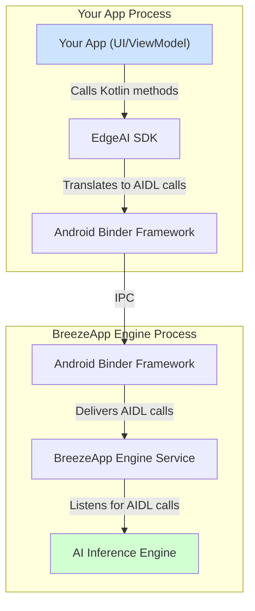

# EdgeAI SDK Architecture

EdgeAI SDK provides a Kotlin API for Android apps to communicate with BreezeApp Engine via AIDL IPC.

## Client-Server Model

**EdgeAI SDK (Client)**: Lightweight library that provides developer-friendly API and manages communication. No AI models.

**BreezeApp Engine (Server)**: Standalone app that manages AI models, handles inference, and optimizes hardware usage.

**Architecture**: `Your App → EdgeAI SDK → AIDL IPC → BreezeApp Engine → AI Models`

## AIDL Communication

EdgeAI and BreezeApp Engine communicate across process boundaries using Android's AIDL (Android Interface Definition Language).

**Why AIDL?**

- **Independent updates** - SDK and Engine can update separately
- **Performance** - Optimized IPC with efficient marshalling
- **Shared resources** - Multiple apps share one engine
- **Stability** - Engine crashes don't affect client apps

## SDK Responsibilities

EdgeAI SDK provides:

- **Type-safe models** - Kotlin data classes instead of raw AIDL
- **Async operations** - Kotlin Coroutines and Flow
- **Connection management** - Automatic binding/unbinding
- **Error handling** - Clear exception hierarchy

**See**: [Error Handling](../client-developers/error-handling.md) for exception types