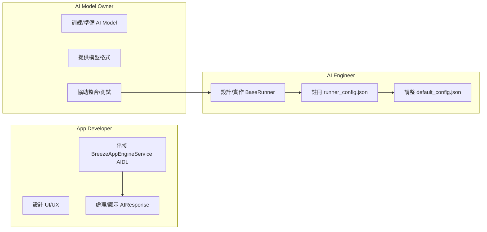
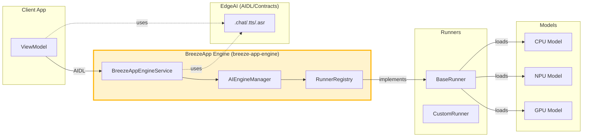
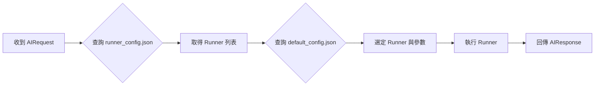
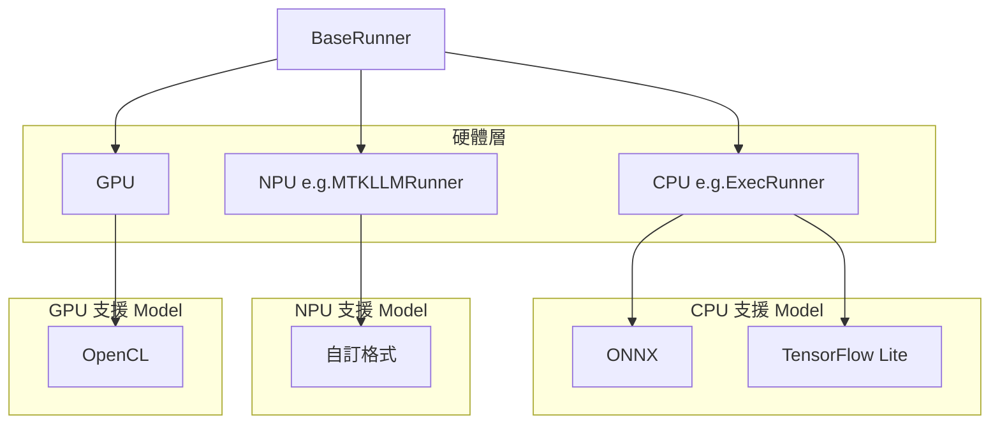
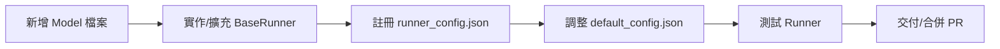
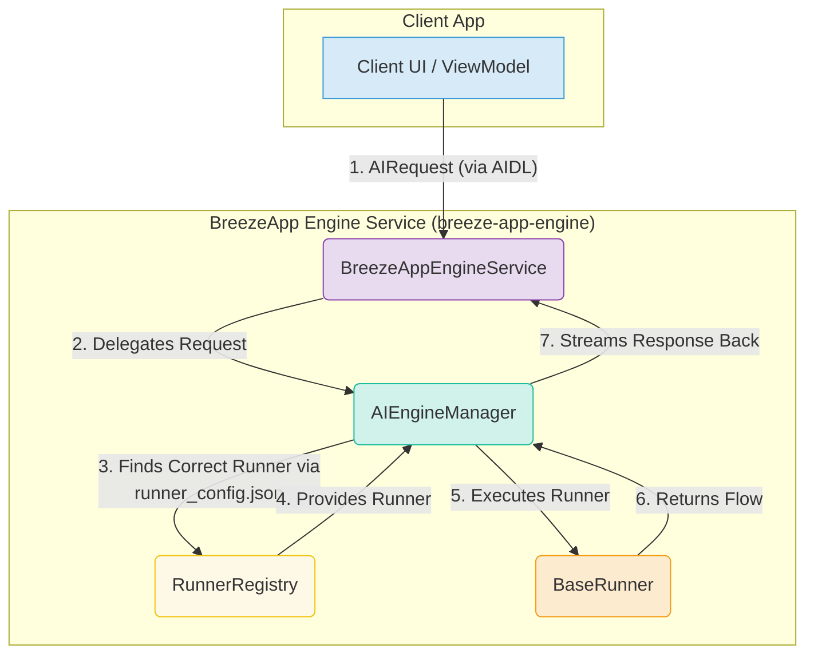
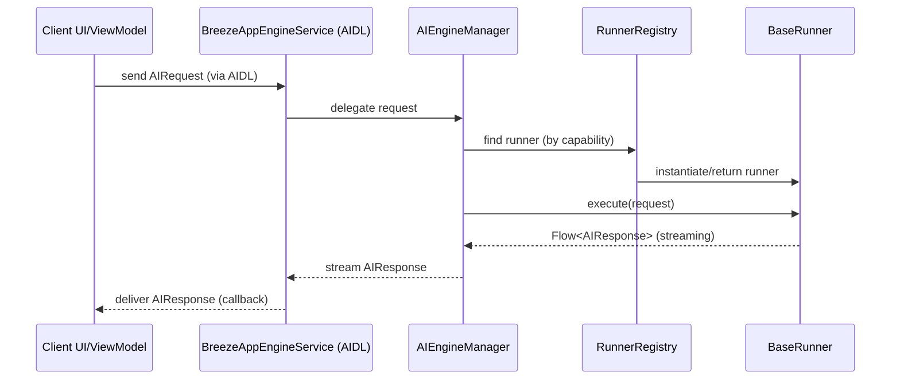

# BreezeApp Engine

BreezeApp Engine 是整個 AI 能力整合的核心。它以高度模組化、可擴充、型別安全為設計主軸，讓 App 開發者、AI 工程師、模型擁有者都能各司其職、協作無礙。

---

## 1. 角色定位與責任分工

這張圖明確標示三大角色在專案中的主要任務、交付物與互動界面，讓每個人一眼知道「我該做什麼、和誰互動」。



> **這張圖讓 App Developer、AI Engineer、AI Model Owner 能一眼看出自己在這個專案中的定位與主要任務。**

---

## 2. 模組架構與資料流向

本圖展示 BreezeApp v2 以 Engine 為核心的模組依賴與資料流向，強調 Engine 的中樞地位與各模組的邊界。



> **這張圖說明 Engine 作為中樞，如何串接 Client、EdgeAI 合約、Runner 與 Model，並清楚劃分模組責任。**

---

## 3. Engine 運作與決策流程

本圖細緻描述 Engine 收到請求後，如何根據 config 決定用哪個 Runner、如何注入參數、執行與回傳。



> **這張圖橫向呈現 Engine 如何根據兩個設定檔自動選擇與執行正確的 Runner，並標註每個步驟的重點。**

---

## 4. Runner 與 Model 的客製化關聯

本圖說明一個 Runner 可支援多種硬體（CPU/NPU/GPU），每種硬體下又有不同格式的 Model，並標註擴充方式。



> **這張圖讓 AI Engineer 與 Model Owner 清楚知道如何擴充 Runner 支援新硬體或新格式的 Model。**

---

## 5. 擴充流程圖：如何支援新模型/硬體

本圖以 step-by-step 流程，指引開發者如何擴充 Engine 支援新模型或新硬體。



> **這張圖讓新手或進階開發者一目了然如何正確擴充 Engine 能力。**

---

## 6. Engine 運作細節與原有內容整合

### 高層資料流



---

### End-to-End Communication Sequence



> **這張圖說明了從 App 發送請求到收到 AI 回應的完整流程，包含 streaming 支援。**

---

## 7. 配置檔說明（Two-File System）

### 1. `runner_config.json` (Discovery & Registration)

- **Purpose:** 註冊所有可用 Runner 類別，類似 plugin registry。

- **範例：**
  
  ```json
  {
  "runners": [
    {
      "name": "breeze_llm_mock_v1",
      "class": "com.mtkresearch.breezeapp.engine.data.runner.MockLLMRunner",
      "capabilities": ["LLM"],
      "priority": 100
    }
  ]
  }
  ```

### 2. `default_config.json` (Orchestration & Behavior)

- **Purpose:** 定義每個任務預設用哪個 runner 及其參數。

- **範例：**
  
  ```json
  {
  "runnerConfigurations": {
    "TEXT_GENERATION": {
      "defaultRunner": "breeze_llm_mock_v1",
      "runners": {
        "breeze_llm_mock_v1": {
          "type": "MOCK",
          "model": {
            "parameters": {
              "response_delay_ms": 100
            }
          }
        }
      }
    }
  }
  }
  ```

---

## 8. 開發與貢獻

- **[🧩 Runner Development Guide](docs/RUNNER_DEVELOPMENT.md)**: 學習如何擴充自訂 Runner。
- 請遵循主專案 `CONTRIBUTING.md` 的規範。

---

> 本文件以 Engine 為主體，分層說明角色、模組、流程、擴充與細節，並以圖輔助理解，協助各類開發者快速上手與正確擴充。