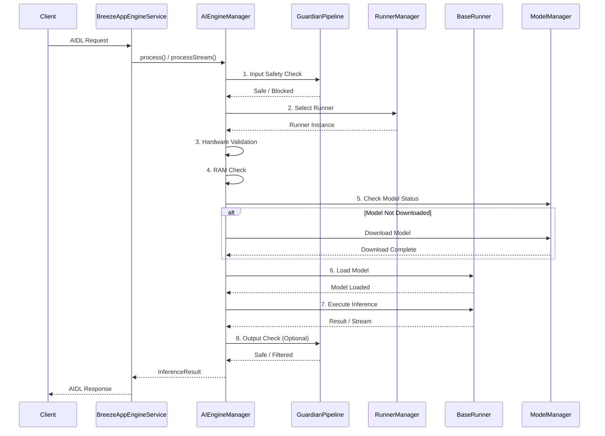

# BreezeApp Engine Module

Android service module providing on-device AI inference (LLM, ASR, TTS, VLM) through AIDL interface.

---

## Engine Workflow

Understanding the request processing workflow is crucial for contributors looking to improve the system.

### Request Processing Flow



### Key Components

| Component | Responsibility | Location |
|-----------|---------------|----------|
| **AIEngineManager** | Request orchestration, runner selection, model loading | `core/AIEngineManager.kt` |
| **RunnerManager** | Runner discovery, priority management, lifecycle | `core/RunnerManager.kt` |
| **ModelManager** | Model downloads, storage, state tracking | `core/ModelManager.kt` |
| **GuardianPipeline** | Content safety (input validation) | `runner/guardian/GuardianPipeline.kt` |
| **BaseRunner** | AI inference interface (implemented by all runners) | `runner/core/BaseRunner.kt` |

### Workflow Steps (AIEngineManager.process)

1. **Guardian Input Check** - Validate request safety (if enabled)
2. **Runner Selection** - Choose best runner based on capability + priority
3. **Hardware Validation** - Check if runner is supported on device
4. **RAM Check** - Ensure sufficient memory (unload other runners if needed)
5. **Model Download** - Auto-download missing models with progress tracking
6. **Model Loading** - Load model into runner (or reload if model changed)
7. **Inference Execution** - Process request through runner
8. **Output Check** - Optional output validation (deprecated for streaming)

**See**: [`AIEngineManager.kt:133-219`](./src/main/java/com/mtkresearch/breezeapp/engine/core/AIEngineManager.kt#L133-L219) for implementation

---

## For Engine Developers

### Quick Start

**Adding a New AI Runner**:
1. Create class extending `BaseRunner` or `FlowStreamingRunner`
2. Add `@AIRunner` annotation with metadata
3. Implement required methods (`load`, `run`, `unload`)
4. See: [Runner Development Guide](../../docs/guides/runner-development.md)

**Adding Models**:
1. Declare in `assets/fullModelList.json`
2. Add download URLs, SHA-256, and metadata
3. Models auto-download on first use
4. See: [Model Management Guide](../../docs/guides/model-management.md)

**Adding a New Capability**:
1. Add to `CapabilityType` enum in `model/CapabilityType.kt`
2. Update `AIEngineManager` routing logic
3. Create runners supporting the new capability
4. See: [Architecture Overview](../../docs/architecture/README.md)

---

## Supported Runners

| Runner | Capability | Backend | Streaming | Status |
|--------|-----------|---------|-----------|--------|
| ExecutorchLLMRunner | LLM | ExecuTorch (CPU) | ✅ | Stable |
| MTKLLMRunner | LLM | MTK NPU | ✅ | Stable |
| SherpaASRRunner | ASR | Sherpa-ONNX | ✅ | Stable |
| SherpaTTSRunner | TTS | Sherpa-ONNX | ✅ | Stable |
| OpenRouterLLMRunner | LLM | Remote API | ✅ | Stable |
| LlamaStackRunner | LLM/VLM | Remote API | ✅ | Experimental |

---

## Native Libraries

Located in `libs/` (prebuilt):

| Library | Purpose | Platform |
|---------|---------|----------|
| `executorch` | On-device LLM inference | arm64-v8a |
| `sherpa-onnx` | ASR/TTS processing | arm64-v8a |

See [libs/README.md](./libs/README.md) for build instructions.

---

## Model Management

**Declaring Models** (`assets/fullModelList.json`):
```json
{
  "id": "llama-3.2-1b-q4",
  "runner": "executorch",
  "backend": "cpu",
  "capabilities": ["llm"],
  "ramGB": 2.0,
  "files": [
    {
      "fileName": "llama-3.2-1b-q4.pte",
      "urls": ["https://example.com/llama-3.2-1b-q4.pte"],
      "sha256": "abc123..."
    }
  ]
}
```

**Storage Path**: `/data/data/com.mtkresearch.breezeapp.engine/files/models/{modelId}/`

**Auto-Download**: Models automatically download on first use with progress notifications.

**See**: [Model Management Guide](../../docs/guides/model-management.md) for details.

---

## Testing

**Run Unit Tests**:
```bash
cd android
./gradlew :breeze-app-engine:test
```

**Run Integration Tests**:
```bash
./gradlew :breeze-app-engine:connectedAndroidTest
```

**Test Runner Locally**:
1. Install engine APK: `./gradlew :breeze-app-engine:installDebug`
2. Open Engine Settings UI
3. Navigate to Quick Test tab
4. Select capability and model
5. Run test

---

## Documentation

- **[Runner Development](../../docs/guides/runner-development.md)** - Create custom AI runners
- **[Model Management](../../docs/guides/model-management.md)** - Model lifecycle & storage
- **[Architecture Overview](../../docs/architecture/README.md)** - System design patterns
- **[Data Flow](../../docs/architecture/data-flow.md)** - Request processing flows
- **[Security Model](../../docs/security/security-model.md)** - Permission-based access