# BreezeApp Engine - Android Implementation

BreezeApp Engine is a modular, extensible AI inference engine designed specifically for Android platforms. It provides a unified API to integrate multiple AI capabilities (LLM, ASR, TTS, VLM) and supports different hardware backends (CPU, NPU, GPU).

# Table of Contents
[English](./README.md) | [繁體中文](./README_zh.md)
- [System Architecture Overview](#1-system-architecture-overview)
- [Service Layer Architecture](#2-service-layer-architecture)
- [Core Business Logic Layer](#3-core-business-logic-layer)
- [Runner Implementation Architecture](#4-runner-implementation-architecture)
- [Model Management System](#5-model-management-system)
- [Security Mechanism - Guardian Pipeline](#6-security-mechanism---guardian-pipeline)
- [Parameter Configuration System](#7-parameter-configuration-system)
- [System Resource Management](#8-system-resource-management)
- [Complete Inference Processing Flow](#9-complete-inference-processing-flow)
- [Supported AI Runners](#10-supported-ai-runners)
- [Deployment and Integration](#11-deployment-and-integration)
- [Development Extension Guide](#12-development-extension-guide)
- [Summary](#13-summary)

---

## 1. System Architecture Overview

This system is based on Clean Architecture principles, implementing a complete AI inference service architecture:


---

## 2. Service Layer Architecture

### 2.1 BreezeAppEngineService - Android Service Core

```mermaid
graph TD
    subgraph "BreezeAppEngineService"
        A[onCreate<br/>🚀 Service Initialization]
        B[onBind<br/>🔗 Client Connection]
        C[onStartCommand<br/>📋 Command Processing]
        D[onDestroy<br/>🗑️ Cleanup]

        E[ServiceOrchestrator<br/>🎭 Component Coordinator]
        F[NotificationManager<br/>🔔 Foreground Service]
        G[Permission Check<br/>🔐 Security Validation]
    end

    subgraph "Android 15+ Features"
        H[onTimeout<br/>⏰ Service Timeout Handler]
        I[updateForegroundServiceType<br/>🎤 Microphone Permission]
    end

    subgraph "Client Management"
        J[AIDL Interface<br/>🔌 IPC Communication]
        K[Callback Management<br/>📞 Streaming Results]
    end

    A --> E
    A --> F
    B --> G
    B --> J
    C --> F
    E --> K
    H --> D
    I --> F

    style A fill:#E8F5E9,stroke:#4CAF50,color:#000000
    style B fill:#E3F2FD,stroke:#2196F3,color:#000000
    style H fill:#FFEBEE,stroke:#F44336,color:#000000
```

### 2.2 ServiceOrchestrator - Component Coordinator


---

## 3. Core Business Logic Layer

### 3.1 AIEngineManager - Inference Processing Core

```mermaid
graph TD
    subgraph "AIEngineManager Processing Pipeline"
        A[InferenceRequest<br/>📝 Input Request]
        B{Guardian Input Check<br/>🛡️ Safety Validation}
        C[Runner Selection<br/>🎯 Best Fit Algorithm]
        D[Model Loading<br/>📦 On-demand Loading]
        E[Inference Execution<br/>🧠 AI Processing]
        F{Guardian Output Check<br/>🛡️ Response Filtering}
        G[InferenceResult<br/>✅ Final Response]
        H[Error Handling<br/>❌ Fallback Strategy]
    end

    subgraph "Resource Management"
        I[Memory Monitor<br/>📊 RAM Usage]
        J[Model Unloading<br/>🗑️ Memory Cleanup]
        K[Concurrent Requests<br/>⚡ Parallel Processing]
    end

    A --> B
    B -->|Safe| C
    B -->|Unsafe| H
    C --> D
    D --> I
    I --> J
    D --> E
    E --> F
    F -->|Safe| G
    F -->|Filtered| G
    C -->|No Runner| H
    D -->|Load Failed| H

    E --> K

    style A fill:#E8F5E9,stroke:#4CAF50,color:#000000
    style B fill:#FFF9C4,stroke:#FFC107,color:#000000
    style E fill:#E3F2FD,stroke:#2196F3,color:#000000
    style F fill:#FFF9C4,stroke:#FFC107,color:#000000
    style G fill:#E0F2F1,stroke:#009688,color:#000000
    style H fill:#FFEBEE,stroke:#F44336,color:#000000
```

### 3.2 RunnerManager - Runner Lifecycle Management

```mermaid
graph TD
    subgraph "Runner Discovery & Registration"
        A[Package Scanning<br/>🔍 Annotation Discovery]
        B[AIRunner Annotation<br/>🏷️ Metadata Extraction]
        C[Hardware Validation<br/>🔧 Capability Check]
        D[RunnerRegistry<br/>📋 Storage]
    end

    subgraph "Priority Resolution"
        E[Capability Matching<br/>🎯 Find Compatible]
        F[Priority Sorting<br/>📊 High to Low]
        G[Hardware Filtering<br/>⚡ Device Support]
        H[Best Runner Selection<br/>🏆 Optimal Choice]
    end

    subgraph "Configuration Management"
        I[EngineSettings<br/>⚙️ Global Config]
        J[Runner Parameters<br/>🔧 Specific Settings]
        K[Parameter Schema<br/>📋 Self-describing]
    end

    A --> B
    B --> C
    C --> D

    D --> E
    E --> F
    F --> G
    G --> H

    I --> J
    J --> K

    style B fill:#F3E5F5,stroke:#9C27B0,color:#000000
    style H fill:#E0F2F1,stroke:#009688,color:#000000
    style K fill:#E1F5FE,stroke:#00BCD4,color:#000000
```

---

## 4. Runner Implementation Architecture

### 4.1 BaseRunner Interface Design


### 4.2 Specific Runner Implementation Details

#### ExecutorchLLMRunner - CPU Inference

```mermaid
graph TD
    subgraph "ExecutorchLLMRunner Implementation"
        A[Model Loading<br/>📦 .pte + tokenizer.bin]
        B[LlmModule<br/>🦙 ExecuTorch Native]
        C[Prompt Formatting<br/>📝 Chat Template]
        D[Token Generation<br/>🔤 Streaming Output]
        E[Stop Token Detection<br/>🛑 Generation Control]
    end

    subgraph "Supported Models"
        F[Llama3_2-3b-4096-250606-cpu<br/>💾 7GB RAM]
        G[Llama3_2-3b-4096-spin-250605-cpu<br/>💾 3GB RAM - Quantized]
    end

    subgraph "Temperature Management"
        H[Temperature Change Detection<br/>🌡️ Dynamic Reload]
        I[Module Reinitialization<br/>🔄 Hot Swapping]
    end

    A --> B
    B --> C
    C --> D
    D --> E

    F --> A
    G --> A

    H --> I
    I --> B

    style F fill:#E3F2FD,stroke:#2196F3,color:#000000
    style G fill:#E8F5E9,stroke:#4CAF50,color:#000000
    style H fill:#FFF9C4,stroke:#FFC107,color:#000000
```

#### MTKLLMRunner - NPU Hardware Acceleration

```mermaid
graph TD
    subgraph "MTKLLMRunner NPU Pipeline"
        A[Hardware Validation<br/>🔧 NPU Support Check]
        B[Native Library Loading<br/>📚 llm_jni.so]
        C[Model Path Resolution<br/>📂 .dla + .yaml Files]
        D[NPU Initialization<br/>⚡ Hardware Setup]
        E[Streaming Generation<br/>🌊 Token Callbacks]
        F[Resource Management<br/>🧹 Memory Cleanup]
    end

    subgraph "MTK-specific Features"
        G[DLA Model Format<br/>🧠 NPU Optimized]
        H[Shared Weights Loading<br/>📦 Memory Efficient]
        I[Token Size Management<br/>⚖️ Cache Optimization]
        J[Retry Mechanism<br/>🔄 Error Recovery]
    end

    subgraph "Parameter Control"
        K[Temperature<br/>🌡️ 0.0-2.0]
        L[Top-K Sampling<br/>🎯 1-100]
        M[Repetition Penalty<br/>🔁 0.1-2.0]
        N[Max Tokens<br/>📏 1-4096]
    end

    A --> B
    B --> C
    C --> D
    D --> E
    E --> F

    G --> C
    H --> D
    I --> F
    J --> D

    K --> E
    L --> E
    M --> E
    N --> E

    style A fill:#FFF9C4,stroke:#FFC107,color:#000000
    style D fill:#E3F2FD,stroke:#2196F3,color:#000000
    style E fill:#E0F2F1,stroke:#009688,color:#000000
    style G fill:#F3E5F5,stroke:#9C27B0,color:#000000
```

#### SherpaASRRunner - Speech Recognition

```mermaid
graph TD
    subgraph "Sherpa ASR Implementation"
        A[Audio Input<br/>🎤 PCM/WAV Data]
        B[Feature Extraction<br/>📊 Mel-spectrogram]
        C[Encoder Model<br/>🧠 encoder.onnx]
        D[Decoder Model<br/>🔤 decoder.onnx]
        E[Text Output<br/>📝 Recognition Result]
    end

    subgraph "Supported Models"
        F[Breeze-ASR-25-onnx<br/>🇹🇼 Optimized Chinese/English]
        G[sherpa-onnx-whisper-base<br/>🌍 General English]
    end

    subgraph "Configuration Management"
        H[Sample Rate<br/>📻 16kHz]
        I[Feature Dimension<br/>📐 80 Mel bins]
        J[Chunk Size<br/>⏱️ Processing Windows]
    end

    A --> B
    B --> C
    C --> D
    D --> E

    F --> C
    G --> C

    H --> B
    I --> B
    J --> B

    style F fill:#E8F5E9,stroke:#4CAF50,color:#000000
    style G fill:#E3F2FD,stroke:#2196F3,color:#000000
```

---

## 5. Model Management System

### 5.1 ModelManager Unified Management


### 5.2 Model Download Process


### 5.3 fullModelList.json Structure

```mermaid
graph TD
    subgraph "Model Registry Structure"
        A[fullModelList.json<br/>📋 Central Registry]
        B[Model Definitions<br/>🏷️ Metadata]
        C[File Groups<br/>📦 Download Units]
        D[Entry Points<br/>🚪 Model Access]
    end

    subgraph "LLM Models"
        E[Breeze2-3B-8W16A-250630-npu<br/>⚡ MTK NPU - 4GB]
        F[Llama3_2-3b-4096-spin-250605-cpu<br/>💻 CPU Quantized - 3GB]
        G[Llama3_2-3b-4096-250606-cpu<br/>💻 CPU Standard - 7GB]
    end

    subgraph "Speech Models"
        H[Breeze-ASR-25-onnx<br/>🎤 Chinese/English ASR - 4GB]
        I[sherpa-onnx-whisper-base<br/>🎤 English ASR - 1GB]
        J[vits-mr-20250709<br/>🔊 Multi-language TTS]
    end

    A --> B
    B --> C
    C --> D

    E --> B
    F --> B
    G --> B
    H --> B
    I --> B
    J --> B

    style A fill:#F3E5F5,stroke:#9C27B0,color:#000000
    style E fill:#FFE4E1,stroke:#FF6B6B,color:#000000
    style F fill:#E8F5E9,stroke:#4CAF50,color:#000000
```

---

## 6. Security Mechanism - Guardian Pipeline

### 6.1 Content Safety Check Process

```mermaid
graph TD
    subgraph "Guardian Pipeline"
        A[Input Request<br/>📝 User Input]
        B{Input Safety Check<br/>🛡️ Pre-processing}
        C[AI Processing<br/>🧠 Model Inference]
        D{Output Safety Check<br/>🛡️ Post-processing}
        E[Safe Response<br/>✅ Clean Output]
        F[Filtered Response<br/>⚠️ Masked Content]
        G[Blocked Request<br/>❌ Unsafe Input]
    end

    subgraph "Guardian Configuration"
        H[GuardianPipelineConfig<br/>⚙️ Safety Rules]
        I[Input Policies<br/>📋 Pre-check Rules]
        J[Output Policies<br/>📋 Post-check Rules]
        K[Risk Thresholds<br/>⚖️ Safety Levels]
    end

    subgraph "Guardian Runners"
        L[MockGuardianRunner<br/>🧪 Development Testing]
        M[Custom Safety Runner<br/>🛡️ Production Rules]
    end

    A --> B
    B -->|Safe| C
    B -->|Unsafe| G
    C --> D
    D -->|Safe| E
    D -->|Filtered| F

    H --> I
    H --> J
    H --> K
    I --> B
    J --> D

    L --> B
    M --> B
    L --> D
    M --> D

    style A fill:#E8F5E9,stroke:#4CAF50,color:#000000
    style B fill:#FFF9C4,stroke:#FFC107,color:#000000
    style C fill:#E3F2FD,stroke:#2196F3,color:#000000
    style D fill:#FFF9C4,stroke:#FFC107,color:#000000
    style E fill:#E0F2F1,stroke:#009688,color:#000000
    style F fill:#FFECB3,stroke:#FF9800,color:#000000
    style G fill:#FFEBEE,stroke:#F44336,color:#000000
```

### 6.2 Streaming Safety Filtering


---

## 7. Parameter Configuration System

### 7.1 Self-Describing Parameter Architecture

```mermaid
graph TD
    subgraph "Parameter Schema System"
        A[BaseRunner<br/>🏃‍♂️ Runner Implementation]
        B[getParameterSchema<br/>📋 Schema Definition]
        C[ParameterSchema<br/>🏷️ Parameter Metadata]
        D[ParameterType<br/>🔧 Type Definitions]
    end

    subgraph "Parameter Types"
        E[StringType<br/>📝 Text Parameters]
        F[FloatType<br/>🔢 Decimal Numbers]
        G[IntType<br/>🔢 Whole Numbers]
        H[BooleanType<br/>✅ True/False]
        I[SelectionType<br/>📋 Dropdown Options]
    end

    subgraph "UI Generation"
        J[Dynamic Forms<br/>🎨 Auto-generated UI]
        K[Validation Rules<br/>✅ Input Checking]
        L[Default Values<br/>⚙️ Sensible Defaults]
        M[Categories<br/>📂 Organized Groups]
    end

    subgraph "Runtime Usage"
        N[Parameter Merging<br/>🔀 Multi-layer Config]
        O[Client Overrides<br/>🎛️ Per-request Params]
        P[Validation<br/>🛡️ Type Safety]
    end

    A --> B
    B --> C
    C --> D

    D --> E
    D --> F
    D --> G
    D --> H
    D --> I

    C --> J
    C --> K
    C --> L
    C --> M

    C --> N
    N --> O
    O --> P

    style C fill:#E1F5FE,stroke:#00BCD4,color:#000000
    style J fill:#F3E5F5,stroke:#9C27B0,color:#000000
    style P fill:#E8F5E9,stroke:#4CAF50,color:#000000
```

### 7.2 Parameter Hierarchy Structure


---

## 8. System Resource Management

### 8.1 Memory Management Strategy

```mermaid
graph TD
    subgraph "Memory Management Pipeline"
        A[Request Received<br/>📨 Inference Request]
        B[Model RAM Check<br/>📊 Memory Requirements]
        C{Sufficient RAM?<br/>💾 Available Memory}
        D[Load Model Directly<br/>✅ Direct Loading]
        E[Find LRU Runners<br/>🔍 Least Recently Used]
        F[Unload Other Models<br/>🗑️ Memory Cleanup]
        G[Recheck Memory<br/>🔄 Validate Available]
        H{RAM Available?<br/>💾 Post-cleanup Check}
        I[Load Target Model<br/>✅ Finally Load]
        J[OOM Error<br/>❌ Insufficient Memory]
    end

    subgraph "Resource Monitoring"
        K[SystemResourceMonitor<br/>📊 Real-time Tracking]
        L[getAvailableRamGB<br/>💾 Memory Query]
        M[Model RAM Requirements<br/>📦 Model Metadata]
    end

    A --> B
    B --> C
    C -->|Yes| D
    C -->|No| E
    E --> F
    F --> G
    G --> H
    H -->|Yes| I
    H -->|No| J

    K --> L
    L --> B
    M --> B

    style D fill:#E8F5E9,stroke:#4CAF50,color:#000000
    style I fill:#E0F2F1,stroke:#009688,color:#000000
    style J fill:#FFEBEE,stroke:#F44336,color:#000000
```

### 8.2 Native Library Management

```mermaid
graph TD
    subgraph "Native Library Management"
        A[NativeLibraryManager<br/>📚 Library Coordinator]
        B[MTK Library Loading<br/>⚡ llm_jni.so]
        C[Sherpa Library Loading<br/>🎤 sherpa-onnx-jni.so]
        D[ExecuTorch Library<br/>🦙 executorch-jni.so]
    end

    subgraph "Hardware Detection"
        E[MTK NPU Support<br/>🔧 Hardware Check]
        F[CPU Capabilities<br/>💻 Architecture Info]
        G[Audio Hardware<br/>🎤 Microphone Access]
    end

    subgraph "Error Handling"
        H[UnsatisfiedLinkError<br/>❌ Library Missing]
        I[Fallback Strategies<br/>🔄 Alternative Paths]
        J[Graceful Degradation<br/>⬇️ Reduced Functionality]
    end

    A --> B
    A --> C
    A --> D

    B --> E
    C --> G
    D --> F

    B --> H
    C --> H
    D --> H
    H --> I
    I --> J

    style E fill:#FFE4E1,stroke:#FF6B6B,color:#000000
    style F fill:#E3F2FD,stroke:#2196F3,color:#000000
    style G fill:#E8F5E9,stroke:#4CAF50,color:#000000
```

---

## 9. Complete Inference Processing Flow

### 9.1 End-to-End Request Processing


### 9.2 Error Handling Process

```mermaid
graph TD
    subgraph "Error Handling Strategy"
        A[Error Detected<br/>❌ System Error]
        B{Error Type?<br/>🔍 Classification}
        C[Client Error<br/>👤 4xx Category]
        D[Server Error<br/>🖥️ 5xx Category]
        E[Infrastructure Error<br/>🔧 Hardware/Network]
        F[Structured Response<br/>📋 Error Format]
        G[Fallback Strategy<br/>🔄 Alternative Runner]
        H[Graceful Degradation<br/>⬇️ Reduced Service]
        I[Error Logging<br/>📝 Debug Information]
    end

    subgraph "Recovery Actions"
        J[Retry Request<br/>🔄 Automatic Retry]
        K[Switch Runner<br/>🔀 Alternative Backend]
        L[Reduce Parameters<br/>⚖️ Lower Requirements]
        M[User Notification<br/>🔔 Actionable Message]
    end

    A --> B
    B --> C
    B --> D
    B --> E
    C --> F
    D --> G
    E --> H

    F --> I
    G --> J
    G --> K
    H --> L

    J --> M
    K --> M
    L --> M

    style A fill:#FFEBEE,stroke:#F44336,color:#000000
    style F fill:#E1F5FE,stroke:#00BCD4,color:#000000
    style G fill:#FFF9C4,stroke:#FFC107,color:#000000
    style M fill:#E8F5E9,stroke:#4CAF50,color:#000000
```

---

## 10. Supported AI Runners

### 10.1 Runner Capability Matrix

The system currently supports multiple AI Runners, each optimized for different AI capabilities:

| Runner | Type | LLM | VLM | ASR | TTS | Streaming | Runtime Params |
|--------|------|:---:|:---:|:---:|:---:|:---------:|:---------------:|
| **ExecutorchLLMRunner** | Local | ✅ | 🚧 | ❌ | ❌ | ✅ | ✅ |
| **MTKLLMRunner** | Local NPU | ✅ | 🚧 | ❌ | ❌ | ✅ | ✅ |
| **LlamaStackRunner** | Remote | ✅ | ✅ | ❌ | ❌ | ✅ | ✅ |
| **OpenRouterRunner** | Remote | ✅ | ✅ | ❌ | ❌ | ✅ | ✅ |
| **SherpaASRRunner** | Local | ❌ | ❌ | ✅ | ❌ | ✅ | ✅ |
| **SherpaTTSRunner** | Local | ❌ | ❌ | ❌ | ✅ | ✅ | ✅ |
| **MockRunner** | Test | ✅ | ✅ | ✅ | ✅ | ✅ | ✅ |

**Legend**: ✅ Supported | 🚧 Experimental | ❌ Not Supported

### 10.2 Runtime Parameters System

Supports dynamic parameter adjustment without reloading models:

```kotlin
// Dynamic model switching and parameter adjustment
val request = InferenceRequest(
    inputs = mapOf("text" to "Hello AI"),
    params = mapOf(
        "model_id" to "llama-3.2-3b-instruct",  // Override model
        "temperature" to 0.9f,                  // Override temperature
        "max_tokens" to 2048,                   // Override generation length
        "enable_vision" to true                 // Override capability
    )
)
```

### 10.3 Streaming Architecture

Flow-based streaming architecture provides real-time responses:

```kotlin
// Flow-based streaming response
runner.runAsFlow(request)
    .flowOn(Dispatchers.IO)
    .collect { result ->
        when (result.type) {
            PARTIAL -> updateUI(result.text)
            COMPLETE -> finalizeResponse(result.text)
            ERROR -> handleError(result.error)
        }
    }
```

### 10.4 Runner Selection Strategy

```mermaid
graph TD
    subgraph "Runner Selection Algorithm"
        A[Inference Request<br/>📝 Input + Capability]
        B[Available Runners<br/>🔍 Registry Query]
        C[Hardware Filtering<br/>⚡ Device Compatibility]
        D[Priority Scoring<br/>📊 Performance + Preference]
        E[Best Runner Selection<br/>🏆 Optimal Choice]
    end

    subgraph "Selection Criteria"
        F[Hardware Support<br/>🔧 NPU/CPU/GPU Available]
        G[Model Availability<br/>📦 Local vs Remote]
        H[Performance Profile<br/>⚡ Speed vs Quality]
        I[Resource Requirements<br/>💾 Memory Usage]
    end

    A --> B
    B --> C
    C --> D
    D --> E

    F --> C
    G --> D
    H --> D
    I --> D

    style A fill:#E8F5E9,stroke:#4CAF50,color:#000000
    style E fill:#E0F2F1,stroke:#009688,color:#000000
    style F fill:#FFE4E1,stroke:#FF6B6B,color:#000000
```

---

## 11. Deployment and Integration

### 11.1 Android Integration Requirements

```mermaid
graph TD
    subgraph "Android Integration"
        A[AndroidManifest.xml<br/>📋 Service Declaration]
        B[Permissions<br/>🔐 System Access]
        C[Foreground Service<br/>🔔 Background Processing]
        D[AIDL Interface<br/>🔌 IPC Communication]
    end

    subgraph "Required Permissions"
        E[INTERNET<br/>🌐 Model Download]
        F[RECORD_AUDIO<br/>🎤 Speech Input]
        G[FOREGROUND_SERVICE<br/>⚡ Background AI]
        H[FOREGROUND_SERVICE_MICROPHONE<br/>🎤 Audio Access]
        I[FOREGROUND_SERVICE_DATA_SYNC<br/>📥 Model Sync]
    end

    subgraph "Native Dependencies"
        J[MTK NPU Libraries<br/>⚡ Hardware Support]
        K[Sherpa ONNX<br/>🎤 Speech Processing]
        L[ExecuTorch<br/>🦙 CPU Inference]
    end

    A --> B
    B --> E
    B --> F
    B --> G
    B --> H
    B --> I

    A --> C
    A --> D

    J --> A
    K --> A
    L --> A

    style A fill:#F3E5F5,stroke:#9C27B0,color:#000000
    style C fill:#E3F2FD,stroke:#2196F3,color:#000000
    style D fill:#E8F5E9,stroke:#4CAF50,color:#000000
```

### 11.2 Client Integration Example

```mermaid
sequenceDiagram
    participant App as Client App
    participant Binder as Service Binder
    participant Engine as Engine Service
    participant Manager as AIEngineManager

    App->>Binder: bindService()
    Binder-->>App: Service Connected

    App->>Engine: createInferenceRequest()
    Note over App,Engine: Build request with text input and parameters

    App->>Engine: processStreamingRequest(request, callback)
    Engine->>Manager: processStream(request, LLM)

    loop Streaming Response
        Manager-->>Engine: Token Result
        Engine-->>App: callback.onResult(token)
        Note over App: Update UI with new token
    end

    Manager-->>Engine: Stream Complete
    Engine-->>App: callback.onComplete()

    App->>Binder: unbindService()
```

---

## 12. Development Extension Guide

### 12.1 Adding Custom Runners

```mermaid
graph TD
    subgraph "Custom Runner Development"
        A[1. Implement BaseRunner<br/>🏗️ Interface Implementation]
        B[2. Add @AIRunner Annotation<br/>🏷️ Metadata Declaration]
        C[3. Define Parameter Schema<br/>📋 UI Configuration]
        D[4. Hardware Support Check<br/>🔧 isSupported() Method]
        E[5. Model Loading Logic<br/>📦 load() Implementation]
        F[6. Inference Processing<br/>🧠 run() / runAsFlow()]
        G[7. Resource Cleanup<br/>🗑️ unload() Method]
    end

    subgraph "Registration & Discovery"
        H[Automatic Discovery<br/>🔍 Annotation Scanning]
        I[RunnerRegistry Storage<br/>📋 Central Repository]
        J[Priority Resolution<br/>📊 Selection Algorithm]
        K[Hardware Validation<br/>✅ Runtime Checks]
    end

    subgraph "Testing & Validation"
        L[Unit Tests<br/>🧪 Isolated Testing]
        M[Integration Tests<br/>🔗 End-to-end Testing]
        N[Parameter Validation<br/>✅ Schema Compliance]
        O[Error Handling<br/>❌ Failure Scenarios]
    end

    A --> B
    B --> C
    C --> D
    D --> E
    E --> F
    F --> G

    G --> H
    H --> I
    I --> J
    J --> K

    K --> L
    L --> M
    M --> N
    N --> O

    style A fill:#E8F5E9,stroke:#4CAF50,color:#000000
    style H fill:#E1F5FE,stroke:#00BCD4,color:#000000
    style L fill:#F3E5F5,stroke:#9C27B0,color:#000000
```

### 12.2 Testing Strategy

```mermaid
graph TD
    subgraph "Testing Pyramid"
        A[Unit Tests<br/>🧪 Individual Components]
        B[Integration Tests<br/>🔗 Component Interaction]
        C[System Tests<br/>🖥️ End-to-End Flows]
        D[Performance Tests<br/>⚡ Load & Stress]
    end

    subgraph "Unit Test Coverage"
        E[Runner Loading<br/>📦 Model Initialization]
        F[Parameter Validation<br/>✅ Schema Compliance]
        G[Inference Logic<br/>🧠 Core Processing]
        H[Error Handling<br/>❌ Exception Cases]
    end

    subgraph "Integration Test Scenarios"
        I[Service Binding<br/>🔌 AIDL Connection]
        J[Request Processing<br/>📨 Full Pipeline]
        K[Streaming Flow<br/>🌊 Real-time Response]
        L[Model Management<br/>📥 Download & Storage]
    end

    A --> E
    A --> F
    A --> G
    A --> H

    B --> I
    B --> J
    B --> K
    B --> L

    style A fill:#E8F5E9,stroke:#4CAF50,color:#000000
    style B fill:#E3F2FD,stroke:#2196F3,color:#000000
    style C fill:#FFF9C4,stroke:#FFC107,color:#000000
```

---

## 13. Summary

BreezeApp Engine implements a complete, production-ready AI inference system with the following key features:

### ✅ **Architectural Advantages**

- **Clean Architecture** ensures long-term maintainability
- **Modular Design** supports flexible extension
- **Hardware Abstraction** adapts to different device capabilities
- **Type Safety** reduces runtime errors

### ✅ **Feature Completeness**

- **Multi-AI Capabilities** unified support for LLM, ASR, TTS, VLM
- **Streaming Processing** real-time responses with excellent user experience
- **Security Mechanisms** Guardian content filtering protection
- **Intelligent Management** automatic model download and memory optimization

### ✅ **Developer Friendly**

- **Self-Describing Parameters** zero UI development with auto-generated settings interface
- **Rich Testing** comprehensive unit and integration tests
- **Detailed Documentation** complete development guide and API documentation
- **Extensibility** simple Runner extension mechanism

### 🚀 **Technical Innovation**

- **Annotation-Driven** configuration reduces boilerplate code
- **Flow Streaming** elegant coroutine-based concurrency handling
- **Dynamic Loading** on-demand model loading saves resources
- **Hardware Awareness** intelligent selection of optimal inference backends

This architecture provides a powerful, flexible, and reliable infrastructure for AI applications on Android platforms, supporting the complete lifecycle from prototype development to production deployment.

---

## 📚 Further Reading

- **[🧩 Runner Development Guide](../../docs/RUNNER_DEVELOPMENT.md)**: Learn how to develop custom Runners
- **[🏗️ Architecture Overview](../../docs/ARCHITECTURE.md)**: Deep dive into system architecture design

---

**© 2025 MediaTek Research. All rights reserved.**