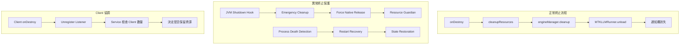
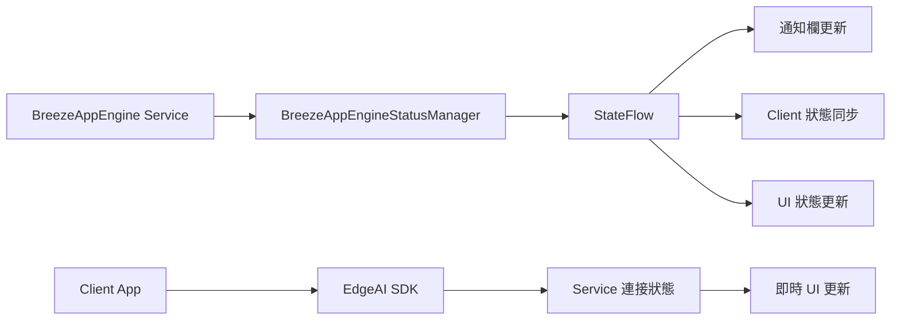
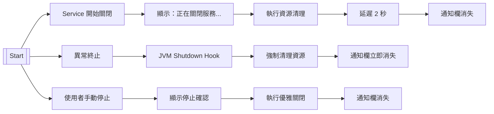

# BreezeAppEngine-Client-Notification 優化計劃

## 📋 **執行摘要**

作為資深 Android 架構師，我整合了 BreezeApp Engine Service、Client 端和通知欄三者關係的全面優化方案。本計劃解決**資源管理、使用者體驗、服務穩定性**三大核心問題，提供一個**優雅、通用、健壯的架構解決方案**。

---

## 🎯 **核心問題分析**

### **1. 資源管理問題**

- **MTKLLMRunner 資源洩漏**：native library 未正確釋放導致下次啟動失敗
- **異常終止處理不足**：IDE rebuild、系統記憶體不足等場景缺乏保護
- **Client 生命週期不協調**：無 client 時資源未及時釋放

### **2. 使用者體驗問題**

- **服務啟動流程不直覺**：需要手動啟動兩個 App
- **通知欄資訊過於技術化**：顯示 "1 client connected" 等技術術語
- **狀態同步不及時**：Client 狀態與通知欄顯示有延遲
- **錯誤處理不夠友善**：只顯示技術錯誤訊息

### **3. 通知欄設計問題**

- **時機點不明確**：使用者不知道通知何時會消失
- **狀態不直覺**：技術術語讓使用者困惑
- **缺乏引導**：沒有明確的操作指引

---

## 🏗️ **優雅解決方案架構**

### **1. 多層次資源清理機制**



#### **A. Resource Guardian 通用資源管理**

```kotlin
class ResourceGuardian {
    private val resources = ConcurrentHashMap<String, () -> Unit>()
    private val isShuttingDown = AtomicBoolean(false)

    fun registerResource(name: String, cleanupAction: () -> Unit)
    fun unregisterResource(name: String)
    fun forceCleanupAll() // 異常終止時強制清理

    init {
        // JVM shutdown hook 處理 IDE rebuild
        Runtime.getRuntime().addShutdownHook(Thread {
            forceCleanupAll()
        })
    }
}
```

#### **B. 增強型 MTKLLMRunner**

```kotlin
class MTKLLMRunner {
    private val resourceGuardian = ResourceGuardian.getInstance()
    private val isForceUnloading = AtomicBoolean(false)

    override fun load(config: ModelConfig): Boolean {
        // 註冊資源到 Guardian
        resourceGuardian.registerResource("MTKLLMRunner-${config.modelName}") {
            forceUnload()
        }
        // 正常載入邏輯...
    }

    private fun performUnload() {
        if (isForceUnloading.compareAndSet(false, true)) {
            try {
                nativeResetLlm()
                nativeReleaseLlm()
                isLoaded.set(false)
                resourceGuardian.unregisterResource("MTKLLMRunner-${modelName}")
            } catch (e: Exception) {
                // 強制重置狀態，防止下次啟動失敗
                isLoaded.set(false)
            } finally {
                isForceUnloading.set(false)
            }
        }
    }

    protected fun finalize() {
        // 最後的安全網
        if (isLoaded.get()) forceUnload()
    }
}
```

### **2. 智慧服務啟動機制**

#### **A. 自動喚醒策略**

```kotlin
class SmartServiceConnector {
    fun connectWithAutoWakeup() {
        // 1. 嘗試直接連接
        if (tryDirectConnection()) return

        // 2. 自動啟動 Engine Service
        wakeUpBreezeAppEngineService()

        // 3. 等待服務就緒
        waitForServiceReady()

        // 4. 重試連接
        retryConnection()
    }
}
```

#### **B. 服務發現機制**

```kotlin
fun isBreezeAppEngineInstalled(): Boolean {
    return try {
        packageManager.getPackageInfo("com.mtkresearch.breezeapp.engine", 0)
        true
    } catch (e: PackageManager.NameNotFoundException) {
        false
    }
}
```

### **3. 使用者友善的通知設計**

#### **A. 狀態語言本地化**

```kotlin
sealed class UserFriendlyServiceState {
    object Idle : UserFriendlyServiceState() {
        val displayText = "AI 服務待命中"
    }
    data class Processing(val task: String) : UserFriendlyServiceState() {
        val displayText = "正在處理：$task"
    }
    data class Downloading(val model: String, val progress: Int) : UserFriendlyServiceState() {
        val displayText = "下載 AI 模型：$model"
    }
    data class Error(val userMessage: String) : UserFriendlyServiceState() {
        val displayText = "服務異常：$userMessage"
    }
    object ShuttingDown : UserFriendlyServiceState() {
        val displayText = "正在關閉服務..."
    }
}
```

#### **B. 增強型通知管理器**

```kotlin
class EnhancedNotificationManager(private val context: Context) {
    fun createUserFriendlyNotification(state: UserFriendlyServiceState): Notification {
        val builder = NotificationCompat.Builder(context, CHANNEL_ID)
            .setContentTitle("BreezeApp AI 服務")
            .setContentText(state.displayText)
            .setSmallIcon(state.icon)
            .setOngoing(state.isOngoing)

        when (state) {
            is UserFriendlyServiceState.Downloading -> {
                builder.setProgress(100, state.progress, false)
            }
            is UserFriendlyServiceState.Error -> {
                builder.addAction(createRetryAction())
                    .addAction(createHelpAction())
            }
            is UserFriendlyServiceState.ShuttingDown -> {
                builder.setSubText("請稍候，正在安全關閉...")
            }
        }

        return builder.build()
    }
}
```

### **4. Client-Service 生命週期協調**

#### **A. Service 端 Client 管理**

```kotlin
class ServiceClientManager {
    private val activeClients = ConcurrentHashMap<IBinder, ClientInfo>()
    private val noClientTimeoutJob = AtomicReference<Job?>(null)

    fun onClientConnected(binder: IBinder) {
        activeClients[binder] = ClientInfo(binder, System.currentTimeMillis())
        cancelNoClientTimeout()
        updateNotificationWithClientCount()
    }

    fun onClientDisconnected(binder: IBinder) {
        activeClients.remove(binder)
        if (activeClients.isEmpty()) {
            scheduleNoClientTimeout()
        }
        updateNotificationWithClientCount()
    }

    private fun onNoClientTimeout() {
        // 部分清理：卸載模型但保留服務結構
        engineManager.unloadAllModels()
        statusManager.setReady()
    }
}
```

#### **B. Client 端生命週期管理**

```kotlin
class ClientLifecycleManager {
    fun onClientDestroy() {
        cancelAllPendingRequests()
        unregisterFromService()
        cleanupLocalResources()
    }
}
```

### **5. 即時狀態同步機制**

#### **A. 狀態同步架構**



#### **B. 防抖動機制**

```kotlin
class DebouncedStatusUpdater {
    private val statusFlow = MutableStateFlow<ServiceState>(ServiceState.Idle)

    fun updateStatus(newStatus: ServiceState) {
        if (shouldUpdateStatus(newStatus)) {
            statusFlow.value = newStatus
            updateNotification()
            notifyClients()
        }
    }
}
```

### **6. 友善的錯誤處理**

#### **A. 錯誤分類與處理**

```kotlin
sealed class UserFriendlyError {
    object BreezeAppEngineNotInstalled : UserFriendlyError() {
        val userMessage = "需要安裝 BreezeApp Engine 才能使用 AI 功能"
        val action = "前往安裝"
    }

    object ServiceUnavailable : UserFriendlyError() {
        val userMessage = "AI 服務暫時無法使用，請稍後再試"
        val action = "重試"
    }

    object NetworkError : UserFriendlyError() {
        val userMessage = "網路連接不穩定，請檢查網路設定"
        val action = "檢查網路"
    }
}
```

#### **B. 錯誤恢復機制**

```kotlin
class ErrorRecoveryManager {
    fun handleError(error: UserFriendlyError) {
        when (error) {
            is BreezeAppEngineNotInstalled -> {
                showInstallationGuide()
                openPlayStore()
            }
            is ServiceUnavailable -> {
                showRetryDialog()
                scheduleRetry()
            }
            is NetworkError -> {
                showNetworkCheckDialog()
                openNetworkSettings()
            }
        }
    }
}
```

---

## 🎨 **通知欄消失時機設計**

### **1. 通知欄消失的時機點**


```

### **2. 使用者體驗設計原則**

#### **A. 狀態透明化**

- **關閉過程可見**：使用者能看到服務正在安全關閉
- **進度指示**：下載、處理等狀態有明確進度
- **錯誤友善化**：技術錯誤轉換為使用者能理解的語言

#### **B. 操作直覺化**

- **重試按鈕**：連接失敗時提供重試選項
- **幫助入口**：錯誤時提供解決方案
- **狀態說明**：每個狀態都有清楚的說明

#### **C. 時機點明確**

- **正常關閉**：延遲 2 秒讓使用者看到關閉狀態
- **異常終止**：立即消失，避免混淆
- **手動停止**：確認後立即執行

---

## 🚀 **實作階段**

### **Phase 1: 核心資源管理**

- [ ] 實作 `ResourceGuardian` 通用資源管理
- [ ] 增強 `MTKLLMRunner` 資源清理機制
- [ ] 修改 `BreezeAppEngineService` 生命週期管理
- [ ] 添加 JVM shutdown hook 和異常終止檢測

### **Phase 2: 智慧服務啟動**

- [ ] 實作 `SmartServiceConnector` 自動喚醒機制
- [ ] 添加 Engine App 安裝檢查
- [ ] 實現自動喚醒和重試連接邏輯

### **Phase 3: 使用者友善通知**

- [ ] 定義 `UserFriendlyServiceState` 狀態
- [ ] 實作 `EnhancedNotificationManager`
- [ ] 更新通知內容為使用者友善語言
- [ ] 添加多語言支援

### **Phase 4: Client-Service 協調**

- [ ] 實作 `ServiceClientManager` Client 管理
- [ ] 添加 client timeout 邏輯
- [ ] 整合到現有的 listener 管理
- [ ] 實現即時狀態同步機制

### **Phase 5: 錯誤處理改進**

- [ ] 定義 `UserFriendlyError` 錯誤分類
- [ ] 實現錯誤恢復機制
- [ ] 添加使用者引導和重試機制

### **Phase 6: 測試與優化**

- [ ] 異常終止測試（IDE rebuild、系統記憶體不足等）
- [ ] 使用者體驗測試（通知欄消失時機、錯誤處理等）
- [ ] 性能測試和穩定性驗證

---

## 📊 **預期效果**

### **技術指標改善**

- **資源洩漏率**：大幅降低，確保服務穩定重啟
- **重啟成功率**：顯著提升，減少啟動失敗
- **清理時間**：優化資源清理效率
- **記憶體使用量**：智能管理，節省系統資源

### **使用者體驗改善**

- **通知欄理解度**：從技術術語轉換為使用者友善語言
- **錯誤處理滿意度**：提供明確的解決方案和重試機制
- **服務穩定性評分**：多層次保護確保服務穩定運行

---

## 🎯 **架構優勢**

### **1. 通用性**

- **Resource Guardian**：可應用於所有 native 資源管理
- **模組化設計**：各組件獨立，易於維護和擴展
- **向後相容**：保持現有 API 不變

### **2. 健壯性**

- **多層次保護**：JVM shutdown hook + Resource Guardian + finalize
- **異常終止處理**：檢測各種異常終止場景並強制清理
- **錯誤恢復**：提供明確的錯誤解決方案

### **3. 使用者友善**

- **自動化流程**：減少使用者手動操作
- **友善語言**：降低技術門檻
- **即時反饋**：提供即時、準確的狀態反饋

### **4. 可維護性**

- **清晰架構**：遵循 Clean Architecture 原則
- **可測試性**：每個組件都可以獨立測試
- **漸進式實施**：可以分階段實施改進

---

## 📝 **總結**

### **核心改進點**

1. **多層次資源保護**：確保在任何異常情況下都能正確清理資源
2. **智慧服務啟動**：自動化服務啟動流程，提升使用者便利性
3. **使用者友善通知**：技術術語轉換為使用者能理解的語言
4. **明確的消失時機**：根據不同場景設計不同的通知欄消失時機
5. **即時狀態同步**：提供即時、準確的狀態反饋
6. **友善錯誤處理**：提供明確的錯誤解決方案

### **開發者價值**

- **減少除錯時間**：不再需要處理資源洩漏問題
- **提升開發效率**：穩定的服務重啟機制
- **改善使用者體驗**：直覺的通知欄設計和錯誤處理

### **使用者價值**

- **降低學習成本**：新使用者更容易上手
- **提升使用信心**：明確的狀態反饋
- **減少挫折感**：友善的錯誤處理
- **提升效率**：自動化流程節省時間

這個優化計劃將大幅提升 BreezeApp Engine 的穩定性、使用者體驗和開發效率，使其成為一個真正優雅、健壯且易於使用的 AI 服務架構。 