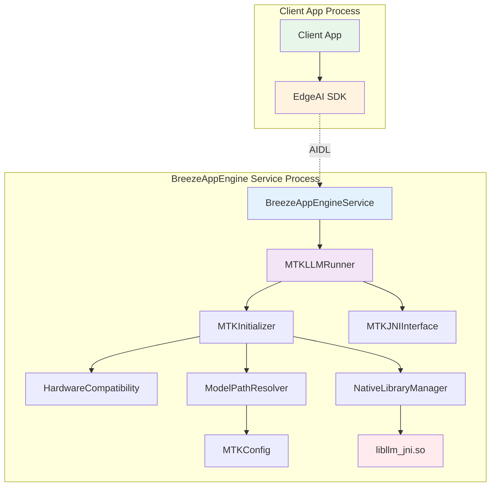

# MTKRunner 開發計劃 (架構修正版)
*BreezeApp Engine 架構下的 MTK NPU 加速 Runner 實作*

## 📋 **專案概述**

### 🎯 **目標**
BreezeApp Engine 架構，開發一個支援 MTK NPU 加速的 `MTKRunner`，整合舊版 BreezeApp 中經過驗證的 MTK 功能，同時遵循 Clean Code 與 Clean Architecture 原則。

### 🏗️ **架構職責修正**
**重要架構決策**：將 MTK 相關模組從 EdgeAI 移至 breeze-app-engine，符合正確的職責分離：

- **EdgeAI**: 純粹的客戶端 SDK，專注於 API 介面與通訊
- **breeze-app-engine**: AI 服務提供者，負責硬體檢測、Runner 實作、模型管理

### 🔍 **舊版分析結果**
從 `LLMEngineService.java` 分析得出的關鍵功能：
- ✅ **原生庫管理**：僅需載入 `llm_jni.so`（移除 `libsigchain.so`）
- ✅ **硬體兼容性檢測**：MTK NPU 可用性檢測
- ✅ **初始化與重試機制**：最多 5 次重試，包含錯誤恢復
- ✅ **串流推論**：支援 `TokenCallback` 與參數配置
- ✅ **資源管理**：適當的清理與釋放機制

### 🚫 **移除的依賴**
- **libsigchain.so**：原用於信號處理，在新架構下不再必要
- **SharedPreferences 濫用**：改用配置注入
- **硬編碼常數**：改用配置文件管理
- **混亂的模型路徑管理**：改用統一的資源管理

---

## 🏗️ **架構設計 (修正版)**

### 📦 **模組分層 (正確的職責分離)**

```
breeze-app-engine/
├── src/main/java/com/mtkresearch/breezeapp/engine/
│   ├── hardware/
│   │   ├── HardwareCompatibility.kt      # 硬體兼容性檢測
│   │   └── MTKHardwareDetector.kt        # MTK 特定硬體檢測
│   ├── infrastructure/
│   │   ├── NativeLibraryManager.kt       # 原生庫管理（僅 llm_jni.so）
│   │   └── ModelPathResolver.kt          # 模型路徑解析器
│   ├── config/
│   │   ├── MTKConfig.kt                  # MTK 配置數據類別
│   │   └── RunnerConfiguration.kt        # Runner 配置管理
│   └── data/runner/
│       ├── MTKRunner.kt                  # 主要 Runner 實作
│       ├── MTKJNIInterface.kt            # JNI 方法包裝
│       └── MTKInitializer.kt             # 初始化邏輯
├── assets/
│   ├── runner_config.json                # 更新 MTKRunner 配置
│   └── default_config.json               # 更新預設參數
└── libs/
    └── arm64-v8a/
        └── libllm_jni.so                 # MTK JNI 庫

EdgeAI/
├── src/main/java/com/mtkresearch/breezeapp/edgeai/
│   ├── EdgeAI.kt                         # 客戶端 API 入口
│   ├── ChatModels.kt                     # 標準化 API 模型
│   ├── TTSModels.kt                      # TTS API 模型
│   └── ASRModels.kt                      # ASR API 模型
└── src/main/aidl/
    └── com/mtkresearch/breezeapp/edgeai/
        └── IBreezeAppEngineService.aidl         # AIDL 介面定義
```

### 🔄 **依賴關係圖 (修正版)**



---

## 📋 **開發階段 (架構修正版)**

### 🎯 **Phase 1: 基礎設施建設 (2-3 天)**

#### **Task 1.1: 硬體兼容性檢測模組**
```kotlin
// breeze-app-engine/src/main/java/com/mtkresearch/breezeapp/engine/hardware/HardwareCompatibility.kt
object HardwareCompatibility {
    fun isMTKNPUSupported(): Boolean {
        // 檢測 MTK NPU 可用性
        // 基於 HWCompatibility.java 的邏輯，但簡化為 NPU 檢測
    }
    
    fun getMTKChipsetInfo(): ChipsetInfo? {
        // 獲取 MTK 晶片組資訊
    }
    
    fun validateMTKEnvironment(): ValidationResult {
        // 驗證 MTK 執行環境
    }
}
```

#### **Task 1.2: 原生庫管理器（移除 libsigchain）**
```kotlin
// breeze-app-engine/src/main/java/com/mtkresearch/breezeapp/engine/infrastructure/NativeLibraryManager.kt
class NativeLibraryManager {
    fun loadMTKLibrary(): LibraryLoadResult {
        // 僅載入 llm_jni.so，移除 sigchain 依賴
        // 移除 100ms 延遲等待邏輯
    }
    
    fun isLibraryLoaded(): Boolean
    fun unloadLibrary()
}
```

#### **Task 1.3: MTK 配置數據類別**
```kotlin
// breeze-app-engine/src/main/java/com/mtkresearch/breezeapp/engine/config/MTKConfig.kt
data class MTKConfig(
    val modelPath: String,
    val maxInitAttempts: Int = 5,
    val initDelayMs: Long = 200,
    val cleanupTimeoutMs: Long = 5000,
    val defaultTemperature: Float = 0.8f,
    val defaultTopK: Int = 40,
    val defaultRepetitionPenalty: Float = 1.1f
)
```

#### **Task 1.4: 模型路徑解析器**
```kotlin
// breeze-app-engine/src/main/java/com/mtkresearch/breezeapp/engine/infrastructure/ModelPathResolver.kt
class ModelPathResolver(private val config: MTKConfig) {
    fun resolveModelPath(): String
    fun validateModelFile(): ValidationResult
    fun getYAMLConfig(): MTKYAMLConfig
}
```

### 🎯 **Phase 2: MTKLLMRunner 核心實作 (3-4 天)**

#### **Task 2.1: MTKLLMRunner 主類別**
```kotlin
// breeze-app-engine/src/main/java/com/mtkresearch/breezeapp/engine/data/runner/MTKRunner.kt
class MTKLLMRunner(
    private val config: MTKConfig,
    private val hardwareCompatibility: HardwareCompatibility,
    private val nativeLibraryManager: NativeLibraryManager,
    private val initializer: MTKInitializer
) : BaseRunner(), FlowStreamingRunner {
    
    override fun isSupported(): Boolean
    override suspend fun initialize(): Boolean
    override suspend fun streamInference(request: InferenceRequest): Flow<InferenceResult>
    override suspend fun cleanup()
}
```

#### **Task 2.2: JNI 介面包裝**
```kotlin
// breeze-app-engine/src/main/java/com/mtkresearch/breezeapp/engine/data/runner/MTKJNIInterface.kt
class MTKJNIInterface {
    external fun nativeInitLlm(modelPath: String, useNPU: Boolean): Boolean
    external fun nativeStreamingInference(
        prompt: String,
        maxTokens: Int,
        useStreaming: Boolean,
        callback: TokenCallback,
        temperature: Float,
        topK: Int,
        repetitionPenalty: Float
    ): String
    external fun nativeResetLlm()
    external fun nativeReleaseLlm()
    external fun nativeSwapModel(cacheSize: Int)
}
```

#### **Task 2.3: 初始化邏輯**
```kotlin
// breeze-app-engine/src/main/java/com/mtkresearch/breezeapp/engine/data/runner/MTKInitializer.kt
class MTKInitializer(
    private val config: MTKConfig,
    private val nativeLibraryManager: NativeLibraryManager,
    private val jniInterface: MTKJNIInterface
) {
    suspend fun initialize(): InitializationResult {
        // 實作重試機制與錯誤恢復
        // 基於 initializeMTKBackend() 的邏輯
    }
    
    private suspend fun attemptInitialization(): Boolean
    private suspend fun handleInitializationError()
}
```

#### **Task 2.4: 串流推論功能**
```kotlin
// 在 MTKLLMRunner 中實作
override suspend fun streamInference(request: InferenceRequest): Flow<InferenceResult> = flow {
    val callback = object : TokenCallback {
        override fun onToken(token: String) {
            emit(InferenceResult.Token(token))
        }
    }
    
    val result = jniInterface.nativeStreamingInference(
        request.prompt,
        request.maxTokens,
        true,
        callback,
        request.temperature,
        request.topK,
        request.repetitionPenalty
    )
    
    emit(InferenceResult.Complete(result))
}
```

### 🎯 **Phase 3: 配置與註冊 (1-2 天)**

#### **Task 3.1: 更新 runner_config.json**
```json
{
  "runners": [
    {
      "id": "mtk_runner",
      "name": "MTK NPU Runner",
      "className": "com.mtkresearch.breezeapp.engine.data.runner.MTKLLMRunner",
      "capabilities": ["text_generation", "streaming"],
      "priority": 10,
      "requirements": {
        "hardware": "mtk_npu",
        "minRam": "4GB",
        "architecture": "arm64"
      }
    }
  ]
}
```

#### **Task 3.2: 更新 default_config.json**
```json
{
  "mtk_runner": {
    "maxInitAttempts": 5,
    "initDelayMs": 200,
    "cleanupTimeoutMs": 5000,
    "defaultParameters": {
      "temperature": 0.8,
      "topK": 40,
      "repetitionPenalty": 1.1,
      "maxTokens": 2048
    }
  }
}
```

#### **Task 3.3: 實作 isSupported() 方法**
```kotlin
companion object {
    fun isSupported(): Boolean {
        return HardwareCompatibility.isMTKNPUSupported() && 
               NativeLibraryManager.isLibraryAvailable("llm_jni")
    }
}
```

#### **Task 3.4: 測試註冊與發現**
- 驗證 BreezeApp Engine 能正確發現 MTKLLMRunner
- 測試優先級排序
- 驗證 fallback 機制

### 🎯 **Phase 4: 整合與測試 (2-3 天)**

#### **Task 4.1: 單元測試**
```kotlin
// breeze-app-engine/src/test/java/com/mtkresearch/breezeapp/engine/data/runner/MTKRunnerTest.kt
class MTKRunnerTest {
    @Test fun testInitialization()
    @Test fun testStreamingInference()
    @Test fun testErrorHandling()
    @Test fun testResourceCleanup()
}
```

#### **Task 4.2: 整合測試**
- MTKLLMRunner 與 BreezeApp Engine 的串接測試
- 與其他 Runner 的 fallback 測試
- 長時間運行穩定性測試

#### **Task 4.3: 性能測試**
- MTK NPU vs CPU 效能比較
- 記憶體使用量分析
- 推論速度基準測試

#### **Task 4.4: 文檔與範例**
- API 使用指南
- 配置說明文檔
- 故障排除指南

---

## 🎯 **架構優勢 (修正版)**

### ✅ **正確的職責分離**
1. **EdgeAI SDK**: 專注於客戶端 API 與通訊
2. **breeze-app-engine**: 專注於 AI 服務實作與硬體管理
3. **MTKLLMRunner**: 專注於 MTK NPU 推論邏輯

### ✅ **開源社群友好**
1. **EdgeAI**: 穩定的 API，很少需要更新
2. **BreezeApp Engine**: 活躍開發，新 Runner 與硬體支援
3. **獨立部署**: BreezeApp Engine 可獨立更新，無需更新所有客戶端

### ✅ **可維護性提升**
1. **模組化設計**: 每個功能獨立模組
2. **依賴注入**: 便於測試與維護
3. **協程支援**: 非阻塞的異步操作
4. **Flow 串流**: 響應式的推論結果

---

## 🔧 **技術細節**

### 🚫 **移除的依賴項**
1. **libsigchain.so**：
   - 原用途：信號處理
   - 移除原因：在新架構下不再必要，且可能導致相容性問題
   - 影響：移除載入邏輯與相關的 100ms 延遲

2. **SharedPreferences 濫用**：
   - 改用依賴注入的配置管理
   - 統一的配置來源

3. **硬編碼常數**：
   - 移至配置文件
   - 支援運行時調整

### ✅ **保留的核心功能**
1. **重試機制**：最多 5 次初始化嘗試
2. **錯誤恢復**：`nativeResetLlm()` 和 `nativeReleaseLlm()`
3. **串流推論**：`TokenCallback` 支援
4. **參數配置**：temperature, topK, repetitionPenalty
5. **資源管理**：適當的清理與釋放

### 🎯 **優化改進**
1. **模組化設計**：每個功能獨立模組
2. **依賴注入**：便於測試與維護
3. **協程支援**：非阻塞的異步操作
4. **Flow 串流**：響應式的推論結果
5. **統一配置**：YAML 與 JSON 配置支援

---

## 📊 **進度追蹤**

### 🗓️ **時程安排**
- **Phase 1**：Day 1-3 (基礎設施)
- **Phase 2**：Day 4-7 (核心實作)
- **Phase 3**：Day 8-9 (配置註冊)
- **Phase 4**：Day 10-12 (測試整合)

### ✅ **完成標準**
- [ ] 所有單元測試通過
- [ ] 整合測試驗證
- [ ] 性能達到預期基準
- [ ] 文檔完整且準確
- [ ] Code Review 通過

### 🎯 **成功指標**
1. **功能性**：MTKLLMRunner 能正常初始化並執行推論
2. **穩定性**：長時間運行無記憶體洩漏
3. **性能**：相較 CPU 後端有顯著提升
4. **可維護性**：代碼結構清晰，易於擴展

---

## 🚀 **後續擴展**

### 📈 **Phase 5: 進階功能**
- 動態模型切換
- 批次推論支援
- 量化模型支援
- 多線程優化

### 🔄 **持續改進**
- 性能監控與調優
- 錯誤處理機制完善
- 配置熱更新支援
- 更多硬體平台支援

---

*此計劃遵循 Clean Architecture 原則與正確的職責分離，確保代碼的可測試性、可維護性和可擴展性。* 

---

## 📦 模型下載與版本管理設計方案

### 目標與重要性
BreezeApp Engine 預期支援多種 Runner（如 MTKLLMRunner、CPURunner、VLMRunner 等），模型格式、來源、結構高度多樣。為確保可擴充性、穩定性與多硬體平台支援，需建立統一且彈性的模型下載與版本管理機制。

### 架構構想
- **統一管理**：所有 Runner（MTK、CPU、VLM...）的模型下載、校驗、版本切換、清理等，皆透過統一機制管理。
- **高彈性**：支援多來源（Hugging Face、CDN、GCS...）、多檔案、多格式（ONNX、PT、TFLite...）、多版本。
- **易擴充**：未來可無痛支援 LoRA、Diffusion、語音等新型態模型。
- **高可用**：下載過程具備續傳、重試、進度回報、錯誤回滾與完整性校驗。

#### 架構圖（高階）
```mermaid
graph TD
    subgraph "App/BreezeAppEngine"
        A[ModelManager] --> B[ModelDownloader]
        A --> C[ModelVersionStore]
        A --> D[ModelValidator]
        A --> E[ModelRegistry]
    end
    B --> F[DownloadSource(HF/CDN/GCS)]
    B --> G[FileSystem]
    D --> G
    C --> G
    E --> G
```

### 模組劃分與責任
- **ModelManager**：核心門面，提供高階 API（下載、查詢、切換、刪除、校驗模型版本），管理所有模型 metadata 與狀態。
- **ModelDownloader**：多檔案下載、續傳、重試、進度回報，支援多來源，負責下載過程異常處理與回滾。
- **ModelVersionStore**：管理本地已下載模型 metadata（名稱、版本、檔案列表、下載狀態、校驗碼等），提供查詢、切換、刪除 API。
- **ModelValidator**：校驗檔案完整性（hash、size、簽章等），支援下載後自動驗證，失敗自動回滾。
- **ModelRegistry**：管理所有可用模型的「來源清單」與「結構描述」，支援硬體過濾。

### 介面設計（高階）
```kotlin
interface ModelManager {
    fun listAvailableModels(): List<ModelInfo>
    fun listDownloadedModels(): List<ModelInfo>
    fun getCurrentModel(runner: String): ModelInfo?
    fun downloadModel(modelId: String, listener: DownloadListener): Job
    fun switchModel(modelId: String): Boolean
    fun deleteModel(modelId: String): Boolean
    fun cleanupOldVersions(keepLatest: Int = 1): Int
}

interface ModelDownloader {
    fun download(model: ModelInfo, listener: DownloadListener): Job
    fun pause(modelId: String)
    fun resume(modelId: String)
    fun cancel(modelId: String)
}
interface DownloadListener {
    fun onProgress(modelId: String, percent: Int, speed: Long)
    fun onCompleted(modelId: String)
    fun onError(modelId: String, error: Throwable)
}

interface ModelVersionStore {
    fun getDownloadedModels(): List<ModelInfo>
    fun getModelFiles(modelId: String): List<File>
    fun saveModelMetadata(modelInfo: ModelInfo): Boolean
    fun removeModel(modelId: String): Boolean
    fun getCurrentModelId(runner: String): String?
    fun setCurrentModelId(runner: String, modelId: String): Boolean
}

interface ModelValidator {
    fun validate(model: ModelInfo): Boolean
    fun getValidationError(model: ModelInfo): String?
}

interface ModelRegistry {
    fun listAllModels(): List<ModelInfo>
    fun getModelInfo(modelId: String): ModelInfo?
    fun filterByHardware(hw: String): List<ModelInfo>
}

// ModelInfo 資料結構範例

data class ModelInfo(
    val id: String, // e.g. breeze2-3b-spin-240701-mtk
    val name: String,
    val version: String, // e.g. 240701, v1.2.3, 20240701
    val runner: String, // mtk, cpu, vlm, ...
    val files: List<ModelFile>,
    val hash: String?, // optional
    val size: Long,
    val backend: String, // mtk, cpu, ...
    val extra: Map<String, Any> = emptyMap()
)
data class ModelFile(
    val url: String,
    val fileName: String,
    val size: Long,
    val hash: String?
)
```

### 關鍵流程
- **下載流程**：
    1. 使用 ModelRegistry 查詢可用模型，選擇目標 ModelInfo
    2. 呼叫 ModelManager.downloadModel(modelId, listener)
    3. ModelDownloader 依序下載所有檔案，支援續傳、重試、進度回報
    4. 每個檔案下載完成後，ModelValidator 進行 hash/size 校驗
    5. 全部檔案通過校驗後，ModelVersionStore 記錄 metadata，並標記為可用
    6. 若任一檔案失敗，則自動回滾（刪除不完整檔案）
- **版本切換**：ModelManager.switchModel(modelId) → ModelVersionStore 更新當前使用的 modelId
- **清理舊版**：ModelManager.cleanupOldVersions(keepLatest = 1)
- **查詢/刪除**：ModelManager.listDownloadedModels()、ModelManager.deleteModel(modelId)
- **下載進度與續傳**：DownloadListener 回報進度、速度、錯誤，支援中斷續傳（檔案以 .part 或 .tmp 結尾，下載完成後 rename）
- **錯誤處理**：網路失敗自動重試、空間不足即時回報、校驗失敗自動回滾、使用者取消即時終止

### 命名與版本策略建議
- **模型 ID**：`<name>-<size>-<date>-<backend>` 例：`breeze2-3b-spin-240701-mtk`
- **版本號**：建議用 `YYYYMMDD` 或 `v1.2.3`，可與日期結合
- **檔案結構**：
  ```
  /models/
    /breeze2-3b-spin-240701-mtk/
      model.pte
      tokenizer.json
      config.json
      ...
  ```
- **metadata**：每個模型資料夾下可有 `model.json` 記錄所有檔案 hash、版本、來源等

### 與 MTKLLMRunner/多 Runner 架構的關聯
- 所有 Runner（MTKLLMRunner、CPURunner、VLMRunner...）皆透過 ModelManager 查詢/下載/切換模型，無需關心底層來源與結構差異。
- MTKLLMRunner 只需取得正確的 ModelInfo 與本地路徑，即可進行初始化與推論。
- 支援多版本共存、動態切換、硬體過濾，確保最佳相容性與用戶體驗。

--- 