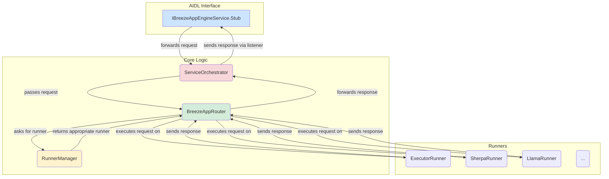

# BreezeApp-engine Internal Architecture

This document details the internal architecture of the `BreezeApp-engine` module.

## Component Diagram

The following diagram shows the flow of a request within the engine.

## Component Descriptions

*   **IBreezeAppEngineService.Stub:**
    *   This is the entry point into the engine. It's an implementation of the AIDL interface that receives raw requests from the `EdgeAI` SDK.
    *   Its sole responsibility is to pass the request to the `ServiceOrchestrator` and return the binder to the client.

*   **ServiceOrchestrator:**
    *   Acts as the central coordinator for the service. It manages the lifecycle of all major components, including the `BreezeAppRouter` and `RunnerManager`.
    *   It initializes the system and handles cleanup on destruction.

*   **BreezeAppRouter:**
    *   The brain of the engine. It receives a request and is responsible for the entire execution lifecycle.
    *   It queries the `RunnerManager` to get the correct runner for the request.
    *   It manages a coroutine scope for each request, allowing for cancellation.
    *   It passes the final response back to the client listener.

*   **RunnerManager:**
    *   A factory and registry for all available `BreezeAppRunner` implementations.
    *   It inspects a request (e.g., the model name or type) and determines which runner is capable of handling it.

*   **Runners (ExecutorRunner, SherpaRunner, etc.):**
    *   These are the workhorses. Each runner is a specialized class that knows how to interact with a specific AI library (e.g., PyTorch Executor, Sherpa-ONNX).
    *   It performs the actual inference and produces a stream of responses, which it sends back to the `BreezeAppRouter` via a listener callback.
