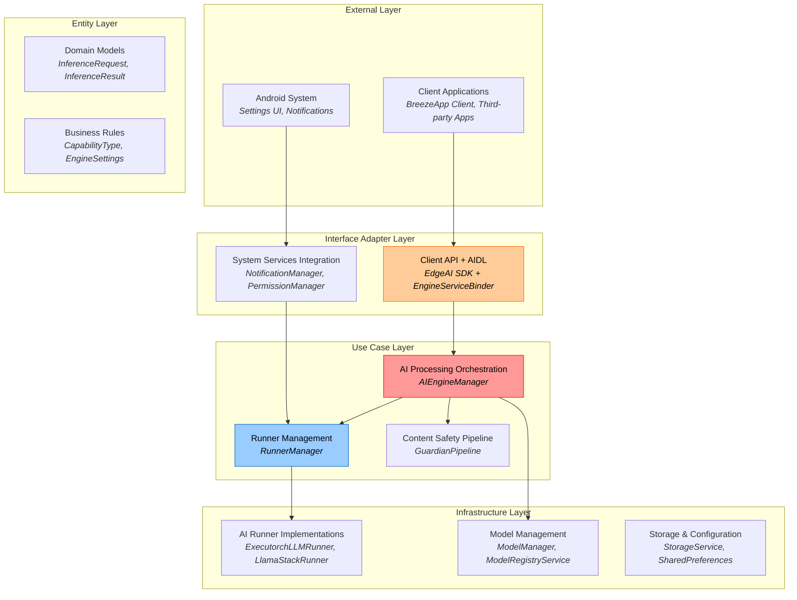
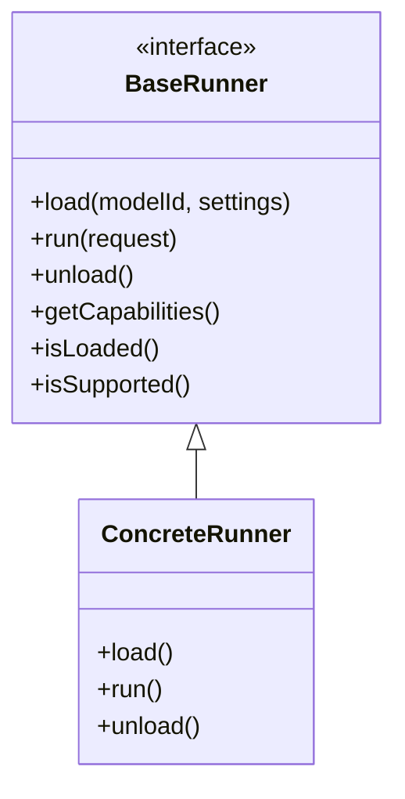

# BreezeApp Engine Architecture

This document describes the high-level architecture patterns and design principles of the BreezeApp Engine. It focuses on stable architectural concepts rather than specific implementation details.

## Core Architecture Pattern

BreezeApp Engine follows **Clean Architecture** principles with clear separation of concerns:



## Architectural Principles

### 1. Clean Architecture Compliance
- **Dependency Inversion**: High-level modules don't depend on low-level modules
- **Single Responsibility**: Each component has one reason to change
- **Interface Segregation**: Clients depend only on interfaces they use
- **Open/Closed**: Open for extension, closed for modification

### 2. Capability-Based Design
The system routes requests based on AI capabilities rather than specific implementations:

```
Request + Capability Type → Best Available Runner → Result
```

**Core Capabilities**:
- **LLM**: Large Language Model text generation
- **VLM**: Vision-Language Model multimodal processing
- **ASR**: Automatic Speech Recognition
- **TTS**: Text-to-Speech synthesis
- **GUARDIAN**: Content safety and filtering

### 3. Runner Pattern
All AI implementations follow a common contract:



**Key Benefits**:
- **Pluggability**: Add new AI backends without changing core logic
- **Testability**: Mock runners for testing and development
- **Flexibility**: Switch between local/remote/cloud implementations
- **Hardware Adaptation**: Automatic selection based on device capabilities

## Request Processing

For detailed request processing flows, see [Data Flow](./data-flow.md) which covers:
- LLM, ASR, and TTS processing pipelines
- Streaming and non-streaming flows
- Content safety integration
- Error handling strategies

## Configuration Strategy

The system uses a **3-layer parameter hierarchy**:

1. **Runner Defaults** (Base layer): Sensible defaults from runner implementations
2. **Engine Settings** (Configuration layer): Administrator/user preferences
3. **Client Overrides** (Request layer): Limited per-request customization

```
Final Parameters = Runner Defaults + Engine Settings + Client Overrides
                  (lowest precedence)              (highest precedence)
```

This approach ensures:
- **Consistency**: Validated, administrator-controlled settings
- **Security**: Clients cannot override critical parameters
- **Flexibility**: Per-request customization for appropriate parameters

**Note on Client Overrides:**
Client overrides are provided via the `params` field in the `InferenceRequest`. These parameters are passed directly to the selected runner, allowing for dynamic, per-request adjustments to inference behavior (e.g., `temperature`, `max_tokens`, or specific `model` IDs). The system prioritizes these client-provided parameters over Engine Settings and Runner Defaults.

## Model Management

For comprehensive model management details, see [Model Management Guide](../guides/model-management.md) which covers:
- Model declaration and discovery
- Automatic download process
- Storage structure and management
- User-facing model operations

## Scalability Patterns

### Resource Management
- **Lazy Loading**: Components initialized only when needed
- **Memory Pressure Response**: Intelligent resource cleanup
- **Concurrent Processing**: Multiple requests handled simultaneously
- **Cancellation Support**: Long-running operations can be cancelled

### Performance Optimization
- **Runner Caching**: Loaded runners reused across requests
- **Model Sharing**: Same model serves multiple concurrent requests  
- **Hardware Optimization**: Automatic selection of optimal compute resources
- **Asynchronous Processing**: Non-blocking operations throughout

## Extension Points

The architecture provides several extension points for future enhancement:

### New AI Capabilities
Add new capability types by:
1. Defining new `CapabilityType` enum value
2. Implementing runners that support the capability
3. System automatically integrates new capability

### New Runner Implementations  
For detailed runner development guide, see [Runner Development](../guides/runner-development.md).

### Custom Content Safety
Extend safety pipeline by:
1. Implementing guardian runner for specific safety policies
2. Configuring safety rules through settings
3. System automatically applies safety checks

## Design Goals Achieved

✅ **Maintainability**: Clear separation of concerns, stable interfaces <br>
✅ **Testability**: Mock implementations, dependency injection <br>
✅ **Extensibility**: Plugin-based runner system, capability-driven routing <br>
✅ **Performance**: Lazy loading, resource optimization, streaming support <br>
✅ **Reliability**: Structured error handling, graceful degradation <br>
✅ **Security**: Content safety integration, parameter validation <br>
✅ **Usability**: Automatic model management, progress feedback <br>

---

## Related Documentation

- **[Data Flow](./data-flow.md)** - Request processing flows, streaming, error handling
- **[Model Management](../guides/model-management.md)** - Model lifecycle and management
- **[Runner Development](../guides/runner-development.md)** - Creating custom AI runners
- **[Security Model](../security/security-model.md)** - Permission-based access control

---

## Technology Stack

### Platform

- **OS**: Android 14+ (API 34)
- **Language**: Kotlin 100% (Java 11 compatibility)
- **Build System**: Gradle 8.x, Android Gradle Plugin 8.x
- **Minimum SDK**: 34
- **Target SDK**: 34

### AI Frameworks

| Framework | Purpose | Version |
|-----------|---------|---------|
| **ExecuTorch** | LLM/VLM inference | 0.2.0+ |
| **Sherpa ONNX** | ASR/TTS | Latest |
| **MTK NPU SDK** | Hardware acceleration | MediaTek proprietary |
| **NNAPI** | Fallback acceleration | Android built-in |

### Android Components

- **Service**: Background service with AIDL
- **AIDL**: 4 interface files (`IAIEngineService.aidl`, callbacks)
- **Permissions**: 1 custom permission (`BIND_ENGINE_SERVICE`, normal protection)
- **Process**: Isolated process (`:ai_engine`)
- **Foreground Service**: Type `dataSync`

### Testing

- **Unit Tests**: JUnit 4, Mockk, Robolectric
- **Integration Tests**: AndroidJUnit4, Espresso
- **Coverage**: ~85% for security-critical code

### Build & Release

- **ProGuard/R8**: Code shrinking and obfuscation
- **Play App Signing**: Google-managed certificate
- **Versioning**: Semantic versioning (MAJOR.MINOR.PATCH)

---

## Key Design Decisions

### DD1: Why AIDL instead of REST API?

**Decision**: Use AIDL (Android IPC) for service communication.

**Rationale**:
- ✅ Native Android mechanism (no network overhead)
- ✅ Type-safe interface generation
- ✅ Better performance (<1ms overhead vs. HTTP ~50ms)
- ✅ Automatic marshaling/unmarshaling
- ✅ Built-in lifecycle management
- ✅ No need for localhost server (security risk)

**Trade-offs**:
- ❌ Android-specific (not cross-platform)
- ❌ Limited to 1MB transaction size (Binder limit)
- ❌ More complex than REST for developers unfamiliar with Android

**Mitigation**: For large data (images, audio), use `ParcelFileDescriptor` to transfer file handles instead of raw bytes.

### DD2: Why Normal Permission Protection?

**Decision**: Use `normal` protection level for `BIND_ENGINE_SERVICE` permission.

**Rationale**:
- ✅ Automatic grant (no user prompt needed)
- ✅ Simpler deployment (no certificate coordination)
- ✅ Easier for third-party integration
- ✅ Still requires explicit permission declaration

**Trade-offs**:
- ❌ Any app can declare the permission and bind
- ❌ Relies on obscurity (service not publicly documented)

**Note**: Originally designed with `signature` protection, but changed to `normal` for simpler deployment. Service binding is still controlled via permission requirement.

### DD3: Why Separate Process (`:ai_engine`)?

**Decision**: Run service in isolated process.

**Rationale**:
- ✅ Memory isolation (LLM models use 2-4GB RAM)
- ✅ Crash isolation (engine crash doesn't crash clients)
- ✅ Easier to kill/restart for memory management
- ✅ Better thermal management

**Trade-offs**:
- ❌ IPC overhead (~0.5ms per call)
- ❌ More complex debugging (multiple processes)

**Benchmarks**: IPC overhead negligible compared to inference time (100ms-10s).

### DD4: Why Zero Data Collection?

**Decision**: No telemetry, analytics, or user data collection.

**Rationale**:
- ✅ User privacy (core value proposition)
- ✅ GDPR/CCPA compliance (no PII collection)
- ✅ Offline-first design (no dependency on servers)
- ✅ Trust building (transparent open-source)

**Trade-offs**:
- ❌ No usage analytics for product improvements
- ❌ Harder to diagnose issues in the wild

**Mitigation**: Provide opt-in crash reporting via Firebase Crashlytics (future).

### DD5: Why LRU Cache for Signature Verification?

**Decision**: Cache signature verification results (5-minute TTL).

**Rationale**:
- ✅ Performance target: <10ms per verification
- ✅ Clients bind/unbind frequently (activity lifecycle)
- ✅ Signature won't change within session

**Trade-offs**:
- ❌ Potential security window (5 minutes) if app is reinstalled with different cert

**Mitigation**: 5-minute TTL is short enough; also check cache validity on app update events.
