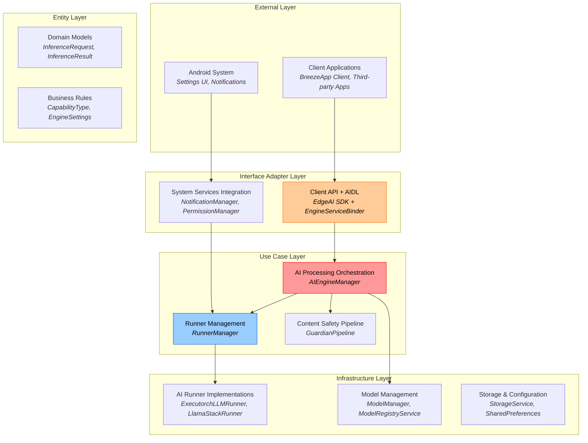
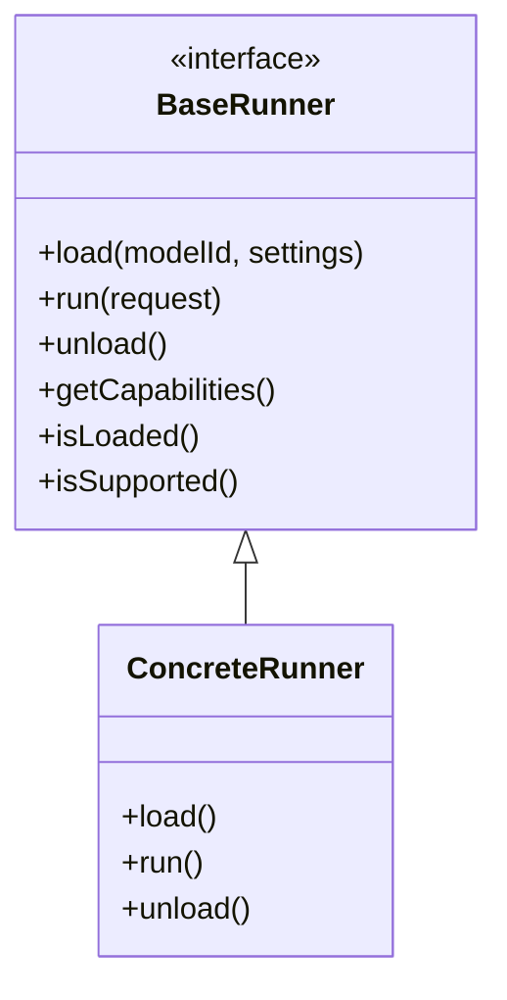

# BreezeApp Engine Architecture

This document describes the high-level architecture patterns and design principles of the BreezeApp Engine. It focuses on stable architectural concepts rather than specific implementation details.

## Core Architecture Pattern

BreezeApp Engine follows **Clean Architecture** principles with clear separation of concerns:



## Architectural Principles

### 1. Clean Architecture Compliance
- **Dependency Inversion**: High-level modules don't depend on low-level modules
- **Single Responsibility**: Each component has one reason to change
- **Interface Segregation**: Clients depend only on interfaces they use
- **Open/Closed**: Open for extension, closed for modification

### 2. Capability-Based Design
The system routes requests based on AI capabilities rather than specific implementations:

```
Request + Capability Type → Best Available Runner → Result
```

**Core Capabilities**:
- **LLM**: Large Language Model text generation
- **VLM**: Vision-Language Model multimodal processing
- **ASR**: Automatic Speech Recognition
- **TTS**: Text-to-Speech synthesis
- **GUARDIAN**: Content safety and filtering

### 3. Runner Pattern
All AI implementations follow a common contract:



**Key Benefits**:
- **Pluggability**: Add new AI backends without changing core logic
- **Testability**: Mock runners for testing and development
- **Flexibility**: Switch between local/remote/cloud implementations
- **Hardware Adaptation**: Automatic selection based on device capabilities

## Request Processing

For detailed request processing flows, see [Data Flow](./data-flow.md) which covers:
- LLM, ASR, and TTS processing pipelines
- Streaming and non-streaming flows
- Content safety integration
- Error handling strategies

## Configuration Strategy

The system uses a **3-layer parameter hierarchy**:

1. **Runner Defaults** (Base layer): Sensible defaults from runner implementations
2. **Engine Settings** (Configuration layer): Administrator/user preferences
3. **Client Overrides** (Request layer): Limited per-request customization

```
Final Parameters = Runner Defaults + Engine Settings + Client Overrides
                  (lowest precedence)              (highest precedence)
```

This approach ensures:
- **Consistency**: Validated, administrator-controlled settings
- **Security**: Clients cannot override critical parameters
- **Flexibility**: Per-request customization for appropriate parameters

**Note on Client Overrides:**
Client overrides are provided via the `params` field in the `InferenceRequest`. These parameters are passed directly to the selected runner, allowing for dynamic, per-request adjustments to inference behavior (e.g., `temperature`, `max_tokens`, or specific `model` IDs). The system prioritizes these client-provided parameters over Engine Settings and Runner Defaults.

## Model Management

For comprehensive model management details, see [Model Management Guide](../guides/model-management.md) which covers:
- Model declaration and discovery
- Automatic download process
- Storage structure and management
- User-facing model operations

## Extension Points

The architecture provides several extension points for future enhancement:

### New AI Capabilities
Add new capability types by:
1. Defining new `CapabilityType` enum value
2. Implementing runners that support the capability
3. System automatically integrates new capability

### New Runner Implementations  
For detailed runner development guide, see [Runner Development](../guides/runner-development.md).

### Custom Content Safety
Extend safety pipeline by:
1. Implementing guardian runner for specific safety policies
2. Configuring safety rules through settings
3. System automatically applies safety checks

---

## Related Documentation

- **[Data Flow](./data-flow.md)** - Request processing flows, streaming, error handling
- **[Model Management](../guides/model-management.md)** - Model lifecycle and management
- **[Runner Development](../guides/runner-development.md)** - Creating custom AI runners
- **[Security Model](../security/security-model.md)** - Permission-based access control