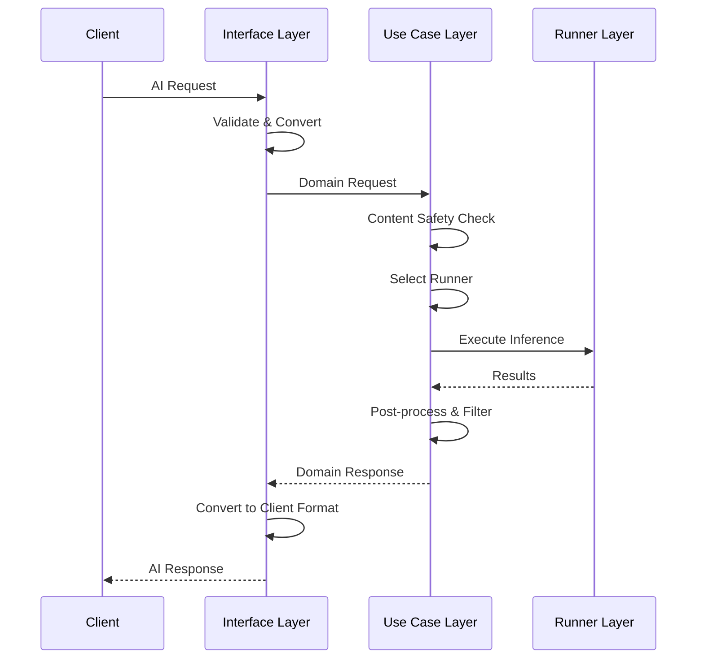
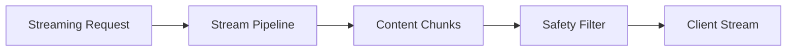
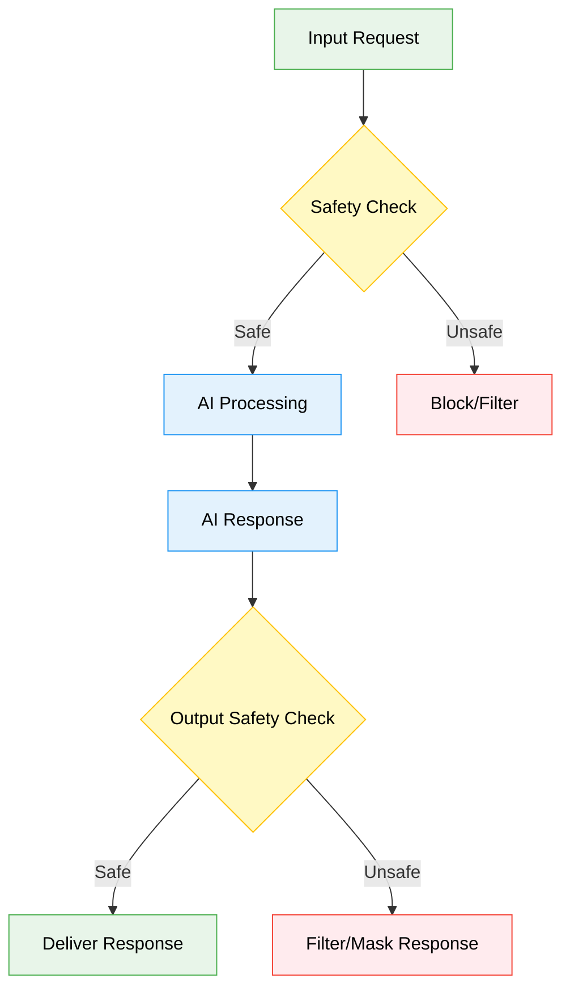
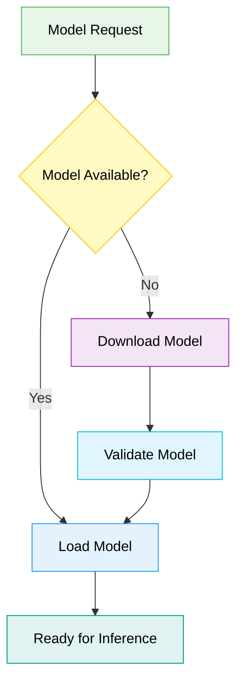

# BreezeApp Engine Architecture

This document describes the high-level architecture patterns and design principles of the BreezeApp Engine. It focuses on stable architectural concepts rather than specific implementation details.

## Core Architecture Pattern

BreezeApp Engine follows **Clean Architecture** principles with clear separation of concerns:


## Architectural Principles

### 1. Clean Architecture Compliance
- **Dependency Inversion**: High-level modules don't depend on low-level modules
- **Single Responsibility**: Each component has one reason to change
- **Interface Segregation**: Clients depend only on interfaces they use
- **Open/Closed**: Open for extension, closed for modification

### 2. Capability-Based Design
The system routes requests based on AI capabilities rather than specific implementations:

```
Request + Capability Type → Best Available Runner → Result
```

**Core Capabilities**:
- **LLM**: Large Language Model text generation
- **VLM**: Vision-Language Model multimodal processing
- **ASR**: Automatic Speech Recognition
- **TTS**: Text-to-Speech synthesis
- **GUARDIAN**: Content safety and filtering

### 3. Runner Pattern
All AI implementations follow a common contract:


**Key Benefits**:
- **Pluggability**: Add new AI backends without changing core logic
- **Testability**: Mock runners for testing and development
- **Flexibility**: Switch between local/remote/cloud implementations
- **Hardware Adaptation**: Automatic selection based on device capabilities

## Request Processing Pipeline



**Pipeline Stages**:
1. **Input Validation**: Request format and parameter validation
2. **Content Safety**: Pre-processing safety checks (optional)
3. **Runner Selection**: Choose best runner for the capability and context
4. **Model Loading**: On-demand model loading with automatic download
5. **Inference Execution**: Process request through selected runner
6. **Output Processing**: Post-processing safety checks and formatting
7. **Response Delivery**: Convert results to client format

## Streaming Architecture

For real-time AI responses, the system supports flow-based streaming:



**Streaming Benefits**:
- **Low Latency**: Immediate response feedback
- **Backpressure Handling**: Automatic flow control
- **Cancellation**: Cooperative cancellation support
- **Memory Efficiency**: Chunk-by-chunk processing

## Content Safety (Guardian) System

Content safety is integrated throughout the processing pipeline:



**Guardian Features**:
- **Input Validation**: Pre-processing safety checks
- **Output Filtering**: Post-processing response filtering  
- **Streaming Support**: Real-time chunk validation
- **Configurable Policies**: Customizable safety rules
- **Risk Assessment**: Structured safety scoring

## Configuration Strategy

The system uses a **3-layer parameter hierarchy**:

1. **Runner Defaults** (Base layer): Sensible defaults from runner implementations
2. **Engine Settings** (Configuration layer): Administrator/user preferences
3. **Client Overrides** (Request layer): Limited per-request customization

```
Final Parameters = Runner Defaults + Engine Settings + Client Overrides
                  (lowest precedence)              (highest precedence)
```

This approach ensures:
- **Consistency**: Validated, administrator-controlled settings
- **Security**: Clients cannot override critical parameters
- **Flexibility**: Per-request customization for appropriate parameters

**Note on Client Overrides:**
Client overrides are provided via the `params` field in the `InferenceRequest`. These parameters are passed directly to the selected runner, allowing for dynamic, per-request adjustments to inference behavior (e.g., `temperature`, `max_tokens`, or specific `model` IDs). The system prioritizes these client-provided parameters over Engine Settings and Runner Defaults.

## Model Management Pattern

Models are managed as first-class resources:



**Key Features**:
- **On-Demand Loading**: Models loaded only when needed
- **Automatic Download**: Missing models downloaded automatically
- **Progress Tracking**: Real-time download/loading feedback
- **Memory Management**: Intelligent model unloading based on usage

## Error Handling Philosophy

The system uses structured error handling with clear error categories:

- **Client Errors** (4xx): Invalid requests, missing permissions
- **Server Errors** (5xx): Model loading failures, insufficient resources
- **Infrastructure Errors** (E-codes): Hardware compatibility, network issues

**Error Recovery Strategy**:
1. **Graceful Degradation**: Fall back to alternative runners when possible
2. **Structured Responses**: Consistent error format across all operations
3. **Actionable Messages**: Error messages include suggested fixes
4. **Logging Integration**: Comprehensive logging for debugging

## Scalability Patterns

### Resource Management
- **Lazy Loading**: Components initialized only when needed
- **Memory Pressure Response**: Intelligent resource cleanup
- **Concurrent Processing**: Multiple requests handled simultaneously
- **Cancellation Support**: Long-running operations can be cancelled

### Performance Optimization
- **Runner Caching**: Loaded runners reused across requests
- **Model Sharing**: Same model serves multiple concurrent requests  
- **Hardware Optimization**: Automatic selection of optimal compute resources
- **Asynchronous Processing**: Non-blocking operations throughout

## Extension Points

The architecture provides several extension points for future enhancement:

### New AI Capabilities
Add new capability types by:
1. Defining new `CapabilityType` enum value
2. Implementing runners that support the capability
3. System automatically integrates new capability

### New Runner Implementations  
Add new AI backends by:
1. Implementing the `BaseRunner` interface
2. Adding appropriate annotations for discovery
3. System automatically discovers and integrates runners

### Custom Content Safety
Extend safety pipeline by:
1. Implementing guardian runner for specific safety policies
2. Configuring safety rules through settings
3. System automatically applies safety checks

## Design Goals Achieved

✅ **Maintainability**: Clear separation of concerns, stable interfaces <br>
✅ **Testability**: Mock implementations, dependency injection <br>
✅ **Extensibility**: Plugin-based runner system, capability-driven routing <br>
✅ **Performance**: Lazy loading, resource optimization, streaming support <br>
✅ **Reliability**: Structured error handling, graceful degradation <br>
✅ **Security**: Content safety integration, parameter validation <br>
✅ **Usability**: Automatic model management, progress feedback <br>

This architecture provides a robust foundation for AI inference on mobile devices while maintaining flexibility for future enhancements and evolving requirements. The focus on stable patterns and interfaces ensures long-term maintainability as the system grows.