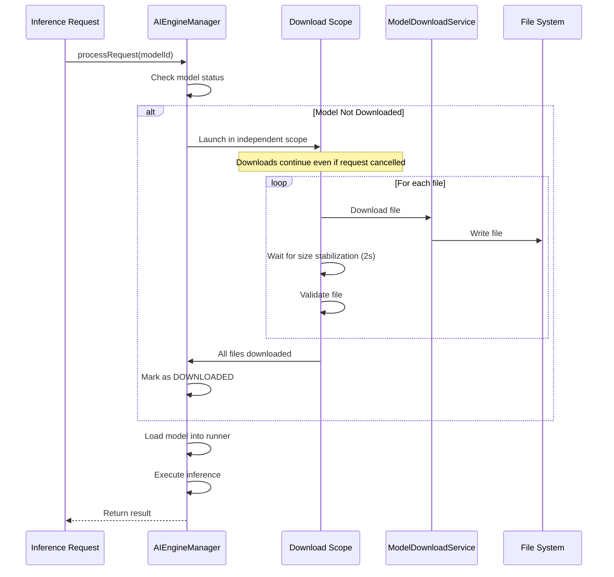

# Model Management Guide

This guide explains how models are declared, discovered, downloaded, and managed in BreezeApp-engine.

## Table of Contents

- [Overview](#overview)
- [Model Declaration](#model-declaration)
- [Model Discovery](#model-discovery)
- [Automatic Model Downloads](#automatic-model-downloads)
- [Automatic Download During Inference](#automatic-download-during-inference)
- [Model Storage](#model-storage)
- [Model Loading (Runtime)](#model-loading-runtime)
- [Default Model Selection](#default-model-selection)
- [API Models (No Download)](#api-models-no-download)
- [Code References](#code-references)
- [Best Practices](#best-practices)
- [Troubleshooting](#troubleshooting)

---

## Overview

**Key Principle**: Model management is **engine-side only**. Client apps using EdgeAI SDK don't manage models - the engine handles everything automatically.

**Model Lifecycle**:
1. **Declaration**: Models defined in `fullModelList.json`
2. **Discovery**: Engine reads model registry on startup
3. **Auto-Download**: Default models downloaded automatically
4. **Storage**: Models stored in engine's private directory
5. **Loading**: Runners load models into memory when needed

---

## Model Declaration

### Model Registry

Models are declared in [`fullModelList.json`](../../android/breeze-app-engine/src/main/assets/fullModelList.json):

```json
{
  "models": [
    {
      "id": "Llama3_2-3b-4096-spin-250605-cpu",
      "runner": "executorch",
      "backend": "cpu",
      "ramGB": 3,
      "capabilities": ["LLM"],
      "files": [
        {
          "fileName": "llama3_2-4096-spin.pte",
          "type": "model",
          "urls": [
            "https://huggingface.co/MediaTek-Research/Llama-3.2-3B-Instruct-SpinQuant_INT4_EO8-executorch/resolve/main/llama3_2-4096-spin.pte?download=true"
          ]
        },
        {
          "fileName": "tokenizer.bin",
          "type": "tokenizer",
          "urls": [
            "https://huggingface.co/MediaTek-Research/Llama-3.2-3B-Instruct-SpinQuant_INT4_EO8-executorch/resolve/main/tokenizer.bin?download=true"
          ]
        }
      ],
      "entry_point": {
        "type": "file",
        "value": "llama3_2-4096-spin.pte"
      }
    }
  ]
}
```

### Model Schema

| Field | Type | Description |
|-------|------|-------------|
| `id` | String | Unique model identifier (used in code) |
| `runner` | String | Runner type: `executorch`, `mediatek`, `sherpa_offline_asr_runner_v1`, etc. |
| `backend` | String | Backend type: `cpu`, `npu`, `api` |
| `ramGB` | Integer | Minimum RAM required (GB) |
| `capabilities` | Array | Capabilities: `LLM`, `ASR`, `TTS`, `VLM`, `GUARDIAN` |
| `files` | Array | List of files to download |
| `entry_point` | Object | Entry point configuration |

### File Schema

| Field | Type | Description |
|-------|------|-------------|
| `fileName` | String | Exact filename (for single files) |
| `group` | String | File group name (for pattern-based files) |
| `pattern` | String | Filename pattern with wildcards |
| `type` | String | File type: `model`, `tokenizer`, `config`, `dla`, `weights`, `embedding` |
| `urls` | Array | Download URLs (supports multiple mirrors) |

### Adding a New Model

1. **Add to `fullModelList.json`**:
```json
{
  "id": "your-model-id",
  "runner": "executorch",
  "backend": "cpu",
  "ramGB": 2,
  "capabilities": ["LLM"],
  "files": [
    {
      "fileName": "model.pte",
      "type": "model",
      "urls": ["https://your-url/model.pte"]
    }
  ],
  "entry_point": {
    "type": "file",
    "value": "model.pte"
  }
}
```

2. **Rebuild the engine** - Model registry is read from assets

3. **Model will appear** in Engine Settings UI automatically

---

## Model Discovery

### How Users See Available Models

Users can view available models in the **Engine Settings** UI:

1. Open BreezeApp Engine app
2. Navigate to "Model Management"
3. See models organized by category:
   - **LLM Models**: Text generation models
   - **ASR Models**: Speech recognition models
   - **TTS Models**: Text-to-speech models

### Model Information Displayed

For each model, users see:
- **Name**: Human-readable name
- **Size**: Total download size
- **Status**: Available, Downloading, Downloaded, Ready
- **Backend**: CPU, NPU, or API-based
- **RAM Required**: Minimum RAM needed

### Code Reference

Model discovery is handled by [`ModelManager.loadAvailableModels()`](../../android/breeze-app-engine/src/main/java/com/mtkresearch/breezeapp/engine/core/ModelManager.kt#L359-L404):

```kotlin
// Engine reads fullModelList.json on startup
private fun loadAvailableModels() {
    val json = context.assets.open("fullModelList.json").bufferedReader().use { it.readText() }
    val root = JSONObject(json)
    val models = root.optJSONArray("models") ?: JSONArray()
    
    // Parse each model and add to availableModels list
    for (i in 0 until models.length()) {
        val m = models.getJSONObject(i)
        availableModels.add(ModelInfo(...))
    }
}
```

---

## Automatic Model Downloads

### When Downloads Happen (Priority Order)

**1. On-Demand During Inference** ⭐ (Most Common)

When an inference request is made with a model that isn't downloaded yet, the engine automatically downloads it:

- **Client apps** make inference request via EdgeAI SDK
- **Quick Test** runs with undownloaded model in Engine Settings
- **Any AIDL request** with undownloaded model

The download happens automatically in the background, user sees progress notification, and inference runs after download completes.

**This works for ALL capabilities**: LLM, ASR, TTS

**2. Engine First Startup** (One-time)

When the engine starts for the first time, it automatically downloads default models:

```kotlin
// BreezeAppEngineService.onCreate()
private fun ensureDefaultModelReadyWithLogging() {
    val modelManager = ModelManager.getInstance(this)
    
    // Download essential categories: LLM, ASR, TTS
    val essentialCategories = listOf(
        ModelManager.ModelCategory.LLM,
        ModelManager.ModelCategory.ASR,
        ModelManager.ModelCategory.TTS
    )
    
    modelManager.downloadDefaultModels(essentialCategories, listener)
}
```

**Default Models**:
- **LLM**: `Llama3_2-3b-4096-spin-250605-cpu` (2.1 GB)
- **ASR**: `Breeze-ASR-25-onnx` (varies)
- **TTS**: VITS models (varies)


---

## Automatic Download During Inference

### The Primary Download Mechanism

**When it happens**: When an inference request is made with a model that isn't downloaded yet.

**Example workflow**:
1. User runs Quick Test with LLM model "Llama3_2-3b-4096-spin-250605-cpu"
2. User taps "Run Test"
3. Engine checks if model is downloaded
4. **If not downloaded**: Engine automatically downloads it
5. Download progress shown in notification
6. After download completes, inference runs automatically

### How It Works (AIEngineManager Workflow)



### Key Features

1. **Independent Scope**: Downloads continue even if request is cancelled
2. **Sequential Downloads**: Files downloaded one at a time (prevents corruption)
3. **Size Stabilization**: Waits 2 seconds for file size to stop changing
4. **Batch Tracking**: Prevents service from stopping between files
5. **Download Deduplication**: Prevents duplicate downloads of same model
6. **Progress Notifications**: Shows download progress in notification bar

### Code Reference

See [`AIEngineManager.kt:499-656`](../../android/breeze-app-engine/src/main/java/com/mtkresearch/breezeapp/engine/core/AIEngineManager.kt#L499-L656) for implementation.

### Download Process (Detailed)

```
Inference Request → AIEngineManager.selectAndLoadRunner()
  │
  ├─> Check if model downloaded
  │   └─> If yes: Load model directly
  │
  ├─> If no: Start automatic download
  │   │
  │   ├─> Check download deduplication
  │   │   └─> If already downloading: Wait for completion
  │   │
  │   ├─> Launch in independent scope (survives cancellation)
  │   │
  │   ├─> For each file in model:
  │   │   ├─> ModelDownloadService.startDownload(url, fileName)
  │   │   ├─> Wait for file size to stabilize (2 seconds)
  │   │   └─> Mark file complete in batch
  │   │
  │   ├─> Validate all files (existence + size > 1KB)
  │   │
  │   └─> Mark model as DOWNLOADED
  │
  └─> Load model into runner
      └─> Execute inference
```

**Key Points**:
- Downloads happen in `downloadScope` (independent coroutine scope)
- Files downloaded sequentially (not parallel)
- File stabilization prevents incomplete downloads
- Batch tracking prevents service stop between files
- Download continues even if request is cancelled

### Download Notifications

Users see persistent notifications during downloads:
- **Title**: "Downloading [Model Name]"
- **Progress**: "Downloading file 1/3: model.pte"
- **Speed**: "5.2 MB/s"
- **Actions**: Shows in notification bar

---

### Quick Test Example

Engine Settings includes a Quick Test feature that triggers the same automatic download:

1. Open Engine Settings → Quick Test tab
2. Select capability (LLM, ASR, TTS)
3. Select model
4. Tap "Run Test"
5. If model not downloaded: automatic download starts
6. Test runs after download completes

> **Note**: Quick Test currently has its own download implementation ([`EngineSettingsActivity.kt:1897+`](../../android/breeze-app-engine/src/main/java/com/mtkresearch/breezeapp/engine/ui/EngineSettingsActivity.kt#L1897)) that duplicates AIEngineManager's workflow. This should be refactored to use AIEngineManager directly.

---

## Model Storage

### Storage Structure

Models are stored in the engine's private directory:

```
/data/data/com.mtkresearch.breezeapp.engine/files/models/
├── llm/
│   ├── Llama3_2-3b-4096-spin-250605-cpu/
│   │   ├── llama3_2-4096-spin.pte (2.1 GB)
│   │   └── tokenizer.bin (500 KB)
│   └── Breeze2-3B-8W16A-250630-npu/
│       ├── BreezeTinyInstruct_v0.1_sym8W_sym16A_Overall_14layer_*.dla
│       ├── embedding_int16.bin
│       ├── shared_weights_*.bin
│       └── tokenizer.tiktoken
├── asr/
│   ├── Breeze-ASR-25-onnx/
│   │   ├── breeze-asr-25-half-encoder.int8.onnx
│   │   ├── breeze-asr-25-half-decoder.int8.onnx
│   │   └── breeze-asr-25-half-tokens.txt
│   └── sherpa-onnx-whisper-base/
│       ├── base-encoder.int8.onnx
│       ├── base-decoder.int8.onnx
│       └── base-tokens.txt
└── tts/
    └── vits-models/
        └── (TTS model files)
```

### Storage Management

Users can manage storage via Engine Settings:

**View Storage Usage**:
```kotlin
val totalUsed = ModelManager.getInstance(context).calculateTotalStorageUsed()
val byCategory = ModelManager.getInstance(context).getStorageUsageByCategory()
// Returns: Map<ModelCategory, Long> (bytes per category)
```

**Delete Models**:
```kotlin
ModelManager.getInstance(context).deleteModel(modelId)
// Removes all files for the model
```

**Cleanup Orphaned Files**:
```kotlin
ModelManager.getInstance(context).cleanupStorage()
// Removes files not referenced in fullModelList.json
```

---

## Model Loading (Runtime)

### When Models Load into Memory

Models are loaded into memory when a runner receives its first inference request:

```
Client Request → AIEngineManager → RunnerManager → ExecutorchLLMRunner
                                                          │
                                                          ├─> Check if loaded
                                                          │   └─> If no: load()
                                                          │
                                                          └─> runAsFlow()
```

### Loading Process

```kotlin
// ExecutorchLLMRunner.load()
override fun load(modelId: String, settings: EngineSettings, initialParams: Map<String, Any>): Boolean {
    // 1. Resolve model paths
    val paths = ExecutorchUtils.resolveModelPaths(context, modelId)
    modelPath = paths.modelPath
    tokenizerPath = paths.tokenizerPath
    
    // 2. Create native module
    llmModule = LlmModule(modelPath, tokenizerPath, temperature)
    
    // 3. Load into memory (JNI call)
    val loadResult = llmModule.load()
    
    // 4. Mark as loaded
    isLoaded = (loadResult == 0)
    return isLoaded
}
```

**Loading Time**: 1-5 seconds depending on model size

### Memory Management

- **Lazy Loading**: Models load only when needed
- **Unloading**: Models can be unloaded to free memory
- **Reloading**: Models reload if parameters change (e.g., temperature)

---

## Default Model Selection

### How Defaults Are Determined

Default models are specified in runner annotations:

```kotlin
@AIRunner(
    vendor = VendorType.EXECUTORCH,
    priority = RunnerPriority.HIGH,
    capabilities = [CapabilityType.LLM],
    defaultModel = "Llama3_2-3b-4096-spin-250605-cpu"  // ← Default model
)
class ExecutorchLLMRunner : BaseRunner, FlowStreamingRunner {
    // ...
}
```

---

## API Models (No Download)

Some models don't require downloads (API-based):

```json
{
  "id": "openai/gpt-oss-20b:free",
  "runner": "OpenRouterLLMRunner",
  "backend": "api",
  "ramGB": 1,
  "capabilities": ["LLM"],
  "files": [],  // ← No files to download
  "entry_point": {
    "type": "api",
    "value": "openai/gpt-oss-20b:free"
  }
}
```

**Characteristics**:
- No download required
- Requires internet connection
- Uses API key (configured separately)
- Lower RAM usage
- Higher latency

---

## Code References

### Core Components

- [`ModelManager.kt`](../../android/breeze-app-engine/src/main/java/com/mtkresearch/breezeapp/engine/core/ModelManager.kt) - Central model management
- [`ModelDownloadService.kt`](../../android/breeze-app-engine/src/main/java/com/mtkresearch/breezeapp/engine/core/download/ModelDownloadService.kt) - Download service
- [`ModelFile.kt`](../../android/breeze-app-engine/src/main/java/com/mtkresearch/breezeapp/engine/model/ModelFile.kt) - Model data structures
- [`fullModelList.json`](../../android/breeze-app-engine/src/main/assets/fullModelList.json) - Model registry

### Key Methods

- `ModelManager.getAvailableModels(category)` - List models
- `ModelManager.downloadModel(modelId)` - Download model
- `ModelManager.deleteModel(modelId)` - Delete model
- `ModelManager.getDefaultModel(category)` - Get default
- `ModelManager.calculateTotalStorageUsed()` - Storage usage

---

## Best Practices

### For Engine Developers

1. **Always specify default models** in runner annotations
2. **Test downloads** on slow connections
3. **Validate checksums** for downloaded files
4. **Handle download failures** gracefully
5. **Provide clear error messages** to users

### For Model Providers

1. **Use stable URLs** (avoid temporary links)
2. **Provide multiple mirrors** for reliability
3. **Include checksums** in model metadata
4. **Document RAM requirements** accurately
5. **Test on target devices** before release

### For Users

1. **Download on WiFi** to save mobile data
2. **Check storage space** before downloading large models
3. **Delete unused models** to free space
4. **Use default models** for best compatibility
5. **Check model status** in Engine Settings

---

## Troubleshooting

### Download Fails

**Symptoms**: Download stuck or fails with error

**Solutions**:
1. Check internet connection
2. Check storage space
3. Retry download
4. Try different mirror URL
5. Check logs: `adb logcat | grep ModelDownload`

### Model Not Loading

**Symptoms**: Inference fails with "model not loaded"

**Solutions**:
1. Check model is downloaded (Engine Settings)
2. Check RAM availability
3. Check model files exist in storage
4. Restart engine
5. Re-download model

### Storage Issues

**Symptoms**: "Not enough space" error

**Solutions**:
1. Delete unused models
2. Run cleanup: `ModelManager.cleanupStorage()`
3. Check storage: `ModelManager.calculateTotalStorageUsed()`
4. Free device storage

---

## See Also

- [Data Flow](../architecture/data-flow.md) - Request processing flows
- [Runner Development](./runner-development.md) - Creating custom runners
- [Architecture Overview](../architecture/README.md) - Overall architecture
