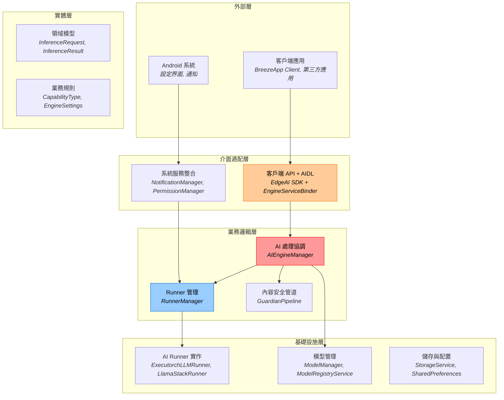
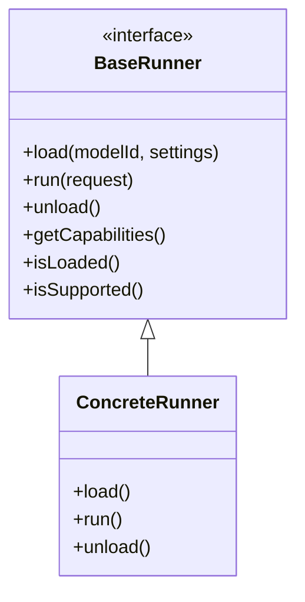
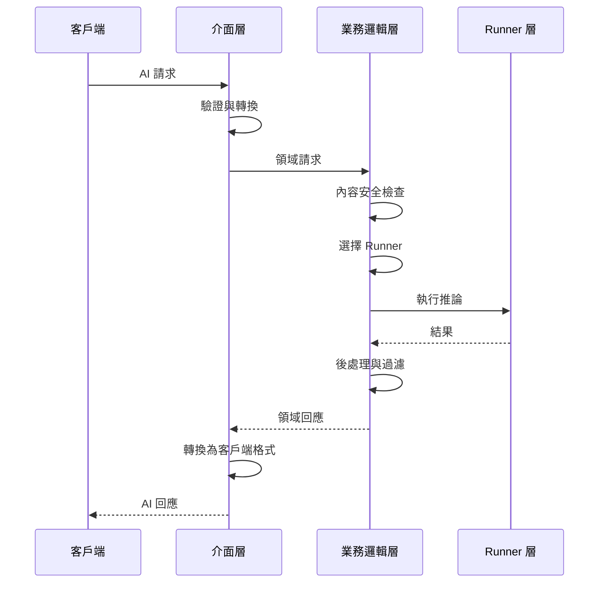
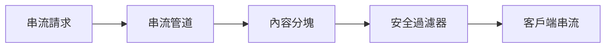
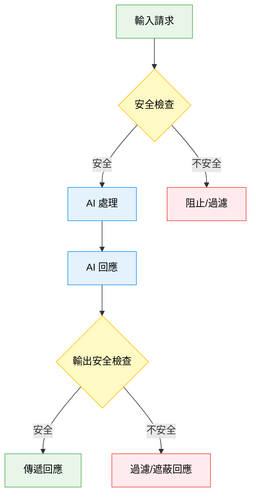
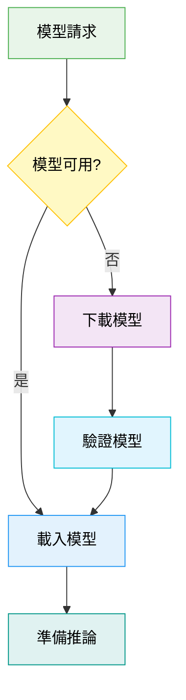

# BreezeApp Engine 架構

本文檔描述 BreezeApp Engine 的高層架構模式和設計原則。專注於穩定的架構概念，而非具體的實作細節。

## 核心架構模式

BreezeApp Engine 遵循 **Clean Architecture** 原則，具有清晰的關注點分離：



## 架構原則

### 1. Clean Architecture 合規性
- **依賴反轉**：高層模組不依賴低層模組
- **單一職責**：每個組件只有一個變更原因
- **介面隔離**：客戶端僅依賴其使用的介面
- **開放封閉**：對擴展開放，對修改封閉

### 2. 基於能力的設計
系統根據 AI 能力而非特定實作來路由請求：

```
請求 + 能力類型 → 最佳可用 Runner → 結果
```

**核心能力**：
- **LLM**：大型語言模型文本生成
- **VLM**：視覺-語言模型多模態處理
- **ASR**：自動語音識別
- **TTS**：文字轉語音合成
- **GUARDIAN**：內容安全和過濾

### 3. Runner 模式
所有 AI 實作都遵循通用約定：



**主要優勢**：
- **可插拔性**：不改變核心邏輯即可添加新的 AI 後端
- **可測試性**：用於測試和開發的 Mock runners
- **靈活性**：在本地/遠端/雲端實作間切換
- **硬體適配**：基於設備能力的自動選擇

## 請求處理管道



**管道階段**：
1. **輸入驗證**：請求格式和參數驗證
2. **內容安全**：預處理安全檢查（可選）
3. **Runner 選擇**：為能力和上下文選擇最佳 runner
4. **模型載入**：按需模型載入與自動下載
5. **推論執行**：透過選定的 runner 處理請求
6. **輸出處理**：後處理安全檢查和格式化
7. **回應傳遞**：將結果轉換為客戶端格式

## 串流架構

對於即時 AI 回應，系統支援基於 flow 的串流：



**串流優勢**：
- **低延遲**：即時回應反饋
- **背壓處理**：自動流量控制
- **取消支援**：協作式取消支援
- **記憶體效率**：分塊處理

## 內容安全（Guardian）系統

內容安全整合在整個處理管道中：



**Guardian 功能**：
- **輸入驗證**：預處理安全檢查
- **輸出過濾**：後處理回應過濾
- **串流支援**：即時分塊驗證
- **可配置策略**：可自訂安全規則
- **風險評估**：結構化安全評分

## 配置策略

系統使用 **3 層參數階層**：

1. **Runner 預設值**（基礎層）：來自 runner 實作的合理預設值
2. **引擎設定**（配置層）：管理員/用戶偏好
3. **客戶端覆蓋**（請求層）：有限的每請求自訂

```
最終參數 = Runner 預設值 + 引擎設定 + 客戶端覆蓋
         （最低優先級）              （最高優先級）
```

這種方法確保：
- **一致性**：經過驗證的管理員控制設定
- **安全性**：客戶端無法覆蓋關鍵參數
- **靈活性**：適當參數的每請求自訂

**客戶端覆蓋注意事項：**
客戶端覆蓋透過 `InferenceRequest` 中的 `params` 欄位提供。這些參數會直接傳遞給選定的 runner，允許對推論行為進行動態的、每請求調整（例如，`temperature`、`max_tokens` 或特定的 `model` ID）。系統會優先使用這些客戶端提供的參數，而非引擎設定和 Runner 預設值。

## 模型管理模式

模型作為一級資源進行管理：



**主要功能**：
- **按需載入**：僅在需要時載入模型
- **自動下載**：自動下載缺失的模型
- **進度追蹤**：即時下載/載入進度反饋
- **記憶體管理**：基於使用情況的智能模型卸載

## 錯誤處理哲學

系統使用結構化錯誤處理，具有清晰的錯誤類別：

- **客戶端錯誤** (4xx)：無效請求、缺少權限
- **服務器錯誤** (5xx)：模型載入失敗、資源不足
- **基礎設施錯誤** (E-codes)：硬體相容性、網路問題

**錯誤恢復策略**：
1. **優雅降級**：盡可能回退到備用 runners
2. **結構化回應**：所有操作的一致錯誤格式
3. **可操作訊息**：錯誤訊息包含建議修復
4. **日誌整合**：用於除錯的全面日誌

## 可擴展性模式

### 資源管理
- **懶加載**：組件僅在需要時初始化
- **記憶體壓力回應**：智能資源清理
- **並發處理**：同時處理多個請求
- **取消支援**：可取消長時間運行的操作

### 性能優化
- **Runner 快取**：已載入的 runners 跨請求重用
- **模型共享**：同一模型服務多個並發請求
- **硬體優化**：自動選擇最佳計算資源
- **非同步處理**：全程非阻塞操作

## 擴展點

架構提供多個擴展點供未來增強：

### 新的 AI 能力
添加新能力類型：
1. 定義新的 `CapabilityType` 枚舉值
2. 實作支援該能力的 runners
3. 系統自動整合新能力

### 新的 Runner 實作
添加新的 AI 後端：
1. 實作 `BaseRunner` 介面
2. 添加適當的註解以便發現
3. 系統自動發現並整合 runners

### 自訂內容安全
擴展安全管道：
1. 為特定安全策略實作 guardian runner
2. 透過設定配置安全規則
3. 系統自動應用安全檢查

## 實現的設計目標

✅ **可維護性**：清晰的關注點分離，穩定的介面
✅ **可測試性**：模擬實作，依賴注入
✅ **可擴展性**：基於插件的 runner 系統，能力驅動的路由
✅ **性能**：懶加載，資源優化，串流支援
✅ **可靠性**：結構化錯誤處理，優雅降級
✅ **安全性**：內容安全整合，參數驗證
✅ **易用性**：自動模型管理，進度反饋

---

此架構為移動設備上的 AI 推論提供了堅實的基礎，同時保持未來增強和不斷變化需求的靈活性。專注於穩定的模式和介面確保了系統成長時的長期可維護性。