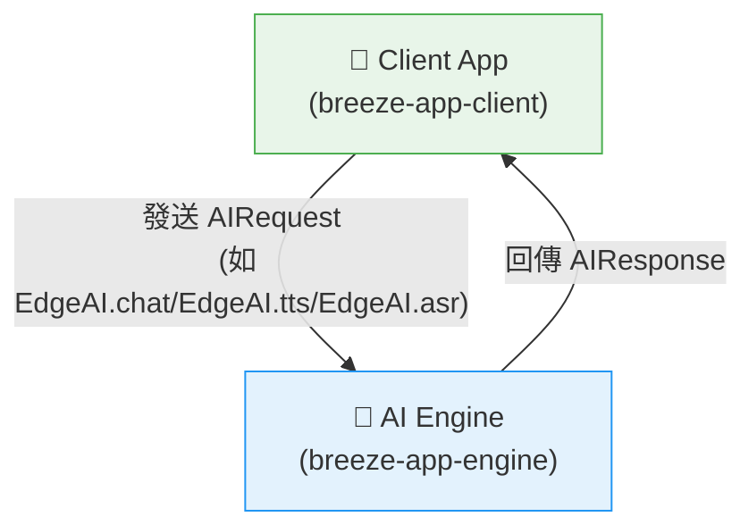

[English](../../README.md) | 繁體中文

# 🤖 歡迎使用 BreezeApp Engine！

準備好在 Android 裝置上打造未來的 AI 嗎？你來對地方了！

BreezeApp Engine 是新一代的 AI 框架，專為打造強大、模組化、可擴展的 AI 體驗而設計。它強調型別安全、現代 Android 實踐，以及優秀的開發者體驗。

### 📦 最新版本

- `BreezeApp-engine`: `v0.1.1`
- `EdgeAI`: `v0.1.7`

## ✨ 專案核心：AI 引擎

本專案最重要的部分是 **`android/breeze-app-engine`**。

你可以把它想像成一個強大的「無UI」**AI 大腦**，在 Android 上以背景服務方式運作，完全獨立於任何 UI。它的唯一目標是管理、執行並提供 AI 能力（如文字生成、語音辨識等）給任何需要的應用程式。

將複雜的 AI 邏輯與 UI 解耦，讓開發者能輕鬆為應用加入先進的 AI 功能。

## 🔎 執行時架構：Client 如何與 Engine 溝通

執行時，你的 App（Client）會送出 `AIRequest` 給引擎，AI 引擎處理後回傳 `AIResponse`。這個互動完全與 UI 邏輯分離。

這種乾淨的分層讓引擎能保持與 UI 無關、專注於服務導向。

## 🚀 如何開始

根據你的目標選擇路徑。你是想用引擎建構應用，還是為引擎建構新功能？

### 📱 對於 App 開發者（使用引擎）

如果你想為你的 Android 應用加入 AI 功能，這是你的路徑。

1.  **從這裡開始：** 我們的 **[BreezeApp Client 指南](https://github.com/mtkresearch/BreezeApp-client/blob/174b3717575664dd8b08f195cbfad9aad5c300f1/docs/i18n/README_zh.md)** 是最好的起點。它提供如何整合 `EdgeAI` SDK 並進行第一次 API 呼叫的逐步教程。
2.  **探索 API：** `EdgeAI` SDK 是引擎的公開 API。你可以在 **[EdgeAI README](../android/EdgeAI/README.md)** 中探索其功能和資料模型。

### 🧠 對於 AI/ML 工程師（擴展引擎）

如果你想為引擎本身添加新模型或 AI 能力。

1.  **了解設設計：** **[架構指南](./ARCHITECTUR_zh.md)** 說明了引擎的內部設計以及所有部分如何配合。
2.  **建構 Runner：** 依照 **[Runner 開發指南](./RUNNER_DEVELOPMENT_zh.md)** 學習如何實作能被引擎發現的新 `Runner`。

## 🤝 歡迎加入社群與貢獻

無論你是修 bug、改進文件，還是新增革命性 runner，我們都歡迎你的貢獻！

* **貢獻指南：** 請閱讀我們的 **[貢獻指南](./CONTRIBUTING_zh.md)**。
* **有問題？** 歡迎開 issue，我們樂意協助。