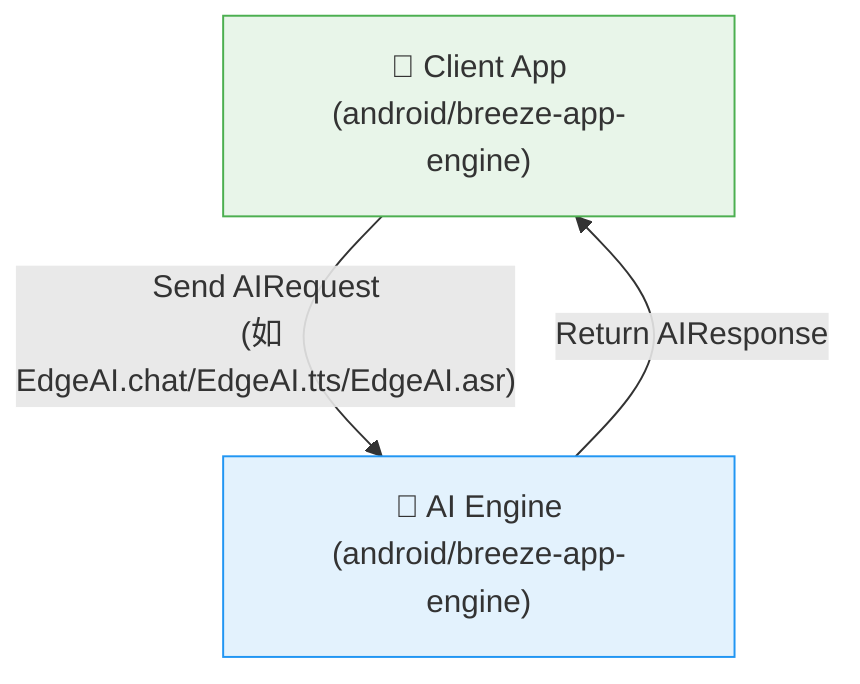

[English](../../README.md) | 繁體中文

# 🤖 歡迎使用 BreezeApp Engine！

準備好在 Android 裝置上打造未來的 AI 嗎？你來對地方了！

BreezeApp Engine 是新一代的 AI 框架，專為打造強大、模組化、可擴展的 AI 體驗而設計。它強調型別安全、現代 Android 實踐，以及優秀的開發者體驗。

## 📁 專案結構

```
BreezeApp-engine/
├── android/                    # Android 專案根目錄
│   ├── EdgeAI/                # EdgeAI 函式庫模組
│   ├── breeze-app-engine/     # 主要 AI 引擎模組
│   ├── build.gradle.kts       # 根建構腳本
│   ├── settings.gradle.kts    # 專案設定
│   └── jitpack.yml           # JitPack 設定
├── docs/                      # 文件
│   ├── QUICK_START.md         # 快速開始指南
│   ├── CONTRIBUTING.md        # 貢獻指南
│   ├── ARCHITECTURE.md        # 架構指南
│   ├── RUNNER_DEVELOPMENT.md  # Runner 開發指南
│   ├── MODEL_DOWNLOAD_UI_TUTORIAL.md  # 模型下載 UI 教程
│   ├── PERMISSION_SYSTEM.md   # 權限系統文件
│   ├── internal/              # 內部開發文件
│   └── i18n/                  # 國際化
│       ├── README_zh.md       # 中文 README
│       ├── QUICK_START_zh.md  # 中文快速開始
│       ├── CONTRIBUTING_zh.md # 中文貢獻指南
│       ├── ARCHITECTURE_zh.md # 中文架構指南
│       ├── RUNNER_DEVELOPMENT_zh.md # 中文 runner 指南
│       └── internal/          # 中文內部文件
├── README.md                  # 本文件
├── LICENSE                    # 授權條款
└── .github/                   # GitHub 工作流程
```

## ✨ 專案核心：AI 引擎

本專案最重要的部分是 **`android/breeze-app-engine`**。

你可以把它想像成一個強大的「無頭」**AI 大腦**，在 Android 上以背景服務方式運作，完全獨立於任何 UI。它的唯一目標是管理、執行並提供 AI 能力（如文字生成、語音辨識等）給任何需要的應用程式。

將複雜的 AI 邏輯與 UI 解耦，讓開發者能輕鬆為應用加入先進的 AI 功能。

## 🔎 執行時架構：Client 如何與 Engine 溝通

執行時，你的 App（Client）會送出 `AIRequest` 給引擎，AI 引擎處理後回傳 `AIResponse`。這個互動完全與 UI 邏輯分離。



這種乾淨的分層讓引擎能保持與 UI 無關、專注於服務導向。

## 🚀 如何開始：依你的角色選擇

了解大致架構後，根據你的目標選擇切入點：

---

### 📱 我是 App 開發者...

*...我想在我的應用中**使用** BreezeApp Engine。*

太棒了！你只需專注於 API 的使用。

1. **從這裡開始：** 請參考 **[快速開始指南](./QUICK_START_zh.md)**，這是一個完整的指南，展示如何連接服務並使用其功能。
2. **了解 API：** 接著閱讀 **[README](../../android/EdgeAI/docs/i18n/README_zh.md)**，了解你會用到的 `AIRequest` 和 `AIResponse` 模型。
3. **JitPack 整合：** 參考 **[使用指南](../../android/EdgeAI/docs/i18n/USAGE_GUIDE_zh.md)**，學習如何透過 JitPack 整合 EdgeAI。
4. **權限系統：** 了解我們統一的權限管理系統 **[權限系統指南](./PERMISSION_SYSTEM_zh.md)**。

---

### 🧠 我是 AI/ML 工程師...

*...我想為 BreezeApp Engine **擴充新模型**。*

很棒！你的路徑是實作 runner。

1. **從這裡開始：** 請參考 **[架構指南](./ARCHITECTURE_zh.md)**，這裡說明了路由引擎的內部架構。
2. **開發你的第一個 Runner：** 依照 **[🧩 Runner 開發指南](./RUNNER_DEVELOPMENT_zh.md)**，一步步建立、測試並註冊新 runner。

---

### 🏗️ 我是建構工程師...

*...我想**建構與部署**這個專案。*

沒問題！你需要知道：

1. **Android 專案：** 所有 Android 相關檔案都在 `android/` 目錄下
2. **建構指令：**
   ```bash
   cd android
   ./gradlew :EdgeAI:assembleRelease
   ./gradlew :breeze-app-engine:assembleRelease
   ```
3. **JitPack 發布：** 請參考 **[android/EdgeAI/docs/JitPack_Release_SOP.md](../../android/EdgeAI/docs/i18n/JitPack_Release_SOP_zh.md)** 了解發布流程。

---

## 🤝 歡迎加入社群與貢獻

無論你是修 bug、改進文件，還是新增革命性 runner，我們都歡迎你的貢獻！

* **貢獻指南：** 請閱讀我們的 **[貢獻指南](./CONTRIBUTING_zh.md)**。
* **有問題？** 歡迎開 issue，我們樂意協助。

---

## 📦 JitPack 整合

EdgeAI 模組可透過 JitPack 輕鬆整合：

```kotlin
// 加到你的 app build.gradle.kts
implementation("com.github.mtkresearch:BreezeApp-engine:EdgeAI-v0.1.1")
```

詳細用法請見 **[android/EdgeAI/docs/USAGE_GUIDE.md](../../android/EdgeAI/docs/i18n/USAGE_GUIDE_zh.md)**。 