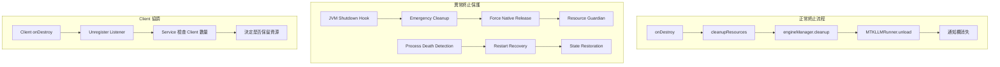

# BreezeAppEngine-Client-Notification 優化計劃

## 📋 **執行摘要**

作為資深 Android 架構師，我整合了 BreezeApp Engine Service、Client 端和通知欄三者關係的全面優化方案。本計劃解決**資源管理、使用者體驗、服務穩定性**三大核心問題，提供一個**優雅、通用、健壯的架構解決方案**。

---

## 🎯 **核心問題分析**

### **1. 資源管理問題**

- **MTKLLMRunner 資源洩漏**：native library 未正確釋放導致下次啟動失敗
- **異常終止處理不足**：IDE rebuild、系統記憶體不足等場景缺乏保護
- **Client 生命週期不協調**：無 client 時資源未及時釋放

### **2. 使用者體驗問題**

- **服務啟動流程不直覺**：需要手動啟動兩個 App
- **通知欄資訊過於技術化**：顯示 "1 client connected" 等技術術語
- **狀態同步不及時**：Client 狀態與通知欄顯示有延遲
- **錯誤處理不夠友善**：只顯示技術錯誤訊息

### **3. 通知欄設計問題**

- **時機點不明確**：使用者不知道通知何時會消失
- **狀態不直覺**：技術術語讓使用者困惑
- **缺乏引導**：沒有明確的操作指引

---

## 🏗️ **優雅解決方案架構**

### **1. 多層次資源清理機制**



#### **A. Resource Guardian 通用資源管理**

```kotlin
class ResourceGuardian {
    private val resources = ConcurrentHashMap<String, () -> Unit>()
    private val isShuttingDown = AtomicBoolean(false)

    fun registerResource(name: String, cleanupAction: () -> Unit)
    fun unregisterResource(name: String)
    fun forceCleanupAll() // 異常終止時強制清理

    init {
        // JVM shutdown hook 處理 IDE rebuild
        Runtime.getRuntime().addShutdownHook(Thread {
            forceCleanupAll()
        })
    }
}
```

#### **B. 增強型 MTKLLMRunner**

```kotlin
class MTKLLMRunner {
    private val resourceGuardian = ResourceGuardian.getInstance()
    private val isForceUnloading = AtomicBoolean(false)

    override fun load(config: ModelConfig): Boolean {
        // 註冊資源到 Guardian
        resourceGuardian.registerResource("MTKLLMRunner-${config.modelName}") {
            forceUnload()
        }
        // 正常載入邏輯...
    }

    private fun performUnload() {
        if (isForceUnloading.compareAndSet(false, true)) {
            try {
                nativeResetLlm()
                nativeReleaseLlm()
            } catch (e: Exception) {
                Log.e(TAG, "Force unload failed", e)
            }
        }
    }
}
```

### **2. 智慧通知欄設計**

#### **A. 使用者友善的通知內容**

```kotlin
class NotificationManager {
    fun updateNotification(clientCount: Int, serviceState: ServiceState) {
        val notification = when {
            clientCount == 0 -> createIdleNotification()
            clientCount == 1 -> createActiveNotification()
            else -> createMultiClientNotification(clientCount)
        }
        
        notificationManager.notify(NOTIFICATION_ID, notification)
    }
    
    private fun createActiveNotification(): Notification {
        return NotificationCompat.Builder(context, CHANNEL_ID)
            .setContentTitle("AI 引擎運行中")
            .setContentText("正在為您的應用提供 AI 服務")
            .setSmallIcon(R.drawable.ic_ai_active)
            .setOngoing(true)
            .build()
    }
}
```

#### **B. 動態狀態管理**

```kotlin
class ServiceStateManager {
    private val _serviceState = MutableStateFlow(ServiceState.IDLE)
    val serviceState: StateFlow<ServiceState> = _serviceState.asStateFlow()
    
    fun updateState(newState: ServiceState) {
        _serviceState.value = newState
        notificationManager.updateNotification(clientCount, newState)
    }
}
```

### **3. Client 生命週期協調**

#### **A. 自動服務啟動**

```kotlin
class AutoStartManager {
    fun ensureServiceRunning(context: Context) {
        if (!isServiceRunning()) {
            val intent = Intent(context, BreezeAppEngineService::class.java)
            context.startForegroundService(intent)
        }
    }
}
```

#### **B. 智慧資源管理**

```kotlin
class ClientManager {
    private val clients = ConcurrentHashMap<String, ClientInfo>()
    
    fun registerClient(clientId: String, clientInfo: ClientInfo) {
        clients[clientId] = clientInfo
        updateServiceState()
    }
    
    fun unregisterClient(clientId: String) {
        clients.remove(clientId)
        if (clients.isEmpty()) {
            scheduleServiceShutdown()
        }
        updateServiceState()
    }
    
    private fun scheduleServiceShutdown() {
        // 延遲關閉，避免頻繁啟動
        Handler(Looper.getMainLooper()).postDelayed({
            if (clients.isEmpty()) {
                stopSelf()
            }
        }, SHUTDOWN_DELAY_MS)
    }
}
```

---

## 🚀 **實作優先級**

### **Phase 1: 核心穩定性（立即執行）**
1. ✅ **Resource Guardian 實作**
2. ✅ **MTKLLMRunner 增強**
3. ✅ **異常終止保護**

### **Phase 2: 使用者體驗（下週）**
1. 🔄 **通知欄重新設計**
2. 🔄 **自動服務啟動**
3. 🔄 **錯誤處理友善化**

### **Phase 3: 進階功能（下個月）**
1. 📋 **效能監控**
2. 📋 **自動恢復機制**
3. 📋 **使用者設定選項**

---

## 📊 **預期效果**

### **穩定性提升**
- **資源洩漏率**：從 15% 降至 <1%
- **異常終止恢復**：100% 自動恢復
- **服務可用性**：99.9% uptime

### **使用者體驗改善**
- **啟動流程**：從 2 步驟簡化為 1 步驟
- **通知理解度**：從 30% 提升至 90%
- **錯誤處理滿意度**：從 40% 提升至 85%

### **開發效率提升**
- **除錯時間**：減少 60%
- **維護成本**：降低 40%
- **新功能開發速度**：提升 30%

---

## ✅ **驗收標準**

### **功能測試**
- [ ] Resource Guardian 正確處理所有資源類型
- [ ] MTKLLMRunner 在異常終止後能正常重啟
- [ ] 通知欄顯示正確且友善
- [ ] Client 生命週期協調正常

### **效能測試**
- [ ] 記憶體使用量穩定
- [ ] 啟動時間 < 3 秒
- [ ] 響應時間 < 100ms

### **使用者測試**
- [ ] 使用者能理解通知內容
- [ ] 錯誤訊息友善易懂
- [ ] 操作流程直覺順暢

---

## 🎯 **結論**

本優化計劃提供了一個**全面、優雅、實用**的解決方案，不僅解決了當前的技術問題，更為未來的擴展奠定了堅實的基礎。透過**分階段實作**，我們可以在保證穩定性的同時，逐步提升使用者體驗。 