# BreezeApp Engine Architecture Overview

As a professional Android architect and product manager, this document provides a comprehensive architectural overview of the `BreezeApp-engine`.

To give a clear and truthful picture of the architecture, this document contains a series of diagrams that represent the system from different perspectives. A single diagram is insufficient to capture the complexity and design philosophy of a well-architected system.

**🎯 Architecture Assessment: This document reflects the actual codebase implementation as of 2025 and includes architectural cleanup recommendations.**

The following diagrams cover the system from a high-level context to low-level implementation details:

1.  **System Context Diagram (C4 Model Level 1):** To show how the BreezeApp Engine fits into the broader ecosystem and who interacts with it.
2.  **Container Diagram (C4 Model Level 2):** To illustrate the high-level technical components and the key communication protocols between them.
3.  **Component Diagrams (C4 Model Level 3):** To zoom into the `breeze-app-engine` module and show the internal components and their responsibilities at both a high level and a detailed, code-level view.
4.  **Sequence Diagram (Runtime Flow):** To show the lifecycle of a request from the client to the AI runner and back.
5.  **Extensibility Flowchart:** To document the process for adding new models and runners.
6.  **Clean Architecture Implementation:** To show the proper layered architecture.
7.  **Refactoring Recommendations:** To propose minimal-impact improvements.

---

### 1. System Context Diagram

**Purpose:** To provide a high-level, zoomed-out view of the system, showing how it interacts with its users (actors) and other systems. This is the "big picture."

**Key Components:**
*   **Actors:** The different roles that interact with the system (App Developer, AI Engineer).
*   **Systems:** The `Client App` and the `BreezeApp Engine` itself.

**Relationships & Insights:** This diagram shows that the engine is a backend system designed to be used by other applications and extended by AI engineers, establishing its role as a foundational AI platform.

```mermaid
graph TD
    subgraph "Actors"
        A[📱 App Developer]
        B[🧠 AI/ML Engineer]
    end

    subgraph "Systems"
        C["Client App"]
        D["🤖 BreezeApp Engine"]
    end

    A -- "Uses (via EdgeAI SDK)" --> D
    C -- "Communicates with" --> D
    B -- "Extends with new AI models" --> D

    style D fill:#FFF3CD,stroke:#FFB300,stroke-width:4px
```

---

### 2. Container Diagram

**Purpose:** To zoom into the system and show the major deployable units (containers, in the C4 model sense) and their interactions. This clarifies the primary architectural pattern.

**Key Components:**
*   **Client App Process:** The application that consumes the AI services. It contains the `EdgeAI SDK`.
*   **BreezeApp Engine Process:** The standalone Android service application that performs the AI work.
*   **Communication:** The `AIDL` (Android Interface Definition Language) interface, which is the contract for Inter-Process Communication (IPC).

**Relationships & Insights:** This diagram clearly illustrates the decoupled, client-server architecture. The `EdgeAI SDK` is a lightweight client library, while the `BreezeApp Engine` is a heavy-lifting background service. This separation allows the engine to be updated independently of the apps that use it.


---

### 3. Android Service Binding Architecture (Clear View)

**Purpose:** To clearly show how Android Service binding works and why clients can't bind "higher up" in the architecture. This addresses the common confusion about service architecture.

**🎯 KEY INSIGHT**: Android requires clients to bind to a `Service` class, but that service immediately delegates to specialized components for clean architecture.

```mermaid
graph TB
    subgraph "🔵 Client Process"
        CLIENT[Client App]
        SDK[EdgeAI SDK]
    end
    
    subgraph "🟢 BreezeApp Engine Process"
        subgraph "📱 Android Service Layer (BINDING POINT)"
            SERVICE[BreezeAppEngineService]
            SERVICE_NOTE["✅ ONLY this layer can be bound to by Android framework"]
        end
        
        subgraph "🎛️ Orchestration Layer"
            ORCH[ServiceOrchestrator]
            ORCH_NOTE["🎯 Coordinates all components<br/>Creates and manages dependencies"]
        end
        
        subgraph "🔌 AIDL Interface Layer"
            BINDER[EngineServiceBinder]
            BINDER_NOTE["🎯 Implements AIDL interface<br/>Converts external → internal models"]
        end
        
        subgraph "⚙️ Business Logic Layer"
            MGR[AIEngineManager]
            RUNNER_MGR[RunnerManager]
            MGR_NOTE["🎯 Pure business logic<br/>No Android dependencies"]
        end
        
        subgraph "🔍 AI Implementation Layer"
            RUNNERS[BaseRunner Implementations]
            MODELS[AI Models]
        end
    end
    
    CLIENT --> SDK
    SDK -.->|"bindService() [Android IPC]"| SERVICE
    SERVICE -->|"onCreate() delegates to"| ORCH
    SERVICE -->|"onBind() returns IBinder from"| BINDER
    ORCH -->|"creates & configures"| BINDER
    ORCH -->|"creates & configures"| MGR
    BINDER -->|"delegates requests to"| MGR
    MGR --> RUNNER_MGR
    RUNNER_MGR --> RUNNERS
    RUNNERS --> MODELS
    
    style SERVICE fill:#ffebee,stroke:#d32f2f,stroke-width:4px
    style BINDER fill:#e8f5e8,stroke:#2e7d32,stroke-width:3px
    style MGR fill:#fff3e0,stroke:#ef6c00,stroke-width:3px
    style ORCH fill:#f3e5f5,stroke:#7b1fa2,stroke-width:3px
```

#### 🔍 **Why This Architecture?**

| Layer | Purpose | Why Not Bind Here? |
|-------|---------|-------------------|
| **BreezeAppEngineService** | Android Service entry point | ✅ **Clients bind here** (Android requirement) |
| **ServiceOrchestrator** | Component coordinator | ❌ Not a Service class - Android won't allow binding |
| **EngineServiceBinder** | AIDL implementation | ❌ Not a Service class - Android won't allow binding |
| **AIEngineManager** | Business logic | ❌ Should be isolated from external dependencies |

### 3a. Component Relationship Diagram

**Purpose:** To show the internal component relationships without the confusing direct connections that don't exist in the code.

```mermaid
graph TD
    subgraph "BreezeApp Engine Internal Architecture"
        direction TB
        
        subgraph "🎯 Extension Points"
            RUNNERS[BaseRunner Implementations]
            R1[MTKLLMRunner]
            R2[SherpaASRRunner] 
            R3[ExecutorchLLMRunner]
            R4[Mock Runners]
            
            MODELS[AI Models]
            M1["Breeze2-3B (NPU)"]
            M2["Llama3.2 (CPU)"]
            M3["Breeze-ASR (ONNX)"]
        end
        
        subgraph "🔍 Discovery System"
            REGISTRY[RunnerRegistry]
            DISCOVERY[RunnerAnnotationDiscovery] 
            PRIORITY[RunnerPriorityResolver]
        end
        
        subgraph "⚙️ Business Logic"
            AI_MGR[AIEngineManager]
            RUNNER_MGR[RunnerManager]
        end
        
        AI_MGR -->|"getRunner(capability)"| RUNNER_MGR
        RUNNER_MGR -->|"uses"| REGISTRY
        RUNNER_MGR -->|"uses"| DISCOVERY
        RUNNER_MGR -->|"uses"| PRIORITY
        
        REGISTRY -->|"stores discovered"| RUNNERS
        DISCOVERY -->|"finds @AIRunner classes"| RUNNERS
        PRIORITY -->|"selects best"| RUNNERS
        
        RUNNERS --> R1 & R2 & R3 & R4
        R1 --> M1
        R2 --> M3  
        R3 --> M2
    end

    style AI_MGR fill:#D1F2EB,stroke:#1ABC9C,stroke-width:3px
    style RUNNER_MGR fill:#FEF9E7,stroke:#F1C40F,stroke-width:3px
    style REGISTRY fill:#FDEBD0,stroke:#F39C12,stroke-width:2px
    style RUNNERS fill:#E8F5E8,stroke:#2E7D32,stroke-width:2px
```

---

### 3a. Detailed Component & Dependency Diagram

**Purpose:** To provide a detailed, low-level view of the component instantiation and dependency graph within the `breeze-app-engine`. This diagram answers the question: "How are the core components created and connected at startup?"

**Key Components:**
*   **Service Layer:** The Android `Service` class itself.
*   **Orchestration Layer:** The `ServiceOrchestrator` which acts as a master coordinator.
*   **System Components:** Managers for system-level tasks like notifications, permissions, and visual state.
*   **Core Engine:** The central logic, including the `AIEngineManager` and `RunnerManager`.
*   **Configuration:** The `BreezeAppEngineConfigurator` which acts as a dependency injection container.
*   **Client Communication:** The `EngineServiceBinder` which implements the AIDL interface.

**Relationships & Insights:** This diagram reveals a clean, decoupled architecture. The `BreezeAppEngineService` is extremely lightweight, delegating all work. The `BreezeAppEngineConfigurator` acts as a dedicated dependency container, wiring together the core AI logic. The `EngineServiceBinder` is a pure "Adapter" that translates external AIDL calls into internal method calls on the `AIEngineManager`.


#### Architectural Walkthrough

1.  **Service Entry Point (`BreezeAppEngineService`):**
    *   When the Android system starts the service, `BreezeAppEngineService.onCreate()` is called.
    *   Its primary responsibility is to instantiate and initialize the `ServiceOrchestrator`.
    *   When a client binds, `onBind()` returns the `IBinder` interface provided by the `EngineServiceBinder`.

2.  **The Orchestrator (`ServiceOrchestrator`):**
    *   This class acts as the master coordinator for the service.
    *   It initializes all system-level components required for the engine to function within the Android OS, such as `PermissionManager`, `NotificationManager`, and `VisualStateManager`.
    *   Crucially, it creates the `BreezeAppEngineConfigurator`, which sets up the core logic.
    *   It also creates the components responsible for client communication: `ClientManager` and `EngineServiceBinder`.

3.  **The Configurator (`BreezeAppEngineConfigurator`):**
    *   This class functions as a manual Dependency Injection (DI) container. It is responsible for creating and "wiring up" the core components of the AI engine.
    *   It creates the `RunnerManager`, which handles the discovery and selection of AI runners.
    *   It then creates the `AIEngineManager` (the main use case handler) and injects the `RunnerManager` and other dependencies into it.

4.  **The Core Engine (`AIEngineManager` & `RunnerManager`):**
    *   `RunnerManager` is the heart of the extensible plugin system. On initialization, it uses `RunnerAnnotationDiscovery` to find all classes annotated with `@AIRunner`, `RunnerRegistry` to store them, and `RunnerPriorityResolver` to select the best one for a given task.
    *   `AIEngineManager` is the "brain." It receives processed requests and uses the `RunnerManager` to select and execute the appropriate AI runner (e.g., `MTKLLMRunner`, `SherpaASRRunner`).

5.  **Client Communication (`EngineServiceBinder`):**
    *   This is the "front door" for all external requests. It implements the `IBreezeAppEngineService.Stub` AIDL interface.
    *   It receives raw `ChatRequest`, `TTSRequest`, etc., from clients.
    *   It converts these into a standardized internal `InferenceRequest` domain model.
    *   It delegates the processing of this `InferenceRequest` to the `AIEngineManager`.
    *   It uses the `ClientManager` to send responses (or errors) back to all registered client listeners.

---

### 4. Request Lifecycle: From Client Binding to AI Response

**Purpose:** To illustrate the complete lifecycle from service binding to AI response, clarifying both the **one-time binding process** and the **recurring request processing**.

#### 4a. Service Binding Process (One-time Setup)

```mermaid
sequenceDiagram
    participant Client as Client App
    participant Android as Android Framework
    participant Service as BreezeAppEngineService
    participant Orch as ServiceOrchestrator

    Note over Client,Orch: ONE-TIME SERVICE BINDING SETUP
    Client->>Android: bindService(intent, connection, BIND_AUTO_CREATE)
    Android->>Service: onCreate() [if first client]
    Service->>Orch: new ServiceOrchestrator(this)
    Orch-->>Service: ✅ All components initialized
    Android->>Service: onBind(intent)
    Service->>Orch: getServiceBinder()
    Orch-->>Service: return EngineServiceBinder.getBinder()
    Service-->>Android: return IBinder
    Android-->>Client: onServiceConnected(IBinder)
    
    Note over Client,Orch: Client now has direct AIDL connection to EngineServiceBinder
```

#### 4b. AI Request Processing (Every Request)


**🎯 Key Insights:**

1. **Binding happens once**: Client binds to `BreezeAppEngineService` and gets direct access to `EngineServiceBinder`
2. **Requests are direct**: After binding, client calls `EngineServiceBinder` methods directly via AIDL
3. **Service is lightweight**: `BreezeAppEngineService` only handles Android lifecycle, not requests
4. **Clean delegation**: Each layer has a single responsibility and delegates appropriately

---

### 5. Extensibility Flowchart (Adding a New Runner)

**Purpose:** To provide a clear, step-by-step process for developers who want to extend the engine's capabilities. This is crucial for a platform-oriented project.

**Key Components:** The steps involved in creating, annotating, and testing a new runner.

**Relationships & Insights:** This diagram shows that the architecture is designed for easy extension. By following a few simple steps, a developer can integrate a completely new AI model or backend without needing to understand the entire engine's internal workings, which significantly lowers the barrier to contribution.

```mermaid
graph LR
    A[Create new class implementing BaseRunner] --> B[Implement load(), run(), unload() methods]
    B --> C{Annotate class with @AIRunner}
    C --> D[Add capability, vendor, priority, etc.]
    D --> E[Implement hardware check in companion object]
    E --> F[Write unit tests for the new runner]
    F --> G[Submit Pull Request]
    G --> H{Engine automatically discovers and uses the new runner}

    style H fill:#D5F5E3,stroke:#2ECC71,stroke-width:2px
```

---

### 5a. Architecture Summary: Why Each Layer Exists

**Purpose:** To provide a clear, non-confusing explanation of why the architecture has multiple layers and what each one does.

```mermaid
graph TB
    subgraph "🎯 COMPLETE ARCHITECTURE EXPLANATION"
        subgraph "1️⃣ Android Framework Requirements"
            SERVICE[BreezeAppEngineService]
            NOTE1["❗ Android REQUIRES clients to bind to a Service class<br/>❗ This class must extend Service<br/>✅ Handles only Android lifecycle (onCreate, onBind, onDestroy)"]
        end
        
        subgraph "2️⃣ Component Coordination"
            ORCH[ServiceOrchestrator]
            NOTE2["🎯 Wires all components together<br/>🎯 Acts as dependency injection container<br/>🎯 Separates Android concerns from business logic"]
        end
        
        subgraph "3️⃣ External Interface"  
            BINDER[EngineServiceBinder]
            NOTE3["🔌 Implements AIDL interface (IBreezeAppEngineService)<br/>🔄 Converts external requests → internal domain models<br/>🔄 Converts internal results → external responses"]
        end
        
        subgraph "4️⃣ Business Logic"
            MANAGER[AIEngineManager]
            NOTE4["⚙️ Pure business logic - no Android dependencies<br/>⚙️ Coordinates AI processing workflow<br/>⚙️ Manages runners and models"]
        end
        
        subgraph "5️⃣ AI Implementation"
            RUNNERS[BaseRunner Implementations]
            NOTE5["🤖 Actual AI processing<br/>🤖 Pluggable via @AIRunner annotation<br/>🤖 Load models and run inference"]
        end
    end
    
    SERVICE -.->|"delegates to"| ORCH
    ORCH -->|"creates & manages"| BINDER
    ORCH -->|"creates & manages"| MANAGER  
    BINDER -->|"delegates requests to"| MANAGER
    MANAGER -->|"selects & uses"| RUNNERS
    
    style SERVICE fill:#ffcdd2,stroke:#d32f2f,stroke-width:3px
    style ORCH fill:#f3e5f5,stroke:#7b1fa2,stroke-width:3px
    style BINDER fill:#e8f5e8,stroke:#2e7d32,stroke-width:3px
    style MANAGER fill:#fff3e0,stroke:#ef6c00,stroke-width:3px  
    style RUNNERS fill:#e3f2fd,stroke:#1976d2,stroke-width:3px
```

#### 🤔 **"Why So Many Layers?" - Explained**

| **Common Question** | **Answer** |
|-------------------|-----------|
| *"Why not bind directly to AIEngineManager?"* | ❌ **Android won't allow it** - only Service classes can be bound to |
| *"Why not put AIDL logic in BreezeAppEngineService?"* | ❌ **Violates Single Responsibility** - Service should only handle Android lifecycle |
| *"Why have ServiceOrchestrator at all?"* | ✅ **Clean Architecture** - separates Android concerns from business logic setup |
| *"Why separate EngineServiceBinder from AIEngineManager?"* | ✅ **Interface Adapter Pattern** - converts external API to internal domain models |

#### 🎯 **The Result: Clean, Testable, Maintainable Architecture**

✅ **Each layer has ONE job**  
✅ **Business logic is isolated from Android**  
✅ **New AI models plug in easily**  
✅ **Everything can be unit tested**  
✅ **Client binding "just works" via Android framework**

---

### 6. Clean Architecture Implementation

**Purpose:** To demonstrate how the BreezeApp Engine correctly implements Clean Architecture principles with proper dependency direction and layer separation.

**Key Layers:**
* **Presentation Layer (AIDL Adapter)**: EngineServiceBinder converts external AIDL calls to internal domain models
* **Use Case Layer (Business Logic)**: AIEngineManager coordinates business workflows
* **Domain Layer (Core Models)**: InferenceRequest, InferenceResult, CapabilityType 
* **Data Layer (Runners & Registry)**: BaseRunner implementations, RunnerRegistry
* **Infrastructure Layer**: System managers, notifications, permissions

**Dependency Rule:** All dependencies point inward toward the domain layer, ensuring testability and flexibility.


#### Clean Architecture Benefits in BreezeApp Engine:

1. **Testability**: Each layer can be tested independently with mocked dependencies
2. **Flexibility**: Infrastructure changes (Android → Desktop) don't affect business logic
3. **Maintainability**: Clear separation of concerns makes code easier to understand
4. **Extensibility**: New runners/models can be added without changing core logic

---

### 7. Refactoring Recommendations: Minimal-Impact Architecture Cleanup

**Purpose:** Based on codebase analysis, identify redundant components that can be safely removed with minimal code changes to improve maintainability.

#### 7.1 Current Architecture Issues: Annotated Problem Analysis

**Problem**: The codebase has evolved to have some manager classes with minimal or overlapping responsibilities that could be consolidated.

##### Current Architecture with Problem Annotations

```mermaid
graph TD
    subgraph "🔍 CURRENT ARCHITECTURE: PROBLEM IDENTIFICATION"
        subgraph "Android Service Layer"
            A[BreezeAppEngineService]
            A_OK["✅ Correctly handles Android lifecycle"]
        end

        subgraph "Orchestration & System Layer"
            B[ServiceOrchestrator]
            B1[PermissionManager]
            B2[NotificationManager] 
            B3[VisualStateManager]
            B4[SherpaLibraryManager]
            
            B_OK["✅ Properly coordinates components"]
            B3_PROBLEM["❌ PROBLEM IDENTIFIED:<br/>• Pure delegation (47 lines)<br/>• No business logic<br/>• Unnecessary indirection<br/>• Maintenance overhead"]
        end

        subgraph "Core Business Logic"
            D[AIEngineManager] 
            E[RunnerManager]
            F[BreezeAppEngineStatusManager]
            F_ISSUE["⚠️ Currently delegates to VisualStateManager<br/>instead of direct coordination"]
        end

        subgraph "AIDL Interface Layer"
            I[EngineServiceBinder]
            J[ClientManager]
            IJ_OK["✅ Clean interface implementation"]
        end

        A --> B
        B --> B1 & B2 & B3 & B4
        B --> D & E & F & I & J
        F -.->|"unnecessary delegation"| B3
        B3 -.->|"pure delegation"| B2
        B3 -.->|"pure delegation"| OTHER_VISUAL["BreathingBorderManager"]
        
        style B3 fill:#ffcdd2,stroke:#d32f2f,stroke-width:4px
        style B3_PROBLEM fill:#ffebee,stroke:#c62828,stroke-width:3px
        style F_ISSUE fill:#fff3e0,stroke:#ef6c00,stroke-width:2px
    end
```

##### Detailed Problem Analysis

| **Component** | **Current Role** | **🔍 Issue Identified** | **Impact** |
|---------------|------------------|-------------------------|------------|
| **BreezeAppEngineStatusManager** | Service state tracking | ✅ **Correctly designed** - Core responsibility clear | None |
| **VisualStateManager** | Visual coordination | ❌ **Pure delegation layer** - No logic, just forwards calls | High maintenance cost |
| **BreathingBorderManager** | Breathing border overlay | ✅ **Correctly designed** - Handles actual visual work | None |
| **NotificationManager** | Status notifications | ✅ **Correctly designed** - Handles actual notification work | None |

##### Root Cause Analysis


**🎯 Key Insight**: This is a common evolution pattern where a coordinator class gradually loses its coordination logic as responsibilities get properly separated, but the empty coordinator remains as "scaffolding code."

#### 7.2 Proposed Refactoring Plan

##### **Phase 1: Visual State Management Consolidation (Low Risk)**

**Current State:**
- `BreezeAppEngineStatusManager` - Manages service state
- `VisualStateManager` - Coordinates visual updates  
- `BreathingBorderManager` - Handles breathing border overlay

**Issue:** `VisualStateManager` is a thin wrapper that only delegates to other managers.

**Proposed Solution:**
```kotlin
// BEFORE: 3 classes with delegation pattern
BreezeAppEngineStatusManager -> VisualStateManager -> BreathingBorderManager
BreezeAppEngineStatusManager -> VisualStateManager -> NotificationManager

// AFTER: 2 classes with direct coordination  
BreezeAppEngineStatusManager -> BreathingBorderManager (direct)
BreezeAppEngineStatusManager -> NotificationManager (direct)
```

**Implementation Steps:**
1. Move `VisualStateManager.updateVisualState()` logic directly into `BreezeAppEngineStatusManager`
2. Update `BreezeAppEngineStatusManager` constructor to accept `BreathingBorderManager` and `NotificationManager` directly
3. Remove `VisualStateManager` class (only 47 lines of delegation code)
4. Update `ServiceOrchestrator` initialization

**Benefits:**
- **-47 lines of code** (remove entire VisualStateManager class)
- **-1 layer of indirection** for visual updates
- **Clearer data flow**: StatusManager directly coordinates visual components
- **Same functionality**: No feature changes, just cleaner architecture

**Code Changes Required:**
```kotlin
// ServiceOrchestrator.kt - Update initialization
class ServiceOrchestrator(private val context: Context) {
    // REMOVE this line:
    // visualStateManager = VisualStateManager(context, breathingBorderManager, notificationManager)
    
    // UPDATE BreezeAppEngineStatusManager constructor:
    statusManager = BreezeAppEngineStatusManager(
        service = null,
        breathingBorderManager = breathingBorderManager,  // Direct injection
        notificationManager = notificationManager        // Direct injection
    )
}

// BreezeAppEngineStatusManager.kt - Add direct visual coordination
class BreezeAppEngineStatusManager(
    private val service: Service?,
    private val breathingBorderManager: BreathingBorderManager,  // NEW
    private val notificationManager: NotificationManager        // NEW
) {
    fun updateState(newState: ServiceState) {
        _currentState.value = newState
        
        // Direct visual updates (replaces VisualStateManager)
        updateBreathingBorder(newState)  // NEW method moved from VisualStateManager
        updateNotification(newState)     // NEW method moved from VisualStateManager
        
        logStateTransition(previousState, newState)
    }
    
    // Move these methods from VisualStateManager
    private fun updateBreathingBorder(state: ServiceState) { /* ... */ }
    private fun updateNotification(state: ServiceState) { /* ... */ }
}
```

##### **Phase 2: Parameter Management Simplification (Medium Risk)**

**Analysis Result**: The parameter hierarchy system in `EngineServiceBinder.buildEngineFirstParameters()` is well-architected and should **NOT** be refactored. It provides:
- 3-layer parameter precedence (Runner defaults → Engine settings → Client overrides)
- Type safety and validation
- Clear separation of concerns

**Recommendation**: Keep current parameter system as-is.

#### 7.3 Implementation Strategy

**Recommended Order:**
1. **Phase 1 Only**: Focus on VisualStateManager removal for maximum benefit with minimal risk
2. **Testing**: Ensure breathing border and notifications still work correctly
3. **Documentation**: Update architecture diagrams to reflect simplified structure

**Risk Assessment:**
- **Low Risk**: VisualStateManager removal (pure delegation layer)
- **High Impact**: Cleaner architecture, reduced complexity
- **Minimal Code Changes**: ~10 lines modified, 47 lines removed

#### 7.4 Enhanced Side-by-Side Architecture Comparison

##### BEFORE vs AFTER: Complete Visual State Management Architecture

```mermaid
graph TB
    subgraph "🔴 CURRENT ARCHITECTURE (BEFORE)"
        subgraph "Service Layer - Current"
            A1[BreezeAppEngineService]
        end
        
        subgraph "Orchestration Layer - Current"
            B1[ServiceOrchestrator]
            B1_CREATES["📦 Creates 6 components"]
        end
        
        subgraph "Status Management - Current"
            SM1[BreezeAppEngineStatusManager]
            SM1_NOTE["📊 Current Responsibilities:<br/>• Track service state<br/>• Log transitions<br/>• ❌ Delegates visual updates"]
        end
        
        subgraph "❌ REDUNDANT DELEGATION LAYER"
            VM1[VisualStateManager]
            VM1_NOTE["🔄 47 lines of pure delegation:<br/>• updateVisualState()<br/>• updateBreathingBorder()<br/>• updateNotification()<br/>• ❌ NO business logic"]
            VM1_ISSUE["⚠️ PROBLEMS:<br/>• Unnecessary indirection<br/>• Maintenance overhead<br/>• No added value"]
        end
        
        subgraph "Visual Implementation - Current"
            BBM1[BreathingBorderManager]
            NM1[NotificationManager]
        end
        
        A1 --> B1
        B1 --> B1_CREATES
        B1_CREATES --> SM1
        B1_CREATES --> VM1
        SM1 -.->|"delegates to"| VM1
        VM1 -.->|"delegates to"| BBM1
        VM1 -.->|"delegates to"| NM1
        
        style VM1 fill:#ffcdd2,stroke:#d32f2f,stroke-width:4px
        style VM1_ISSUE fill:#ffebee,stroke:#c62828,stroke-width:2px
    end
    
    subgraph "🟢 PROPOSED ARCHITECTURE (AFTER)"
        subgraph "Service Layer - Proposed"
            A2[BreezeAppEngineService]
        end
        
        subgraph "Orchestration Layer - Proposed"
            B2[ServiceOrchestrator]
            B2_CREATES["📦 Creates 5 components (-1)"]
        end
        
        subgraph "Enhanced Status Management"
            SM2[BreezeAppEngineStatusManager - Enhanced]
            SM2_NOTE["📊 Enhanced Responsibilities:<br/>• Track service state<br/>• Log transitions<br/>• ✅ DIRECT visual coordination<br/>• ✅ Handle breathing border<br/>• ✅ Handle notifications"]
        end
        
        subgraph "✅ STREAMLINED VISUAL LAYER"
            ELIMINATED["❌ VisualStateManager REMOVED<br/>✅ 47 lines eliminated<br/>✅ 1 layer removed<br/>✅ Direct coordination"]
        end
        
        subgraph "Visual Implementation - Proposed"
            BBM2[BreathingBorderManager]
            NM2[NotificationManager]
        end
        
        A2 --> B2
        B2 --> B2_CREATES
        B2_CREATES --> SM2
        SM2 -->|"direct calls"| BBM2
        SM2 -->|"direct calls"| NM2
        
        style SM2 fill:#c8e6c9,stroke:#2e7d32,stroke-width:4px
        style ELIMINATED fill:#e8f5e8,stroke:#1b5e20,stroke-width:3px
        style B2_CREATES fill:#f1f8e9,stroke:#33691e,stroke-width:2px
    end
```

##### Component Count & Complexity Comparison

| **Metric** | **🔴 CURRENT** | **🟢 PROPOSED** | **📈 IMPROVEMENT** |
|------------|----------------|----------------|-------------------|
| **Total Classes** | 6 components | 5 components | **-1 class (16.7% reduction)** |
| **Lines of Code** | ~300 lines | ~253 lines | **-47 lines (15.7% reduction)** |
| **Delegation Layers** | 3 levels | 2 levels | **-1 layer (33% reduction)** |
| **Update Flow Steps** | 4 steps | 3 steps | **-1 step (25% reduction)** |
| **Dependencies** | 3-level chain | 2-level chain | **-1 indirection level** |
| **Method Calls** | StatusMgr → Visual → Border/Notif | StatusMgr → Border/Notif | **Direct calls (50% fewer hops)** |

##### Data Flow Comparison: State Update Process

```mermaid
graph LR
    subgraph "🔴 CURRENT: 4-Step Update Flow"
        C1[AIEngineManager] -->|"1. updateState()"| C2[BreezeAppEngineStatusManager]
        C2 -->|"2. updateVisualState()"| C3[VisualStateManager]
        C3 -->|"3a. delegate"| C4[BreathingBorderManager]
        C3 -->|"3b. delegate"| C5[NotificationManager]
        
        C_PERF["⚠️ Performance Impact:<br/>• 4 method calls<br/>• 2 delegation hops<br/>• Memory overhead"]
    end
    
    subgraph "🟢 PROPOSED: 3-Step Update Flow"
        P1[AIEngineManager] -->|"1. updateState()"| P2[BreezeAppEngineStatusManager Enhanced]
        P2 -->|"2a. direct call"| P3[BreathingBorderManager]
        P2 -->|"2b. direct call"| P4[NotificationManager]
        
        P_PERF["✅ Performance Benefits:<br/>• 3 method calls (-1)<br/>• 0 delegation hops (-2)<br/>• Reduced memory overhead"]
    end
    
    style C3 fill:#ffcdd2,stroke:#d32f2f,stroke-width:3px
    style C_PERF fill:#ffebee,stroke:#c62828,stroke-width:2px
    style P2 fill:#c8e6c9,stroke:#2e7d32,stroke-width:3px
    style P_PERF fill:#e8f5e8,stroke:#1b5e20,stroke-width:2px
```

##### Code Structure Before/After Comparison


#### 7.5 Component Diagram: Before vs After with Clear Annotations

##### BEFORE: Current Component Architecture (With Problems Highlighted)

```mermaid
graph TD
    subgraph "🔴 CURRENT COMPONENT ARCHITECTURE"
        subgraph "Android Service Layer"
            A1[BreezeAppEngineService]
            A1_NOTE["✅ GOOD: Handles Android lifecycle correctly"]
        end

        subgraph "Orchestration & System Layer - Current" 
            B1[ServiceOrchestrator]
            B1_1[PermissionManager]
            B1_2[NotificationManager]
            B1_3[VisualStateManager]
            B1_4[SherpaLibraryManager]
            
            B1_NOTE["✅ GOOD: Proper component coordination"]
            B1_3_PROBLEM["❌ PROBLEM: Pure delegation layer<br/>• 47 lines of wrapper code<br/>• No business logic<br/>• Unnecessary maintenance burden"]
        end

        subgraph "Dependency Injection Layer"
            C1[BreezeAppEngineConfigurator]
            C1_NOTE["✅ GOOD: Clean DI container"]
        end
        
        subgraph "Clean Architecture - Use Case Layer - Current"
            D1[AIEngineManager]
            E1[RunnerManager]
            F1[BreezeAppEngineStatusManager]
            
            D1_NOTE["✅ GOOD: Core business logic"]
            F1_ISSUE["⚠️ DELEGATES TO: VisualStateManager<br/>instead of direct coordination"]
        end

        subgraph "AIDL Interface Layer"
            G1[EngineServiceBinder]
            H1[ClientManager]
            G1_NOTE["✅ GOOD: Clean AIDL interface"]
        end

        A1 --> B1
        B1 --> C1
        B1 --> G1
        B1 --> H1
        B1 --> B1_1
        B1 --> B1_2
        B1 --> B1_3
        B1 --> B1_4
        B1 --> F1
        C1 --> D1
        C1 --> E1
        F1 -.->|"unnecessary delegation"| B1_3
        B1_3 -.->|"pure delegation"| B1_2
        B1_3 -.->|"pure delegation"| BREATHING1["BreathingBorderManager"]
        G1 --> D1

        style B1_3 fill:#ffcdd2,stroke:#d32f2f,stroke-width:4px
        style B1_3_PROBLEM fill:#ffebee,stroke:#c62828,stroke-width:3px
        style F1_ISSUE fill:#fff3e0,stroke:#ef6c00,stroke-width:2px
        style F1 fill:#ffe0b2,stroke:#f57c00,stroke-width:2px
    end
```

##### AFTER: Proposed Component Architecture (With Improvements Highlighted)

```mermaid
graph TD
    subgraph "🟢 PROPOSED COMPONENT ARCHITECTURE"
        subgraph "Android Service Layer"
            A2[BreezeAppEngineService]
            A2_NOTE["✅ UNCHANGED: Still handles Android lifecycle"]
        end

        subgraph "Orchestration & System Layer - Simplified" 
            B2[ServiceOrchestrator]
            B2_1[PermissionManager]
            B2_2[NotificationManager]
            B2_4[SherpaLibraryManager]
            B2_5[BreathingBorderManager]
            
            B2_NOTE["✅ SIMPLIFIED: Creates 5 components (-1)<br/>• Removes VisualStateManager<br/>• Direct dependency injection"]
            B2_IMPROVEMENT["✅ IMPROVEMENT:<br/>• Less complex initialization<br/>• Fewer components to manage<br/>• Cleaner dependency graph"]
        end

        subgraph "Dependency Injection Layer"
            C2[BreezeAppEngineConfigurator]
            C2_NOTE["✅ UNCHANGED: Still clean DI container"]
        end
        
        subgraph "Clean Architecture - Use Case Layer - Enhanced"
            D2[AIEngineManager]
            E2[RunnerManager]
            F2[BreezeAppEngineStatusManager - Enhanced]
            
            D2_NOTE["✅ UNCHANGED: Same business logic"]
            F2_ENHANCEMENT["✅ ENHANCED RESPONSIBILITIES:<br/>• Direct visual coordination<br/>• Breathing border updates<br/>• Notification updates<br/>• Same state management"]
        end

        subgraph "AIDL Interface Layer"
            G2[EngineServiceBinder]
            H2[ClientManager]
            G2_NOTE["✅ UNCHANGED: Same AIDL interface"]
        end

        subgraph "✅ ELIMINATED COMPONENTS"
            ELIMINATED2["❌ VisualStateManager REMOVED<br/>✅ -47 lines of code<br/>✅ -1 delegation layer<br/>✅ -1 maintenance burden"]
        end

        A2 --> B2
        B2 --> C2
        B2 --> G2
        B2 --> H2
        B2 --> B2_1
        B2 --> B2_2
        B2 --> B2_4
        B2 --> B2_5
        B2 --> F2
        C2 --> D2
        C2 --> E2
        F2 -->|"direct calls"| B2_2
        F2 -->|"direct calls"| B2_5
        G2 --> D2

        style F2 fill:#c8e6c9,stroke:#2e7d32,stroke-width:4px
        style F2_ENHANCEMENT fill:#e8f5e8,stroke:#1b5e20,stroke-width:3px
        style B2_IMPROVEMENT fill:#f1f8e9,stroke:#33691e,stroke-width:2px
        style ELIMINATED2 fill:#e8f5e8,stroke:#1b5e20,stroke-width:3px
    end
```

##### Component-by-Component Change Analysis

| **Component** | **🔴 BEFORE** | **🟢 AFTER** | **Change Type** | **Impact** |
|---------------|---------------|--------------|----------------|------------|
| **BreezeAppEngineService** | Android lifecycle | Android lifecycle | ✅ **No Change** | Same functionality |
| **ServiceOrchestrator** | Creates 6 components | Creates 5 components | 🔄 **Simplified** | Less complexity |
| **PermissionManager** | Permission handling | Permission handling | ✅ **No Change** | Same functionality |
| **NotificationManager** | Notifications | Notifications | ✅ **No Change** | Same functionality |
| **VisualStateManager** | Pure delegation (47 lines) | **DELETED** | ❌ **Removed** | -47 lines, -1 layer |
| **BreathingBorderManager** | Visual effects | Visual effects | ✅ **No Change** | Same functionality |
| **BreezeAppEngineStatusManager** | Delegates to VisualStateManager | Direct visual coordination | 🔄 **Enhanced** | +2 methods, direct calls |
| **AIEngineManager** | Core business logic | Core business logic | ✅ **No Change** | Same functionality |
| **EngineServiceBinder** | AIDL interface | AIDL interface | ✅ **No Change** | Same functionality |

##### Dependency Flow Comparison

```mermaid
graph LR
    subgraph "🔴 BEFORE: Complex Dependency Chain"
        BEFORE_STATUS[BreezeAppEngineStatusManager]
        BEFORE_VISUAL[VisualStateManager]
        BEFORE_BORDER[BreathingBorderManager]
        BEFORE_NOTIF[NotificationManager]
        
        BEFORE_STATUS -->|"delegates to"| BEFORE_VISUAL
        BEFORE_VISUAL -->|"delegates to"| BEFORE_BORDER
        BEFORE_VISUAL -->|"delegates to"| BEFORE_NOTIF
        
        BEFORE_PROBLEM["❌ PROBLEMS:<br/>• 3-level dependency chain<br/>• Unnecessary indirection<br/>• 47 lines of delegation code"]
    end
    
    subgraph "🟢 AFTER: Direct Dependency Chain"
        AFTER_STATUS[BreezeAppEngineStatusManager Enhanced]
        AFTER_BORDER[BreathingBorderManager]
        AFTER_NOTIF[NotificationManager]
        
        AFTER_STATUS -->|"direct calls"| AFTER_BORDER
        AFTER_STATUS -->|"direct calls"| AFTER_NOTIF
        
        AFTER_BENEFITS["✅ BENEFITS:<br/>• 2-level dependency chain (-1)<br/>• Direct coordination<br/>• No delegation overhead"]
    end
    
    style BEFORE_VISUAL fill:#ffcdd2,stroke:#d32f2f,stroke-width:3px
    style BEFORE_PROBLEM fill:#ffebee,stroke:#c62828,stroke-width:2px
    style AFTER_STATUS fill:#c8e6c9,stroke:#2e7d32,stroke-width:3px
    style AFTER_BENEFITS fill:#e8f5e8,stroke:#1b5e20,stroke-width:2px
```

**🎯 Key Architectural Improvements:**

1. **Simplified Component Count**: 6 → 5 components (-16.7%)
2. **Eliminated Delegation Layer**: Direct calls instead of 3-level chain
3. **Enhanced Status Manager**: Added direct visual coordination responsibilities
4. **Reduced Code Base**: -47 lines of redundant delegation code
5. **Improved Performance**: Fewer method calls in visual update path
6. **Better Maintainability**: One less class to understand and test

**🔒 Preserved Functionality:**
- All external interfaces remain unchanged
- Same visual behavior (breathing border, notifications)
- Same business logic and AI processing
- Same Android service lifecycle management
- Same AIDL client communication

#### 7.6 Implementation Risk Assessment & Migration Plan

##### Risk Matrix Analysis

| **Risk Factor** | **🔴 CURRENT** | **🟢 PROPOSED** | **Risk Level** | **Mitigation** |
|-----------------|----------------|----------------|----------------|----------------|
| **Code Complexity** | High (3 layers) | Low (2 layers) | 🟢 **LOW** | Simpler architecture is less error-prone |
| **Testing Surface** | Large (6 components) | Smaller (5 components) | 🟢 **LOW** | Fewer components to test |
| **Maintenance Burden** | High (delegation layer) | Low (direct calls) | 🟢 **LOW** | Less code to maintain |
| **Performance Impact** | Negative (extra hops) | Positive (direct calls) | 🟢 **LOW** | Improved performance |
| **Breaking Changes** | N/A | None (internal refactor) | 🟢 **LOW** | No external API changes |
| **Rollback Difficulty** | N/A | Easy (git revert) | 🟢 **LOW** | Simple to undo if needed |

##### Migration Steps (Estimated: 2-3 hours)


**Step-by-Step Implementation:**

1. **📋 Pre-Migration Checklist (15 min)**
   - [ ] Create feature branch: `git checkout -b refactor/remove-visual-state-manager`
   - [ ] Run existing tests to establish baseline: `./gradlew test`
   - [ ] Verify breathing border and notifications work correctly
   - [ ] Document current behavior for regression testing

2. **🔧 Code Changes (45 min)**
   - [ ] **Step 1**: Update `BreezeAppEngineStatusManager` constructor (10 min)
   - [ ] **Step 2**: Add direct visual update methods to `BreezeAppEngineStatusManager` (15 min)
   - [ ] **Step 3**: Update `ServiceOrchestrator` initialization (10 min)
   - [ ] **Step 4**: Delete `VisualStateManager.kt` file (5 min)
   - [ ] **Step 5**: Update any remaining references (5 min)

3. **✅ Testing & Validation (45 min)**
   - [ ] Run unit tests: `./gradlew test`
   - [ ] Run UI tests: `./gradlew connectedAndroidTest`  
   - [ ] Manual testing of breathing border functionality
   - [ ] Manual testing of notification updates
   - [ ] Performance verification (measure method call overhead)

4. **📚 Documentation Update (15 min)**
   - [ ] Update architecture diagrams in this document
   - [ ] Update code comments if necessary
   - [ ] Update any developer documentation

##### Validation Checklist

| **Test Category** | **Test Description** | **Expected Result** |
|-------------------|---------------------|-------------------|
| **🔧 Unit Tests** | All existing unit tests pass | ✅ Green build |
| **🎨 Visual State** | Breathing border appears during AI processing | ✅ Border shows/hides correctly |
| **📢 Notifications** | Status notifications update correctly | ✅ Notifications work as before |
| **⚡ Performance** | Reduced method call overhead | ✅ Fewer stack frames in profiler |
| **🏗️ Build** | Clean compilation with no warnings | ✅ Successful build |
| **📱 Integration** | Client apps continue to work | ✅ No breaking changes |

#### 7.7 Long-term Architectural Benefits

##### Immediate Benefits (Day 1)
- **Code Reduction**: 47 lines eliminated immediately
- **Performance**: Reduced method call overhead in visual updates
- **Maintainability**: One less class to understand and maintain
- **Testing**: Simpler dependency graph for mocking

##### Medium-term Benefits (1-3 months)
- **Developer Onboarding**: Faster understanding of visual state management
- **Bug Fixes**: Easier debugging with direct call stack
- **Feature Development**: Cleaner foundation for new visual features
- **Code Reviews**: Less code to review in visual state changes

##### Long-term Benefits (6+ months)
- **Architectural Clarity**: Clean separation without unnecessary layers
- **Scalability**: Better foundation for future visual enhancements
- **Technical Debt**: Reduction in overall system complexity
- **Team Velocity**: Faster development cycles for visual features

#### 7.8 Conclusion

This minimal refactoring removes architectural redundancy while maintaining all functionality. The proposed changes:

✅ **Remove 47 lines of redundant code**  
✅ **Eliminate 1 unnecessary abstraction layer**  
✅ **Improve architecture clarity**  
✅ **Maintain 100% feature compatibility**  
✅ **Low implementation risk**  
✅ **Immediate performance benefits**  
✅ **Reduced maintenance burden**  
✅ **Cleaner developer experience**

The refactoring aligns with Clean Architecture principles by removing unnecessary abstraction while preserving the core dependency inversion and separation of concerns. The implementation requires minimal effort (2-3 hours) while delivering significant long-term benefits for maintainability and performance.

---

## 📝 **IMPORTANT ARCHITECTURAL CLARIFICATION NOTE**

**Issue Identified:** Section 4b explanation contains a significant flaw regarding ClientManager behavior.

### 🚨 **Correction Required: ClientManager Response Routing**

**❌ INCORRECT ASSUMPTION (from earlier explanation):**
> "ClientManager broadcasts response to **all registered listeners** (A, B, C...)"

**✅ CORRECT BEHAVIOR:**
- **1-to-1 Response Routing**: When Client A sends a chat request, the response should **ONLY** go back to Client A
- **Not Broadcasting**: Client B and C should **NOT** receive Client A's response
- **Per-Client Isolation**: Each client's requests and responses should be isolated

### 🔍 **Architectural Review Status**
- **Status**: Under Review  
- **Scope**: Complete structure analysis of ClientManager response routing logic
- **Focus**: Verify request-response isolation between clients
- **Date**: Current architectural review in progress

### 🎯 **Expected Correct Flow**
```
Client A → Chat Request → Engine → Response → ONLY Client A
Client B → Chat Request → Engine → Response → ONLY Client B  
Client C → Chat Request → Engine → Response → ONLY Client C
```

**NOT:**
```
Client A → Chat Request → Engine → Response → Broadcast to A, B, C ❌
```

This clarification is critical for understanding the proper isolation and security boundaries between different client applications using the BreezeApp Engine.

```