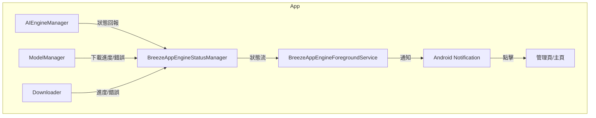
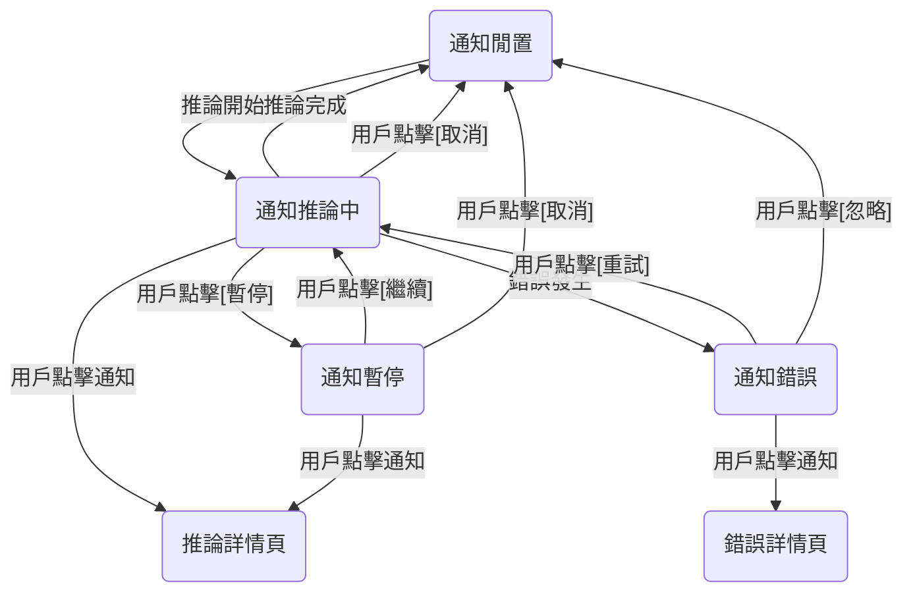

# BreezeApp Engine 狀態通知設計（優化版）

## 1. 設計目標
- **極簡、輕量**：最小依賴、低資源佔用，易於維護。
- **彈性擴充**：狀態、通知、UI/UX、互動皆可隨時調整。
- **用戶體驗佳**：通知資訊明確、互動直覺、狀態切換流暢。
- **鬆耦合架構**：狀態管理、通知、UI 完全分離，便於測試與重構。

---

## 2. 狀態模型設計
- **單一全域狀態流**，所有狀態變更僅經由 BreezeAppEngineStatusManager。
- **簡潔資料結構**，可隨時擴充 runner 狀態、進度、錯誤、互動。

```kotlin
sealed class BreezeAppEngineStatus {
    object Idle : BreezeAppEngineStatus()
    data class Running(val activeRunners: List<RunnerState>) : BreezeAppEngineStatus()
    data class Downloading(val modelName: String, val progress: Int) : BreezeAppEngineStatus()
    data class Error(val message: String, val recoverable: Boolean = true) : BreezeAppEngineStatus()
    // 可隨時擴充更多狀態
}

data class RunnerState(
    val runnerId: String,
    val displayName: String,
    val state: RunnerWorkState,
    val currentModel: String? = null,
    val progress: Int? = null,
    val error: String? = null
)

enum class RunnerWorkState {
    Idle, Inference, Downloading, Error
}
```

---

## 3. 架構圖與資料流


- **狀態來源單一**，所有模組僅回報狀態給 BreezeAppEngineStatusManager。
- **通知與 UI/UX 完全鬆耦合**，可隨時重構。

---

## 4. 通知內容與 UI/UX 設計
- **標題/內容/icon**：根據狀態自動切換，明確區分（如下載、推論、錯誤）。
- **Progress bar**：下載/推論時顯示進度（`setProgress`）。
- **互動設計**：預留 action（暫停/取消/重試/切換模型），MVP 可先不實作。
- **狀態分級**：多 runner 時僅顯示最需用戶關注的狀態，避免資訊過載。
- **國際化**：所有通知文字抽離為資源檔。
- **流暢體驗**：狀態切換時避免閃爍或重複彈出。
- **點擊通知**：根據狀態導向不同頁面（如下載管理、推論詳情）。

---

## 5. 前景服務與狀態管理
- **BreezeAppEngineForegroundService**：僅負責通知與前景存活，無業務邏輯。
- **BreezeAppEngineStatusManager**：唯一狀態來源，使用 StateFlow/Lifecycle 感知。
- **頻率控制**：狀態變更時 debounce，僅有意義變化才更新通知。
- **Service 啟動時機**：僅在有推論/下載/重要狀態時啟動，閒置時自動降級或結束。

---

## 6. MVP 實作建議步驟
1. 定義 `BreezeAppEngineStatus`、`RunnerState` 等資料結構。
2. 建立 `BreezeAppEngineStatusManager`，統一管理狀態。
3. 建立 `BreezeAppEngineForegroundService`，根據狀態更新通知。
4. 在 AIEngineManager/ModelManager/Downloader 等模組適時呼叫 `BreezeAppEngineStatusManager.updateStatus`。
5. MVP 只需 Idle/Running/Downloading/Error 四種狀態，未來可隨時擴充。
6. 預留通知 action、progress bar、狀態分級等接口。

---

## 7. 測試與維護建議
- **單元測試**：BreezeAppEngineStatusManager 可單獨測試狀態流與事件分發。
- **UI 測試**：可用 Espresso/UiAutomator 測試通知點擊、狀態切換。
- **Mock 狀態**：開發階段可提供 debug action 模擬各種狀態，方便 UI/UX 驗證。

---

## 8. 進階彈性設計點
- **多 runner 狀態/進度/錯誤**：RunnerState 可隨時擴充。
- **通知分級**：主通知+子通知或合併摘要，避免通知欄擁擠。
- **用戶自訂**：預留通知開關、顯示內容、優先級自訂。
- **與系統整合**：長時間下載/推論可與 JobScheduler/WorkManager 整合。
- **通知互動**：可加 action（暫停/取消/重試/切換模型）。

---

## 9. 總結
- 設計高度彈性、現代化、輕量，便於未來擴充。
- 架構鬆耦合，Service/狀態管理/通知/業務完全分離。
- UI/UX 直覺、可國際化、可互動，易於打造極佳用戶體驗。
- 強烈建議 MVP 階段就預留通知互動、progress bar、狀態分級等接口，未來可無痛升級。 

---

## 10. UI/UX 視覺與互動設計稿

### 10.1 通知視覺稿（Notification Mockup）

#### 閒置狀態（Idle）
```
┌─────────────────────────────────────────────┐
│  [🟢] BreezeApp Engine                      │
│  BreezeApp Engine 閒置中                     │
│  （點擊可進入模型管理頁）                       │
└─────────────────────────────────────────────┘
```

#### 運行中（推論/多 runner）
```
┌─────────────────────────────────────────────┐
│  [🟡] BreezeApp Engine                             │
│  運行中：LLM 推論中（breeze-3b）               │
│  進度：██████░░░░░ 60%                       │
│  [暫停] [取消]                               │
│  （點擊可查看推論詳情）                         │
└─────────────────────────────────────────────┘
```

#### 模型下載中
```
┌─────────────────────────────────────────────┐
│  [🔵] BreezeApp Engine                      │
│  模型下載中：breeze-3b-mtk                    │
│  進度：█████░░░░░░ 50%                       │
│  [暫停] [取消]                               │
│  （點擊可進入下載管理頁）                       │
└─────────────────────────────────────────────┘
```

#### 錯誤狀態
```
┌─────────────────────────────────────────────┐
│  [🔴] BreezeApp Engine                      │
│  錯誤：模型下載失敗，請檢查網路                  │
│  [重試] [忽略]                               │
│  （點擊可查看錯誤詳情）                         │
└─────────────────────────────────────────────┘
```

---

### 10.2 狀態分級與摘要
- 主通知只顯示最重要/需用戶關注的狀態（如推論、下載、錯誤）
- 多 runner 可合併摘要（如「2 個任務進行中」），點擊展開詳情
- 進度條使用 Android 通知 progress bar，動態顯示進度

---

### 10.3 互動設計
- Action Button：暫停、取消、重試、忽略等（MVP 可先不實作，預留接口）
- 點擊通知：根據狀態導向不同頁面（如模型管理、推論詳情、下載管理、錯誤詳情）
- 錯誤時可 vibration 或高亮顯示，吸引用戶注意

---

### 10.4 用戶體驗細節
- 狀態切換平滑，避免通知閃爍或重複彈出
- icon/顏色/emoji 明確區分不同狀態（🟢閒置、🟡運行、🔵下載、🔴錯誤）
- 國際化：所有文字抽離為資源檔
- 進度條明顯、易讀，百分比與圖形並列
- 多 runner 摘要顯示，點擊可展開詳情

---

### 10.5 UI/UX 流程圖



---

### 10.6 設計說明與彈性
- 所有 UI 元素（icon、顏色、action、內容）皆可隨時調整
- 通知內容、action、導向頁面皆可根據狀態自訂
- 多 runner 支援、狀態分級、摘要與展開皆預留彈性
- MVP 可先只做主通知與進度條，後續逐步擴充互動與詳情

---

### 10.7 附註
- 可提供 Figma/Sketch 設計稿給設計師細化視覺
- 工程實作時，建議用 NotificationCompat + RemoteViews 實現自訂通知 UI
- 測試時可用 debug action 模擬各種狀態 